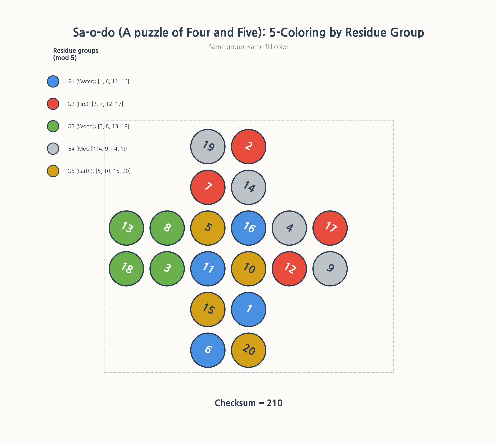
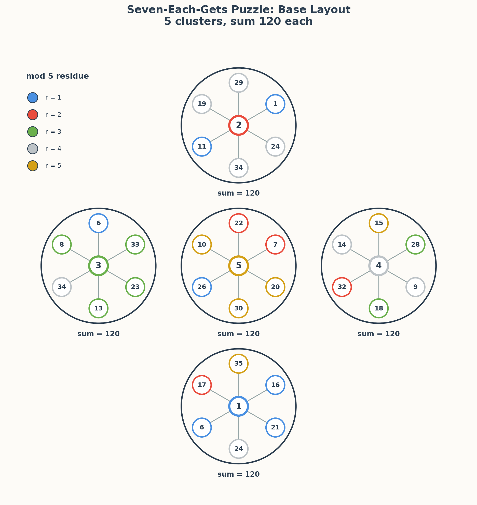
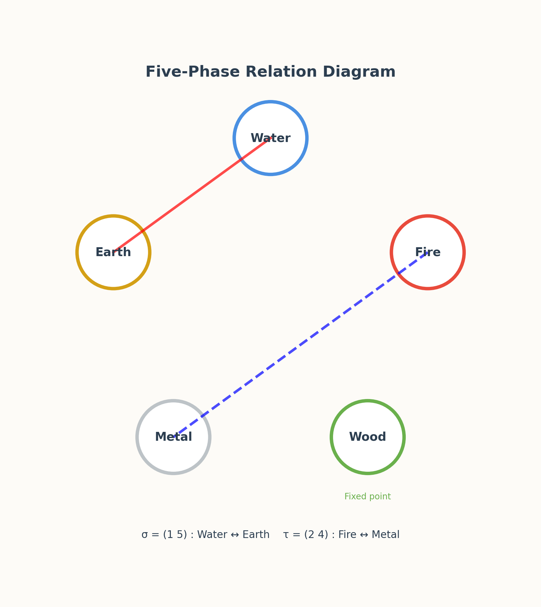

# From Early-Modern Puzzles to Modern Combinatorics: The Story of Saodo and Chiljagakdeuk

Have you ever solved a Sudoku? A simple rule—fill a 9×9 grid with the numbers 1 through 9—has captivated the world. Today, I'd like to introduce two puzzles discovered in Korean mathematical texts that have a different charm from Sudoku. Their names are **Saodo** and **Chiljagakdeuk**. Both involve placing numbers, and, surprisingly, they share a similar skeleton.

---

## 1. Saodo: Five Colors Hidden Inside 20 Circles

Saodo has twenty circles arranged in a symmetrical cross, with each circle containing one of the numbers 1 through 20. At first glance, it looks like a strange number arrangement.



But what if we paint it with **five colors**? The rule is simple: circles whose numbers leave the same remainder when divided by 5 receive the same color.

- Water (blue): 1, 6, 11, 16
- Fire (red): 2, 7, 12, 17
- Wood (green): 3, 8, 13, 18
- Metal (gray): 4, 9, 14, 19
- Earth (yellow-ocher): 5, 10, 15, 20

The surprising thing is that each color appears exactly four times. Twenty divided by five is exactly four. This is no coincidence; it is evidence that someone designed it intentionally. Moreover, the sum of the numbers from 1 to 20 is **210**. The original text carries a note: "共積二百十" (total sum two hundred ten). It feels like an early verification condition, similar to Sudoku's rule that "each row, column, and 3×3 box contains the numbers 1–9 once."

---

## 2. Chiljagakdeuk: A Five-Direction Cluster of 35 Numbers

**Chiljagakdeuk** is like Saodo's sibling. Here, thirty-five numbers are divided into five directions (up, down, left, right, and center), with each direction containing one center number and six surrounding numbers—seven in total. As the name says, it is a structure of "seven obtained each."



The real fun of Chiljagakdeuk lies in the **direction sums**. The seven numbers in each direction all add up to **120**, just as each row of a Sudoku sums to 45. Furthermore, the five center numbers contain 1, 2, 3, 4, and 5 exactly once, so the remainders modulo 5 are completely covered.

---

## 3. Finding the Rules: How Are They Alike?

Now any puzzle enthusiast would naturally ask:

> "Does Saodo also have a sum rule like Chiljagakdeuk?"

Unfortunately, Saodo—even in the original text—only presents a primitive grouping of five sets and does not have a neat per-direction sum rule like Chiljagakdeuk. Let's look at the sum of each color group:

- Water: 34
- Fire: 38
- Wood: 42
- Metal: 46
- Earth: 50

There is an interesting pattern—it increases by 4 each time—but the sums are not all equal. And Saodo lacks explicit center–surrounding connecting lines like Chiljagakdeuk. In other words, Saodo can be seen as a **weaker version** or a **different parameter setting** of Chiljagakdeuk.



Still, what is fascinating is that both puzzles share the skeleton of **five groups**, **mod-5 residue classification**, and **a total-sum invariant**. It is similar to how Sudoku and Kakuro share the common philosophy of "placing the numbers 1 through N according to rules" while having different concrete rules.

---

## 4. Generalization: Viewing the Puzzles as Parameters

Can we go further? The two puzzles can be captured in one formula.

```
Π(p, q, T)
```

- **p**: the number of directions (or groups)
- **q**: the number of surrounding slots in each direction
- **T**: the target sum for each direction (cluster)

Chiljagakdeuk is `Π(5, 6, 120)`: five directions, six surrounding slots, sum 120. It fits perfectly.

What about Saodo? It has five color groups, each with four elements, so we can view it as one center plus three surroundings. Thus it is `Π(5, 3, T_d)`, where `T_d` differs by direction (34, 38, 42, 46, 50). It can be called a **non-uniform example** within the same family.

Seeing it this way makes puzzle design suddenly tidy. It is like classifying "sliding puzzles," "logic puzzles," and "number-placement puzzles."

---

## 5. Expandability: Can We Make More Π(p, q, T) Puzzles?

Now let's use our imagination. If we have the framework `Π(p, q, T)`, can we design new puzzles?

For example:
- `Π(4, 5, 80)`: 4 directions, 5 surrounding slots, sum 80
- `Π(6, 4, 100)`: 6 directions, 4 surrounding slots, sum 100
- `Π(5, 5, 90)`: 5 directions, 5 surrounding slots, sum 90

Of course, not every combination is possible. The total sum of the number set must be consistent with the sum of each cluster. But that itself becomes a mathematical problem.

> For given `p, q, T`, what is the condition for a puzzle to exist?

This question resembles Sudoku's "uniqueness condition" or "minimum number of clues." For a puzzle designer, it is a dream topic.

---

## 6. What Makes These Puzzles Good

### 6.1 Visual Pleasure

Once colored, hidden structures pop out. It is fun just to observe how the same colors are scattered within Saodo's symmetrical cross arrangement.

### 6.2 A Bridge Between Ancient and Modern

Saodo explicitly uses Hado (河圖, the River Chart) and Ohaeng (the Five Phases)
vocabulary in the source material. That establishes a conceptual vocabulary,
not a proven direct origin or transmission route for every geometric feature.
The charm lies in how this historical diagram can be translated into modern
concepts such as **graph coloring**, **block designs**, and **invariants**.

### 6.3 Open Interpretation

Because there is no clear "correct answer" or "rule," various mathematical interpretations can be attempted. One person may approach it as a graph problem, another as an algebraic structure, and yet another as a combinatorial design.

---

## 7. What Is Disappointing About These Puzzles

### 7.1 The Rules Are Unclear

Unlike Sudoku, which has the clear rule that "each row, column, and 3×3 box contains the numbers 1–9 once," Saodo and Chiljagakdeuk are unclear about what the original intention was. The meaning of number tilts or direction markings has not yet been clarified.

### 7.2 The Original Text Alone Makes It Hard to Judge Completeness

Chiljagakdeuk gives the feeling of a "completed puzzle" because of its strong invariant condition, the directional sum. Saodo does not. We cannot tell whether this is intended incompleteness or whether the original text has been partially damaged.

### 7.3 Too Many Interpretive Possibilities

Open interpretation can be an advantage, but "anything could be right" also means "we don't know what the right answer is." It may be intriguing for researchers and puzzle enthusiasts, but it can be difficult for general readers.

---

## 8. Value as a Mathematics Textbook

What would be good about including such puzzles in a school mathematics textbook?

### 8.1 Visualizing Remainder Operations

`mod 5` can be experienced visually, like a coloring activity, rather than treated only as a calculation problem. The rule "numbers with the same remainder get the same color" is easy enough for elementary school students to understand.

### 8.2 Sums and Invariants

The fact that the sum of 1 through 20 is 210, or that each direction in Chiljagakdeuk sums to 120, naturally introduces the important mathematical concept of an **invariant**.

### 8.3 Mathematical Thinking Through Puzzles

Questions like "Can numbers be arranged to satisfy this rule?" cultivate advanced mathematical thinking such as **existence**, **uniqueness**, and **necessary and sufficient conditions**. Just as Sudoku already plays such a role in education, Saodo and Chiljagakdeuk can be excellent material.

### 8.4 Connecting Mathematics with History and Culture

Adding historical context such as the Chinese Hado, Ohaeng, and Joseon mathematical texts can show that mathematics is not mere symbol play but developed in connection with culture.

---

## Conclusion

Saodo and Chiljagakdeuk are still little-known puzzles. But precisely because few people know them, and because their conditions are simple, they are all the more charming to play with. Here we can engage in various mathematical pastimes: **coloring**, **finding sums**, **spotting patterns**, and **generalizing**.

If reading this has given you an idea like, "I would add a rule like this," then you are already a co-researcher of this puzzle. I'll return with another interesting puzzle next time.
