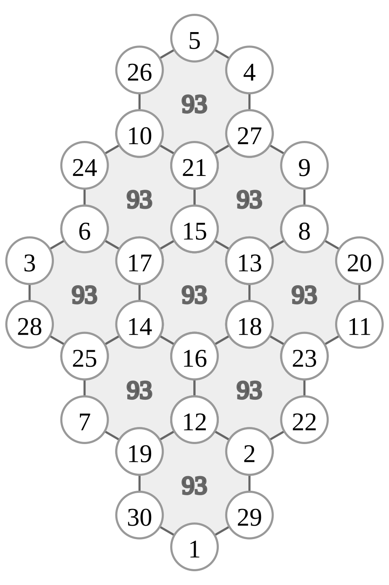

# Jisu-guimun-do Source Text Interpretation and Mod-Based Group Analysis

> **Translation procedure**: The classical Chinese source text in this document was processed in the order **Classical Chinese → Korean (first-pass translation) → English (second-pass translation)**. The Korean is a first-pass translation that follows the grammatical flow of the original, and the English is a second-pass translation based on that Korean interpretation.

---

## 1. Source text and translations

| # | Classical Chinese | Korean (1st pass) | English (2nd pass) |
|---|---|---|---|
| 1 | 六子各得九十三數 | 6개 수의 부분합이 93이다. | The partial sum of six numbers is 93. |
| 2 | 九宮共得八百三十七數 | 9개의 모든 그룹의 합은 837이다. | The sum of all nine clusters is 837. |
| 3 | 中眷三宮, 三宮爲主則 | 가운데의 것이 3개 그룹을 돌보고, 3개 그룹이 주가 되는데 | The center manages three groups; the three groups are the major ones. |
| 4 | 左右十二子 分爲二宮 若爲以 | 좌우 12자가 2개의 그룹으로 나뉜다는 것은 (만약 이를 기준으로 삼는다면) | The twelve numbers on the left and right are divided into two groups (if we take these as the basis). |
| 5 | 四正爲四宮, 中間六子合爲一宮 | 4개의 꼭지그룹이 4개의 그룹이므로, 중간 6개 수를 합쳐 1개의 그룹으로 둔다. | The four orthogonal directions form four groups, and the six center numbers are combined into one group. |
| 6 | 凡九宮化爲十二宮 | 무릇 9그룹이 12개 그룹이 된다. | Commonly, the nine groups are transformed into twelve groups. |

---

## 2. Structure indicated by the source text

The source text describes the **9-hex (turtle-shell) form of Jisu-guimun-do**.

- Each hexagon (palace, 宮) contains **six numbers (六子)** and has sum **93**.
- There are **nine** such palaces, so the repeated-count total is **9 × 93 = 837**.
- The phrase "九宮化爲十二宮" says that the nine palaces can be further subdivided into **twelve groups**.

This structure corresponds to the graph below.



> The image above is the 9-hex turtle-shell graph of Jisu-guimun-do, copied from `../yukjagakdeuk-six-each-gets/jisu-guimun-and-yongyukdo/`.

---

## 3. Mapping the source text onto the graph

Reading the six source phrases against the 9-hex graph gives the following mapping.

| Source phrase | Graph-theoretic reading |
|---|---|
| 六子各得九十三數 | The six vertex numbers in each hexagon sum to 93. |
| 九宮共得八百三十七數 | The repeated-count total of the nine hexagons is 93 × 9 = 837. |
| 中眷三宮, 三宮爲主則 | The three central hexagons (top-center, center, bottom-center or the central cluster) dominate the whole structure. |
| 左右十二子 分爲二宮 | The twelve left/right vertices are grouped into two lateral groups (left palace / right palace). |
| 四正爲四宮, 中間六子合爲一宮 | The four orthogonal-direction hexagons + the six central numbers combined into one central palace. |
| 凡九宮化爲十二宮 | The nine hexagons are reorganized into twelve subgroups by adding four-direction, center, left/right, and finer subdivisions. |

This mapping shows that the text is describing not merely a "hexagonal magic figure" but a **hierarchical spatial structure in which nine palaces are transformed into twelve groups**.

---

## 4. The make/use distinction: 三十子作 and 五十四子用

Although not explicitly stated in the six source phrases, the 9-hex Jisu-guimun-do structure separates **the numbers actually written on the graph (作, "made/used as written")** from **the positions occupied by the structure (用, "used/employed")**. This distinction appears repeatedly in other Saodo and Gakdeuk diagrams.

### 4.0.1 三十子作: the distinct numbers written on the graph

- **作 (zuo)** means "to make" or "to construct."
- In the 9-hex Jisu-guimun-do, the numbers **1 through 30** are written exactly once at the vertices.
- Thus **三十子作** means "the diagram is constructed from thirty numbers (子)."
- The total of these distinct numbers is

```
T = 1 + 2 + … + 30 = 30 × 31 / 2 = 465
```

### 4.0.2 五十四子用: the structural positions used

- **用 (yong)** means "to use" or "to employ."
- Because nine hexagons each contain six numbers, the total number of structural positions is

```
用 = 9 × 6 = 54
```

- These 54 positions are filled by the 30 distinct numbers, with some numbers repeated because shared vertices belong to multiple hexagons.
- The number of extra positions created by duplication is

```
54 − 30 = 24
```

### 4.0.3 The relation among 作, 用, and duplication

These three quantities are linked by the equation

```
用 = 作 + duplicated positions
54 = 30 + 24
```

Or, using the per-hexagon sum S = 93:

```
9 × S = T + D
9 × 93 = 465 + D
837 = 465 + D
D = 372
```

Here D = 372 is the **weighted duplication sum**: the sum of shared-vertex values multiplied by how many extra times each is counted. The number of duplicated positions (24) simply counts how many extra slots exist, while D also incorporates the numerical values in those slots.

| Term | Symbol | Value | Meaning |
|---|---|---:|---|
| 作 (distinct numbers) | M | 30 | 1–30, each used once |
| 用 (total positions) | H × 6 | 54 | 9 hexagons × 6 numbers |
| Duplicated positions | 用 − 作 | 24 | Extra slots caused by shared vertices |
| Distinct total | T | 465 | Sum of 1 through 30 |
| Weighted duplication sum | D | 372 | Sum of shared-vertex values × extra counts |
| Per-hexagon sum | S | 93 | Partial-sum invariant |

### 4.0.4 Comparison with other diagrams

This make/use distinction is not unique to Jisu-guimun-do. The same structure appears in other Saodo and Gakdeuk diagrams.

| Diagram | 作 (distinct numbers) | 用 (total positions) | Partial sum | Notes |
|---|---|---:|---:|---|
| Nakseo Sagudo | 20 | 36 (9 palaces × 4) | 42 | Numbers 1–20 |
| Nakseo Ogudo | 33 | 45 (9 palaces × 5) | 85 | Numbers 1–33 |
| Jisu-yong-yukdo | 20 | 30 (5 hexagons × 6) | 63 | Numbers 1–20 |
| Jisu-guimun-do 9-hex | 30 | 54 (9 hexagons × 6) | 93 | Numbers 1–30 |

In every case, "用" is "number of palaces/hexagons × numbers per palace/hexagon," and "作" is the number of distinct values actually written. The difference is always caused by **shared vertices (duplication coefficients)**, which is the common combinatorial structure of Saodo and Gakdeuk diagrams.

---

## 5. Mod-based group analysis

The phrase "九宮化爲十二宮" can be read in modern terms as **reconstructing groups by superimposing different modulo systems**. The following is a mod analysis for 2, 3, 4, 5, 6, 9, and 12.

### 5.1 mod 2: Binary partition and spatial symmetry

Mod 2 is the most basic partition. Dividing the numbers 1 through M into **even (0 mod 2)** and **odd (1 mod 2)** gives a 2-coloring of the whole graph.

#### 5.1.1 Even/odd distribution inside each hexagon

- Each hexagon has six numbers and sum 93 (odd).
- For six numbers to sum to an odd value, the number of odd entries must be **odd (1, 3, or 5)**.
- The most symmetric case is **3 odds and 3 evens**. Then the hexagon sum is  
  `(sum of 3 odds) + (sum of 3 evens)`, and the two parity groups are balanced.
- If a hexagon has 1 odd and 5 evens, or 5 odds and 1 even, it becomes a parity-imbalanced hexagon.

Counting evens and odds over all nine hexagons (with duplication), if each hexagon contains on average 3 odds, the nine hexagons contain 27 odd entries in total. Because shared vertices are counted multiple times, the **number of distinct odd values is smaller**.

#### 5.1.2 Spatial distribution: parity in the 9-hex structure

The 9-hex turtle-shell layout is usually arranged as follows.

```
        H1
    H2  H3  H4
        H5
    H6  H7  H8
        H9
```

Or, with a central hexagon (H5), four directional hexagons (H2, H4, H6, H8), and four corner hexagons (H1, H3, H7, H9).

- **Central hexagon**: the core of parity balance. If it contains 3 evens and 3 odds, parity spreads evenly up, down, left, and right.
- **Four directional hexagons**: the four orthogonals. Their parity distributions determine left/right and top/bottom symmetry.
- **Four corner hexagons**: the vertices. Their parity affects the rotational symmetry of the whole graph.

Plotting this as a mod-2 coloring shows visually how evens and odds are spread. Ideally the pattern is **centrally symmetric** (180° rotation preserves parity) or **axially symmetric** (left/right or top/bottom).

#### 5.1.3 Three forms of mod-2 symmetry

| Symmetry | Condition | Source-text link |
|---|---|---|
| Left/right symmetry | Number of evens in left half = number of evens in right half | 左右十二子 分爲二宮 |
| Top/bottom symmetry | Number of evens in upper half = number of evens in lower half | 中眷三宮 (top-center-bottom axis) |
| Central symmetry (180°) | Parity is preserved between centrally opposite positions | Cyclic structure of the nine palaces |

The source phrase "左右十二子 分爲二宮" — twelve left/right numbers divided into two groups — connects directly to the mod-2 left/right symmetry reading. For the twelve left/right numbers to form two palaces, their parity distributions should naturally be balanced.

#### 5.1.4 Mod 2 as the seed of higher moduli

Mod 2 is the foundation for several other moduli.

- **mod 4 = mod 2 × mod 2**: parity refined once more into top/bottom and left/right.
- **mod 6 = mod 2 × mod 3**: parity overlaid with the three-direction structure.
- **mod 12 = mod 2 × mod 6 = mod 4 × mod 3**: parity refined through two or more stages.

Thus the spatial symmetry of mod 2 is not merely an even/odd distinction; it is the starting point for all mutations into mod 4, mod 6, and mod 12. If mod-2 symmetry is broken, the higher symmetries of mod 4, mod 6, and mod 12 are broken as well.

### 5.2 mod 3: Three-palace partition

- Classify 1 through M by remainder modulo 3 into three equivalence classes.
- The "三宮" in "中眷三宮, 三宮爲主則" directly corresponds to the three mod-3 classes (0, 1, 2).
- Since 9 palaces = 3 × 3, the nine-palace layout can also be seen as a 3×3 grid obtained by overlaying two three-direction partitions.

### 5.3 mod 4: Four-orthogonal partition

- The four orthogonal directions (east, west, south, north) correspond directly to "四正爲四宮".
- 4 = 2 × 2, so mod 4 refines the mod-2 left/right and top/bottom symmetries one step further.
- The four mod-4 classes naturally link to the four corner/directional groups.

### 5.4 mod 5: Wuxing (five-phase) partition

- Classify 1 through M by remainder modulo 5 into Water, Fire, Wood, Metal, and Earth.
- Because Jisu-guimun-do belongs to the Jisu-yong-yukdo lineage, the mod-5 wuxing partition provides the basic numerological background.
- The distribution of the six numbers in each hexagon across the five wuxing phases is one axis of group analysis.

### 5.5 CRT: Unifying mod 3, mod 4, and mod 5 — Qin Jiushao's Dayan Qiu Yi Shu

The Song-Yuan mathematician **Qin Jiushao (秦九韶, c. 1202–1261)** presented the **Dayan Qiu Yi Shu (大衍求一術, "method of finding unity by the great extension")** in his *Shushu Jiuzhang* (*Mathematical Treatise in Nine Sections*). This algorithm solves systems of simultaneous congruences with pairwise coprime moduli, and it is equivalent to the modern **Chinese Remainder Theorem (CRT)**.

In Jisu-guimun-do, **mod 3, mod 4, and mod 5** are pairwise coprime. Applying all three moduli simultaneously determines any integer uniquely modulo 60 (= 3 × 4 × 5).

```
x ≡ r₃ (mod 3)
x ≡ r₄ (mod 4)
x ≡ r₅ (mod 5)
```

This system has a unique solution modulo 60. Therefore each number in 1..M can be viewed as a point with **three coordinates (r₃, r₄, r₅)**, occupying one of 3 × 4 × 5 = 60 possible combinations.

This CRT coordinate system corresponds to the spatial structure of the source text as follows.

| Coordinate | Spatial meaning | Source-text correspondence |
|---|---|---|
| r₃ (mod 3) | Top/middle/bottom or left/center/right, the three directions | 中眷三宮, 三宮爲主則 |
| r₄ (mod 4) | East/west/south/north, the four orthogonal directions | 四正爲四宮 |
| r₅ (mod 5) | Wuxing (Water, Fire, Wood, Metal, Earth), the five directions | Five-phase (五行) placement |

Thus mod 3 and mod 4 generate the **9-palace / 12-palace spatial lattice**, while mod 5 provides the **independent five-phase coloring**. When these are combined by CRT, each number becomes a single point in a 3×4×5 space, and this is the number-theoretic basis of the 9-palace → 12-palace transformation.

Qin Jiushao's Dayan Qiu Yi Shu handles this situation as follows.

1. Compute M = 3 × 4 × 5 = 60.
2. Compute M₁ = M/3 = 20, M₂ = M/4 = 15, M₃ = M/5 = 12.
3. For each Mᵢ find the **"unity-seeking"** multiplier yᵢ such that Mᵢ·yᵢ ≡ 1 (mod mᵢ).
   - 20·y₁ ≡ 1 (mod 3) ⇒ y₁ = 2
   - 15·y₂ ≡ 1 (mod 4) ⇒ y₂ = 3
   - 12·y₃ ≡ 1 (mod 5) ⇒ y₃ = 3
4. The solution is x = r₃·20·2 + r₄·15·3 + r₅·12·3 (mod 60).

For example, with (r₃, r₄, r₅) = (1, 1, 1):

```
x = 1·40 + 1·45 + 1·36 = 121 ≡ 1 (mod 60)
```

So the coordinate (1, 1, 1) corresponds to the number 1 (or 61, 121, …). In this way CRT reduces the three mod classifications into a single mod-60 coordinate.

From this viewpoint, the source phrase "九宮化爲十二宮" is a refinement from a mod-9 (= 3×3) structure to a mod-12 (= 3×4) structure, while mod 5 remains an independent wuxing axis unaffected by that refinement.

### 5.6 mod 6: Six-children partition

- 六子各得 literally means that **the partial sum of six numbers** is 93.
- mod 6 = 2 × 3, so it simultaneously reflects parity (mod 2) and the three-direction structure (mod 3).
- Because each hexagon forms a 6-cycle, the mod-6 partition is directly tied to the cyclic structure of the hexagon.

### 5.7 mod 9: Nine-palace partition

- The phrase "九宮共得" refers to the nine palaces.
- 9 = 3 × 3, so mod 9 can be read as a 3×3 structure formed by overlaying two mod-3 three-direction partitions.
- In the 9-hex turtle-shell layout, the nine hexagons are arranged as center + four directions + four diagonals (or top/bottom/left/right + intermediates), forming nine cells.

### 5.8 mod 12: Twelve-palace partition

- The phrase "九宮化爲十二宮" says the nine palaces are transformed into twelve groups.
- 12 = 3 × 4 = 2 × 6 = 2 × 2 × 3, so mod 12 is the most refined partition, superimposing mod 3, mod 4, and mod 6.
- The twelve groups can be read as 4 directions × 3 layers, or 3 directions × 4 subdivisions, or 6 directions × 2 splits.

---

## 6. Relations among the mod group classifications

The mod classifications overlap and mutate into one another.

```
mod 2 ──┬── mod 4 ──┬── mod 12
        │           │
        └── mod 6 ──┘
        │
mod 3 ──┴── mod 9
        │
        └── mod 5 (wuxing)
```

| Relation | Explanation |
|---|---|
| mod 2 ↔ mod 4 | mod 4 refines the mod-2 binary into top/bottom and left/right (2 × 2). |
| mod 3 ↔ mod 9 | mod 9 stacks two mod-3 three-direction partitions (3 × 3). |
| mod 2 ↔ mod 6 | mod 6 combines parity (2) and three directions (3) (2 × 3). |
| mod 3 ↔ mod 6 | mod 6 overlays parity onto the three directions (3 × 2). |
| mod 4 ↔ mod 12 | mod 12 multiplies four directions by three layers (4 × 3). |
| mod 6 ↔ mod 12 | mod 12 multiplies six directions by a two-fold split (6 × 2). |
| mod 5 | Wuxing is independent of the 2·3·4·6·9·12 multiple structure, but in the CRT view it supplies the final axis of the mod 3 × mod 4 × mod 5 = mod 60 space. It completes the spatial model when combined with the five directions (center + four cardinals). |

These relations show that "九宮化爲十二宮" is not simply increasing the count but a **systematic transformation from a mod-9 (3×3) structure to a mod-12 (3×4 or 6×2) structure**, with mod 5 (wuxing) acting as an independent five-direction axis that overlays the final 3 × 4 × 5 = 60 CRT cells.

---

## 7. Mutation system based on 2 and 3

The mod analysis of Jisu-guimun-do is fundamentally based on **2 and 3**.

| mod | Factorization | Spatial meaning |
|---|---|---|
| 2 | 2 | Left/right, even/odd, binary |
| 3 | 3 | Top/middle/bottom, three palaces, three directions |
| 4 | 2 × 2 | Four cardinal directions, four orthogonals |
| 6 | 2 × 3 | Hexagon, six children, 6-cycle |
| 9 | 3 × 3 | Nine palaces, 3×3 grid |
| 12 | 2 × 2 × 3 = 3 × 4 = 2 × 6 | Twelve palaces, refinement of nine palaces |
| 5 | 5 | Wuxing, five directions (center + four cardinals) |

Thus the group interpretation of Jisu-guimun-do is a composite system: a **2- and 3-based dyadic-triadic space (4, 6, 9, 12)** overlaid with a **5-direction wuxing structure**.

The 9-palace → 12-palace transformation can be understood as follows.

```
9 palaces = 3 × 3        (mod 3 × mod 3)
12 palaces = 3 × 4       (mod 3 × mod 4)
           = 3 × (2 × 2)  (mod 3 × mod 2 × mod 2)
```

Therefore, transforming nine palaces into twelve palaces can be read as keeping one mod-3 axis while refining the other axis from mod 3 to mod 4 (= 2 × 2). This is the modern interpretation of "九宮化爲十二宮".

---

## 8. Conclusion

The source text of Jisu-guimun-do contains more than the rule "each hexagon sums to 93." It reveals a **hierarchical way of thinking in which nine palaces are transformed into twelve groups**, and that thinking is structured by a mod classification system based on 2 and 3 (2, 3, 4, 6, 9, 12) overlaid with the wuxing system based on 5.

- **六子各得九十三數**: a mod-6 partial-sum invariant.
- **九宮共得八百三十七數**: the mod-9 total, expressed by the duplication-count equation `9 × 93 = 837`.
- **九宮化爲十二宮**: a refinement from mod 9 to mod 12, from 3×3 to 3×4 (or 6×2).

In this way the source text can be translated precisely into the modern combinatorial language of **partial-sum invariants** and **mod-based group partitions**.
