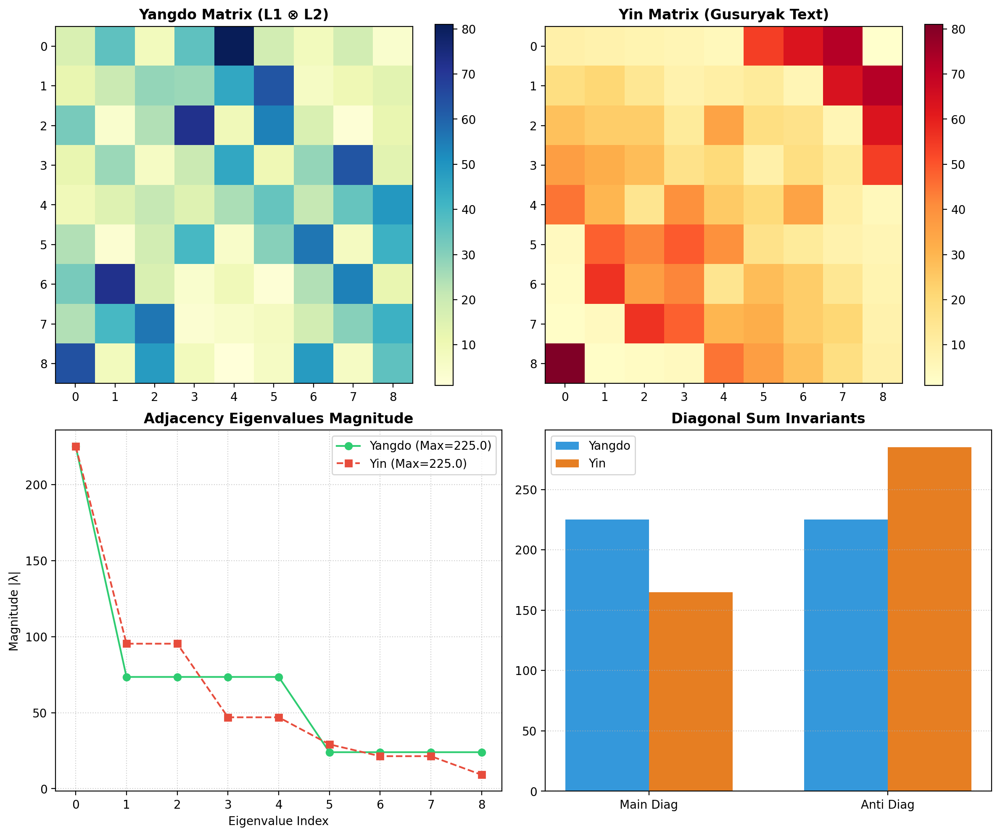

# Gugusubyeongungyangdo (九九數變宮陽圖/陰圖) Advanced Spectral & Invariant Report

## Executive Summary
This report analyzes the mathematical properties of **Gugusubyeongungyangdo** (Yangdo, 陽圖) and **Gugusubyeongungeumdo** (Yin, 陰圖) using Kronecker tensor products ($L_1 \otimes L_2$) of 3x3 Luoshu magic squares, matrix spectral decomposition, and diagonal invariants.

## Key Findings & Mathematical Invariants

1. **Spectral Radius Conservation ($225.0$)**
   - Both Yangdo ($L \otimes L$) and Yin matrices exhibit an exact spectral radius of **$225.0$**.
   - Derived from the base Luoshu magic constant $15$ via Kronecker spectral theory: $\lambda_{\max}(L_1 \otimes L_2) = \lambda_{\max}(L_1) \cdot \lambda_{\max}(L_2) = 15 \times 15 = 225$.

2. **Diagonal Sum Bifurcation**
   - **Yangdo:** Main diagonal sum = $225$, Anti-diagonal sum = $225$ (Isotropic balance).
   - **Yin:** Main diagonal sum = $165$, Anti-diagonal sum = $285$ (Anti-diagonal axis asymmetry).

3. **Palace Block Sum Invariants**
   - Yangdo palace block sums follow structured multi-fold multiples of 45: `[180, 405, 90, 135, 225, 315, 360, 45, 270]`.

## Execution Metrics
- **Non-Isomorphic Solutions Count:** 2
- **Spectral Radius:** `[225.0000, 225.0000]`
- **Graph Betweenness Centrality:** `[0.1425, 0.1425]`
