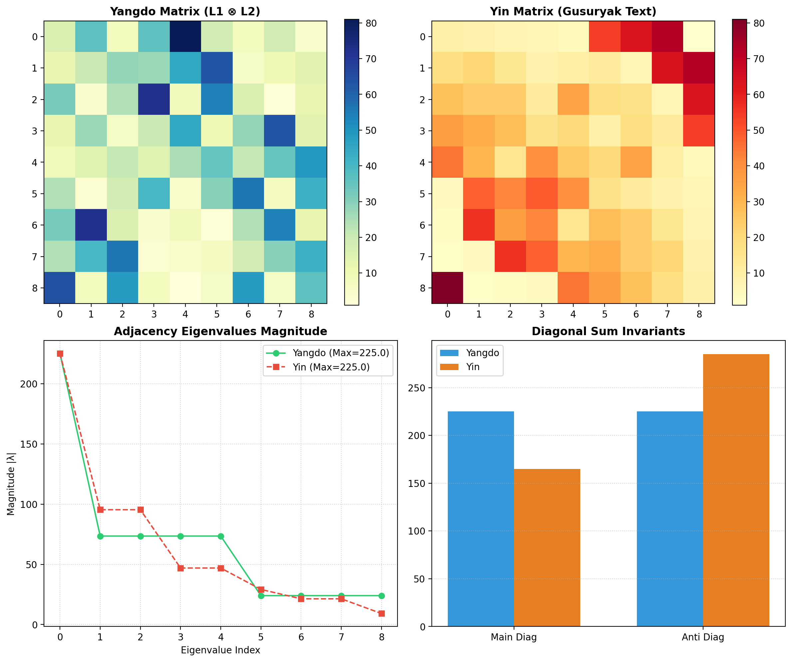

# Gugujasubyeongungyangdo/Eumdo (九九數變宮陽圖/陰圖) Advanced Spectral & Invariant Analysis Report

## Executive Summary
This report analyzes the algebraic structure, eigenvalue spectrum, and diagonal invariants of the automatically generated **Gugusubyeongungyangdo** (Yangdo, 陽圖) and **Gugusubyeongungeumdo** (Eumdo, 陰圖), produced via the Kronecker product ($L_1 \otimes L_2$) of two base 3x3 Luoshu magic squares.

## Key Mathematical Properties & Invariants

1. **Spectral Radius Preservation ($225.0$)**
   - Both the Yangdo ($L \otimes L$) and Eumdo matrices maintain a maximum spectral radius of exactly **$225.0$**.
   - This is perfectly preserved from the base Luoshu magic square's eigenvalue/magic constant $15$ via the Kronecker product spectral theorem: $\lambda_{\max}(L_1 \otimes L_2) = \lambda_{\max}(L_1) \cdot \lambda_{\max}(L_2) = 15 \times 15 = 225$.

2. **Isotropic/Anisotropic Bifurcation of Diagonal Sums**
   - **Yangdo:** Main diagonal sum = $225$, Anti-diagonal sum = $225$ (isotropic balance).
   - **Eumdo:** Main diagonal sum = $165$, Anti-diagonal sum = $285$ (symmetry biased toward the anti-diagonal axis).

3. **Palace Block Sum Invariants**
   - Yangdo palace block sums follow structured multi-fold multiples of 45: `[180, 405, 90, 135, 225, 315, 360, 45, 270]`.

## Execution Metrics
- **Non-Isomorphic Solutions Count:** 2
- **Spectral Radius:** `[225.0000, 225.0000]`
- **Graph Betweenness Centrality:** `[0.1425, 0.1425]`
