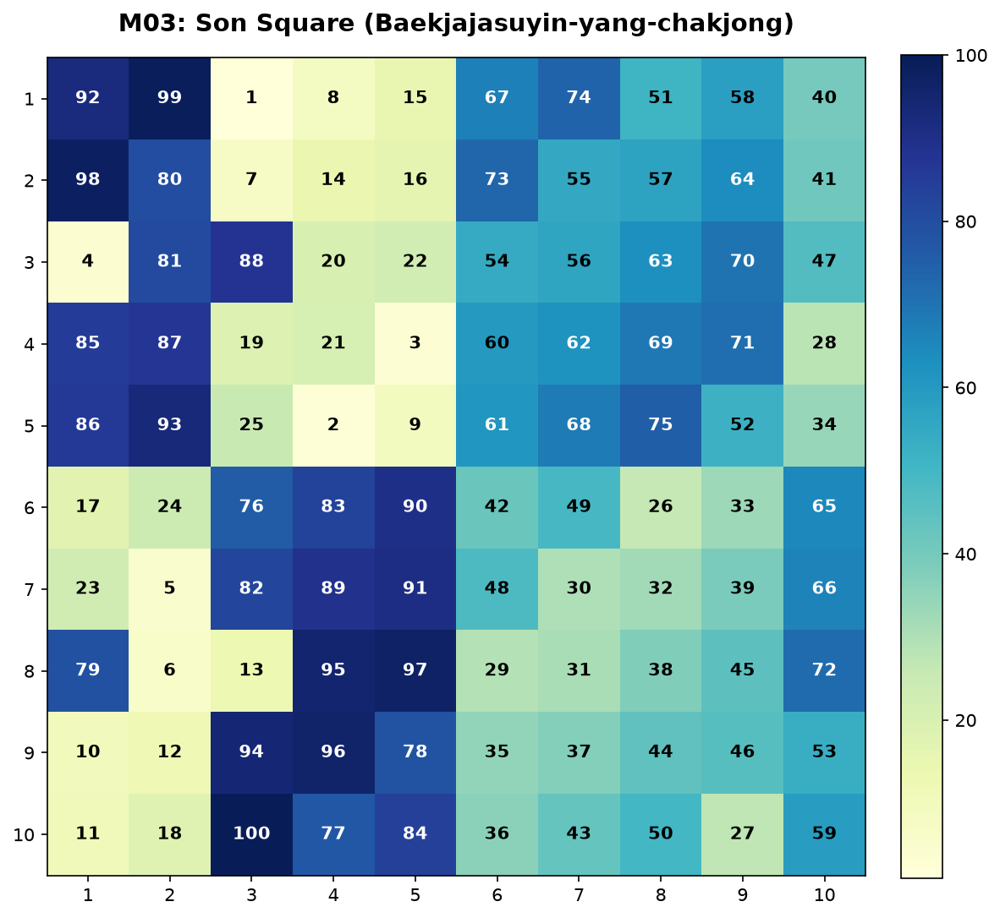
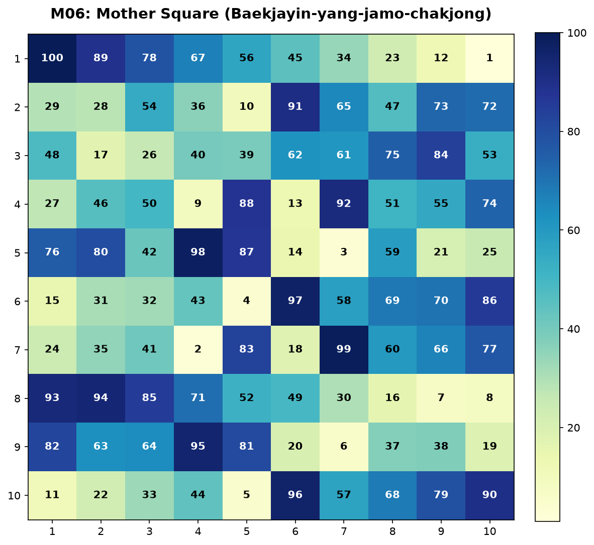
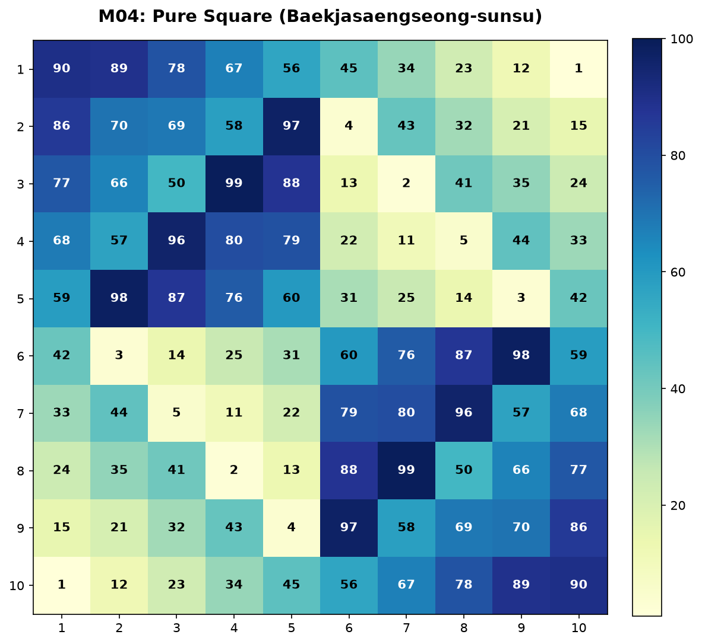
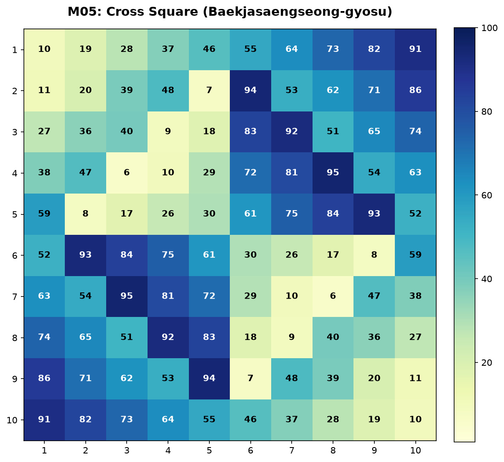

# Guide to the Generation and Classification System of the Baekjado (10×10 Magic Square) Family

This document is a mathematical model of coordinate transformations among
constructed 10×10 arrays inspired by the Baekja (百子) family in *Gusuryak*
(九數略). It is not a corrected edition or reconstruction of the source arrays.

It excludes cosmological or philosophical interpretation and is written purely on the basis of mathematical coordinate transformations and combinatorial rules.

---

## 1. Definitions and Translation of Key Terms

The numerical philosophy of the East and Choi Seok-jeong's mode of description are translated and defined in the language of modern mathematics and combinatorics.

*   **Mother Square (모도 母圖)**
    *   **Definition**: The square that serves as the reference point and origin from which other variant squares are derived within a group of magic squares.
    *   **Model use**: The constructed array $M_{06}$ is called the Mother Square within this module only; it is not the source transcription in `06-baekjayin-yang-jamo-chakjong`.
*   **Son Square (자도 子圖)**
    *   **Definition**: A derived square obtained from the Mother Square through symmetric transformations or the spatial arrangement of its components.
    *   **Note**: The source records the two Latin squares separately; it does not include a combined 1–100 magic square. The 1–100 reference square $M_{03}$ is a constructed model used only in this module.
*   **Yang Square (양도 陽圖)**
    *   **Definition**: A Latin square filled with numbers in the range $1 \sim 10$, which forms the ones digit (base number) in the decimal composition, or functions as the odd-lineage component in the combined structure of the square.
*   **Yin Square (음도 陰圖)**
    *   **Definition**: A Latin square filled with numbers in the range $0 \sim 9$, which forms the tens digit (weight) in the decimal composition, or functions as the even-lineage component in the combined structure of the square.

---

## 2. Constructed-array generation system

### Principle of Baekjado Generation Based on Orthogonal Latin Squares
The 10×10 Baekjado is constructed by superimposing two mutually orthogonal order-10 Latin squares: the **Yang Square $Y$ (1–10)** and the **Yin Square $X$ (0–9)**.
*   **Combination formula ("Yang Square first $\rightarrow$ Yin Square next")**: The Yang Square is placed in the tens digit and the Yin Square is combined in the ones digit.
    $$M(i, j) = 10 \times (Y(i, j) - 1) + X(i, j) + 1$$
    Through this formula, the orthogonal pairs of $Y(i,j) \in \{1,\dots,10\}$ and $X(i,j) \in \{0,\dots,9\}$ fill the plane with the 100 natural numbers from $1$ to $100$ exactly once each, without duplication.

### Scope of the model
The arrays in this module are constructed to demonstrate the stated formula and
dihedral transformations. Their magic-square properties do not establish a
correction to, or intended reading of, the source transcription.

---

## 3. Mathematical derivation relationships among the constructed arrays

The constructed arrays are related by transformations in the two-dimensional
dihedral group, with the **reference square ($M_{03}$)** as their reference.

### 1) Son Square $\rightarrow$ Mother Square (vertical flip, `flipud`)
*   **Source square**: The 1–100 reference square ($M_{03}$) defined for the underlying transformation
*   **Derived model array**: $M_{06}$ (Mother Square)
*   **Derivation formula**:
    $$M_{06}(i, j) = M_{03}(9 - i, j) \quad (0 \le i, j \le 9)$$
    In other words, flipping the row order of the reference square upside down yields the Mother Square perfectly.

### 2) Son Square $\rightarrow$ Baekjasaengseong-sunsu (90° counterclockwise rotation, `rot90`)
*   **Source square**: The 1–100 reference square ($M_{03}$) defined for the underlying transformation
*   **Derived model array**: $M_{04}$
*   **Derivation formula**:
    $$M_{04}(i, j) = M_{03}(j, 9 - i) \quad (0 \le i, j \le 9)$$
    In other words, rotating the reference square 90 degrees counterclockwise derives the corrected Sunsu square.

### 3) Son Square $\rightarrow$ Baekjasaengseong-gyosu (horizontal flip, `fliplr`)
*   **Source square**: The 1–100 reference square ($M_{03}$) defined for the underlying transformation
*   **Derived model array**: $M_{05}$
*   **Derivation formula**:
    $$M_{05}(i, j) = M_{03}(i, 9 - j) \quad (0 \le i, j \le 9)$$
    In other words, reflecting the reference square left-to-right (mirror symmetry) derives the corrected Gyosu square.

---

## 4. Analysis of Visual Materials

By running the visualization program, the generated heatmaps confirm that the spatial symmetry and the numerical distribution correspond perfectly.

| Square Classification | Visual Material | Description and Mathematical Features |
| :--- | :---: | :--- |
| **Son Square (자도)**<br>Reference square ($M_{03}$) |  | The virtual square serving as the reference. It is a perfect magic square in which every row, column, and main diagonal sums to 505. |
| **Mother Square (모도)**<br>Model array $M_{06}$ |  | The model array obtained by flipping the reference square ($M_{03}$) about the horizontal axis (flipud of $M_{03}$). |
| **Generated Pure Square (순수도)**<br>Model array $M_{04}$ |  | The model array derived by rotating the reference square ($M_{03}$) by 90 degrees about the origin (rot90 of $M_{03}$). |
| **Generated Crossed Square (교수도)**<br>Model array $M_{05}$ |  | The model array obtained by flipping the reference square ($M_{03}$) about the vertical axis (fliplr of $M_{03}$). |

---

## 5. How to Run the Python 3 Verification Program

By running the provided `generate.py` program, you can directly verify that the derivation rules described above hold mathematically, and regenerate the visual materials.

### Requirements
*   Python 3.x
*   Required packages: `numpy`, `matplotlib`

### How to Run
1.  Open a terminal and move into this folder (`squares-module`).
2.  Run the following command to execute the code with the libraries installed in the Python virtual environment.
    ```bash
    # Run by pointing directly at the virtual environment's python3
    ../.venv/bin/python3 generate.py
    ```
3.  **Expected output**:
    ```text
    === 방진 간 유도 관계 수학적 검증 ===
    M04 == rot90(M03, 1): True
    M05 == fliplr(M03): True
    M06 == flipud(M03): True
      M03 (아들 방진) 마방진 충족 여부 (합 505): True (대각합: 505, 505)
      M04 (순수도) 마방진 충족 여부 (합 505): True (대각합: 505, 505)
      M05 (교수도) 마방진 충족 여부 (합 505): True (대각합: 505, 505)
      M06 (엄마 방진) 마방진 충족 여부 (합 505): True (대각합: 505, 505)
    시각 자료 저장 완료: .../squares-module/figures/m03_son.png
    시각 자료 저장 완료: .../squares-module/figures/m04_pure.png
    시각 자료 저장 완료: .../squares-module/figures/m05_cross.png
    시각 자료 저장 완료: .../squares-module/figures/m06_mother.png
    ```
4.  When the run finishes, precise heatmap images (PNG) are generated and saved under the `figures/` directory.
