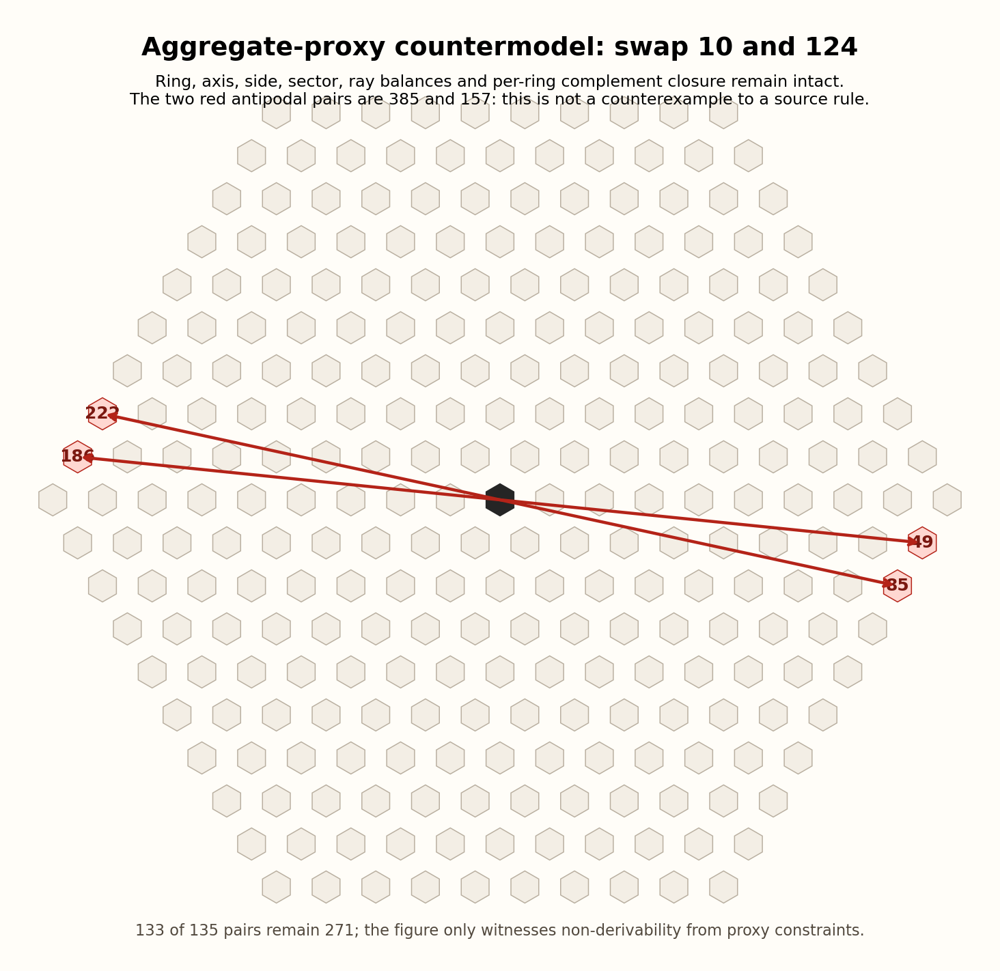

# The 3×3 Lo Shu Origin Rule Across the Nakseo Family and the Yukgodo

## Confirmed shared control array

The actual stored data for the project’s three Nakseo diagrams are all the same 3×3 Lo Shu array, up to rotation or reflection:

\[
\begin{matrix}8&1&6\\3&5&7\\4&9&2\end{matrix}.
\]

| Diagram | Data location | Result |
| --- | --- | --- |
| 洛書九九圖 | Nine central labels in `01-saodo-family/낙서구구도/visualize.py` | Lo Shu array |
| 洛書五九圖 | Nine-palace centres in `낙서오구도/nakseo_ogudo.py` | Lo Shu array |
| 洛書七九圖 | Nine palace centres in `낙서칠구도/visualize_basic.py` | Lo Shu array |

The basic Lo Shu’s central symmetry gives `1+9=2+8=3+7=4+6=10` for its four positional pairs, while only the central 5 is fixed. In other words, the 3×3 array is repeatedly used in this family as a control array that determines centre, symmetry, and sums—not as a mere title ornament.

## Complement pairs are an actual construction tool

洛書九九圖 partitions its outer values 10…81 into 36 complementary pairs summing to 91. Each group receives three 91-pairs and a centre-value correction pair to give a group sum of 369. This is important: in this family, complementary pairs are documented as an actual method for constructing balance in a diagram, not a post hoc observation.

## The exact lift to the Yukgodo

The Yukgodo’s confirmed phrase `通加洛書數六倍` lifts the Lo Shu numbers \(k=1,\ldots,9\) to ring sizes \(6k\). Thus the basic Lo Shu complementary-pair sum becomes:

\[
6k+6(10-k)=60.
\]

In fact, the Naejeok Method calculates the first complementary ring pair as `54+6=60`. This exactly agrees with lifting the Lo Shu complementary pair sum to the Yukgodo ring structure.

## Weight for the Yukgodo antipodal-complement reconstruction principle

The following three levels are distinct, but point in one direction:

1. Nakseo-family diagrams repeatedly preserve the 3×3 Lo Shu as a control array.
2. The family includes 洛書九九圖, which uses complementary pairs as an actual balancing construction rule.
3. The Yukgodo explicitly reproduces the basic Lo Shu complementary sum at the ring level through `通加洛書數六倍` and `54+6=60`.

Together with the 圓束樣式 in the second method of *Taiyin Numbers*—three antipodal pairs after the centre is left vacant—and the Yukgodo’s `271→270=2×135`, pairing antipodal positions with values summing to 271 accords very closely with the book’s internal numerical-construction grammar.

This report does not overstate the evidence level. The author’s title **洛書六觚圖** is strong internal grounds for reading the Yukgodo as a subordinate or expanded diagram of Lo Shu principles. These facts, however, add only **strong internal reconstruction evidence** for `v(c)+v(-c)=271`; a Yukgodo text literally commanding that formula has not yet been found. This is compatible with the logical non-derivability shown by the audit countermodels.

The exact common denominator revealed by the Nakseo-expansion generalisation is equivariance between the positional involution \(\tau\) and the value-complement involution \(\kappa\): `v∘τ=κ∘v`. If this condition is adopted, Yukgodo complementary pairs are necessary; if it is not, they are not. The detailed necessary-and-sufficient proof and reproducible code are in [Nakseo Generalization](../../nakseo-generalization/README.md).

## Where equivariance appears in the other Nakseo diagrams

This cannot be assessed by counting only favorable examples. `python3 tests/test_nakseo_family_audit.py` compares the actual stored coordinates and values of all three diagrams.

| Layer | Nakseo Gugudo | Nakseo Ogudo | Nakseo Chilgudo | Result |
| --- | --- | --- | --- | --- |
| 3×3 control array | holds | holds | holds | all have `v(p)+v(τp)=10` and central 5 |
| Global position-value equivariance over every expanded cell | fails | fails | fails | tested at totals 82, 34, and 64 respectively |
| Complement pairs used as a construction device | holds | not directly audited here | not directly audited here | Gugudo explicitly uses pairs totaling 91 |

The first full-expansion failures are `17+71=88` in Gugudo (not 82), `23+13=36` in Ogudo (not 34), and `31+58=89` in Chilgudo (not 64). Because the existing Chilgudo transcription contains some values reconstructed under its documented rule, this is not a claim about a universal original rule for that diagram; it is a check that the stored diagram data do not show full positional equivariance.

The exact common denominator is therefore not "every expanded cell repeats the same complement placement." What all three diagrams repeat is the position-involution/value-complement equivariance of the **3×3 Lo Shu control layer**. Gugudo then adds a separate local construction using 91-complement pairs. For Yukgodo, extending that control layer to 270 cells is a strong internal reconstruction principle, not a direct precedent already executed across every expanded cell of the other diagrams. This negative result deliberately limits the evidence to its actual scope without making the reconstruction principle unsupported.

## Compound-condition threshold experiment

`python3 tests/test_equivariance_threshold_audit.py` simultaneously imposes: the 271/270/135 Yukgodo geometry; the value set 1...270; the Lo Shu opposite sum 10 and central 5; the documented 91-complement construction of 洛書九九圖; `6k+6(10-k)=60`; complement closure within every Yukgodo ring; the three antipodal orbits of 圓束樣式; and every current non-antipodal solver balance (rings, axes, sides, sectors, and rays).

A countermodel still exists. Moreover, an exhaustive scan of local exchanges that swap only two values with the same ring, axis, and side membership leaves **more than 500** countermodels. This is not one rare exception at the edge of a vast solution space: it is a structural gap in aggregate proxy constraints, which do not preserve a position-value correspondence.

This figure is not a counterexample to the source's placement principle. The exchange is a modern counterfactual that deliberately breaks the very condition under examination, `v∘τ=κ_{271}∘v`; it does not claim that the Naejeok text permits such an exchange. It establishes only that the present **compound proxy conditions** cannot logically derive antipodal complements and hence cannot independently support a confidence claim above 90 percent. The countermodel is not independent negative evidence that the author chose against equivariant placement.

If a conservative numerical wording is retained, this keeps the approximately 85 percent interpretive reconstruction assessment from being promoted above 90 percent; it supplies no reason, by itself, to lower the estimate below 85 percent. Adding `v∘τ=κ_{271}∘v` immediately forces the rule, but that is an independently adopted historical placement principle, not a new consequence of the other conditions.
