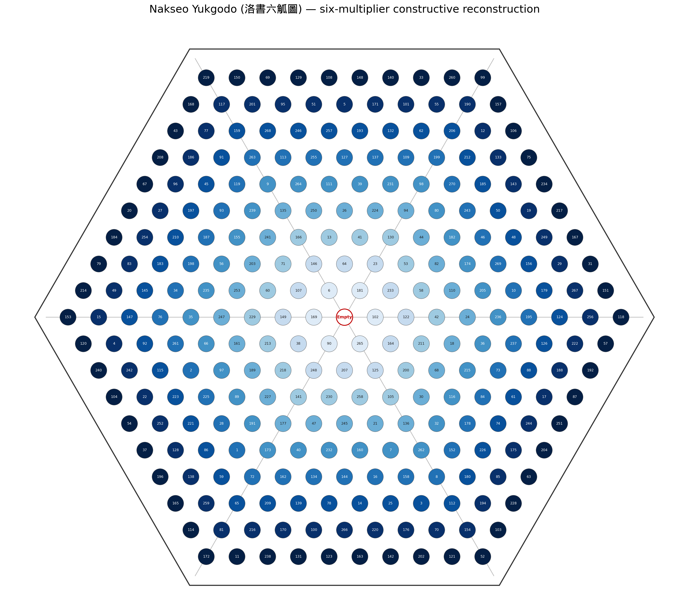
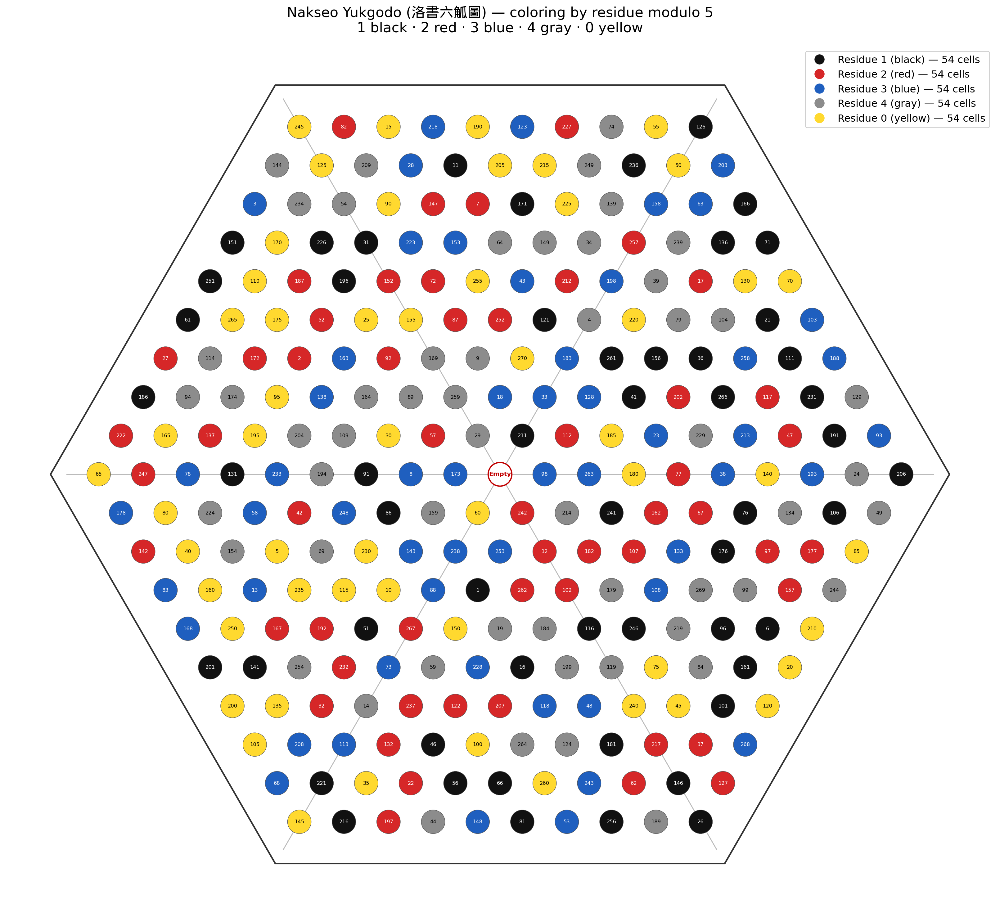
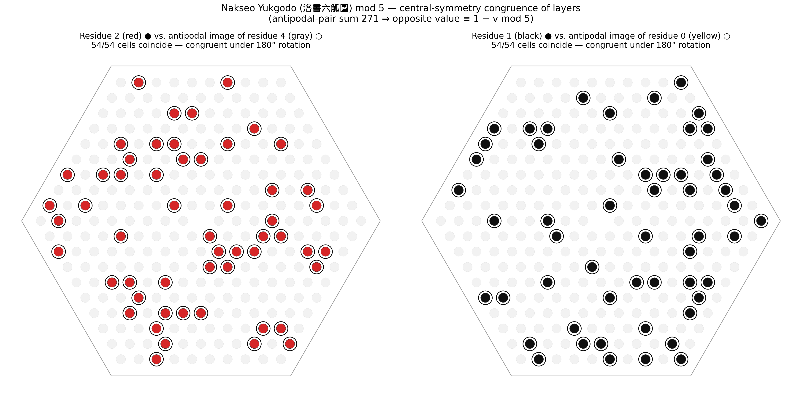

## Confirmed Text

共積二百七十

校計周五十四數

以算遠則係以六

通加洛書數六倍

之數見甲編數器章

虛一則二百七十數

## Appended Manuscript Commentary Image (Handwritten Naejeok Method)

The manuscript commentary describing the Naejeok Method (來積法) is extremely faintly scanned, making the characters difficult to decipher at a glance. Consequently, early automated AI reconstructions (pseudo-transcription data containing hallucinations) were completely discarded. **After contrast adjustment, blurred strokes of every character were split across cropped images for meticulous manual reconstruction, resulting in the character-by-character complete decipherment and transcription into [ALGO_OCR_SUCCESS.md](file:///home/yjlee/gusuryak-translation/english/06-nakseo-yukgodo/ALGO_OCR_SUCCESS.md)**.

By verifying the core numerical properties and operations in this manual transcription text via algebraic graph analysis (`python3 -m yukgodo.naejeok`), we established the high-confidence interpretation that the commentary is not a spatial number placement algorithm, but a **calculative area-chain for verifying the total cell count of the hexagonal grid (積=271, 虛一 270)**.

---

# Nakseo Yukgodo Reconstruction Project

A Python 3 program to reverse-engineer layout configurations (optimal solutions) satisfying the numerical conditions from the deciphered manuscript commentary.

## Interdisciplinary Gap and Restoration Methodology

As detailed in [INTERDISCIPLINARY.md](file:///home/yjlee/gusuryak-translation/english/06-nakseo-yukgodo/INTERDISCIPLINARY.md), Nakseo Yukgodo previously hovered at the boundary of three fields: **History of Mathematics** (limited to primary text reading), **Pure Combinatorics** (with only antipodal sums $271$, the solution space trivially decomposes into $135! \times 2^{135}$), and **Computer Science/Constraint Programming** (unable to extract `.cnf`/MiniZinc specs directly from historical text).

This project implements a 5-step methodology to establish a formal interface across these fields:
1. Reconstruct grid specifications from readable numbers (`ALGO_OCR_SUCCESS.md`, cross-validated with Su Lin's commentary in *Book of Han*).
2. Refute 192 specific constructive models interpreting 添六 as a $\pm 6$ value shift (192 variations) or ring-wise arithmetic progression via numerical evaluation (`output/hypotheses.json`).
3. Disambiguate necessary derived invariants (ring sums $813k$, axis sums $2439$) from arbitrary optimization objectives (side/sector balance).
4. Model the full solution space rather than a single instance (`output/solution.json`, $D_6$ symmetry group).
5. Cross-validate generalized mod N antipodal modular theorems across other diagrams (`yukgodo/modn_generalization.py`).

## Geometric Structure (Confirmed)

The numerical properties in the commentary align perfectly with historical records in the *Book of Han (漢書·律曆志)*: "二百七十一枚而成六觚, 爲一握" and Su Lin's commentary: "其表六九五十四, 算中積凡得二百七十一枚".

- A hexagonal grid of side length 10: center 1 + rings $k$ (each having $6k$ cells, $k=1..9$) = **271 cells**
- **虛一 (Exclude One)**: Leaving the center cell empty $\rightarrow$ **270 cells** (共積二百七十 / 虛一則二百七十數)
- Outer perimeter of **54 cells** (校計周五十四數 = Su Lin's commentary: 六九五十四)
- Total cell count $270 = 6 \times (1 + 2 + \dots + 9) = \mathbf{6 \times 4 5}$ (通加洛書數六倍)
- Central axis (中觚) of **19 cells** (十九爲中觚數也)

## Hypotheses (Consistent with Choi Seok-jeong's other magic squares)

- Placing numbers 1..270 exactly once (consistent with Jisu Gwinumdo 1..30, Huceck Yonggudo 1..72, etc.)
- Values at antipodal (point-symmetric) positions sum to **271** (consistent with the antipodal pair sums in the Joongsang Gwinumdo, etc.)

Under this hypothesis, ring sums ($813k$) and axis sums ($2439$) are structurally guaranteed, and the search optimizes only for side, sector, and ray balance.

## Execution

```bash
python3 tests/test_hexgrid.py     # Test geometric invariants
python3 main.py                   # Search -> Draw -> Analyze properties (output/)
python3 main.py --render-only     # Regenerate drawings and reports using saved solution
python3 -m yukgodo.reverse        # Reverse-engineer rules of the final layout vs. commentary
python3 -m yukgodo.naejeok        # Verify calculation graph of Naejeok commentary numbers
python3 -m yukgodo.mod5           # mod 5 coloring + 5-layer geometric analysis (D6, networkx)
python3 -m yukgodo.modn_generalization  # mod N antipodal modular action - cross-layout validation
```

## Project Documentation

- [NAEJEOK_ASSESSMENT.md](file:///home/yjlee/gusuryak-translation/english/06-nakseo-yukgodo/NAEJEOK_ASSESSMENT.md) — Naejeok Method Evidence & Assessment
- [INTERDISCIPLINARY.md](file:///home/yjlee/gusuryak-translation/english/06-nakseo-yukgodo/INTERDISCIPLINARY.md) — Triple Interdisciplinary Void & Standard Interface Specification
- [ALGO_OCR_SUCCESS.md](file:///home/yjlee/gusuryak-translation/english/06-nakseo-yukgodo/ALGO_OCR_SUCCESS.md) — Deciphered Manuscript Commentary & Numerical Evidence
- [COMPARISON.md](file:///home/yjlee/gusuryak-translation/english/06-nakseo-yukgodo/COMPARISON.md) — Comparative Literature Review
- [DEEP_ANALYSIS.md](file:///home/yjlee/gusuryak-translation/english/06-nakseo-yukgodo/DEEP_ANALYSIS.md) — Geometric and Combinatorial Analysis

## Manuscript Commentary (Naejeok Method) Decipherment, Transcription & Calculation Structure Interpretation

The handwritten manuscript commentary describing the **Naejeok Method (來積法)** in the margins of Nakseo Yukgodo has been **completely deciphered and transcribed character by character** by analyzing stroke details in the scan ([ALGO_OCR_SUCCESS.md](file:///home/yjlee/gusuryak-translation/english/06-nakseo-yukgodo/ALGO_OCR_SUCCESS.md)). Early automated AI pseudo-transcription output (containing hallucinations such as misreading 504 as 506 and incorrect line breaks) was completely discarded, and the confirmed transcription text was established by combining manual character decipherment with algebraic calculation graph verification.

The academic status and confidence criteria for this commentary transcription are as follows:
- **Character Decipherment & Order**: Confirmed (Complete manual decipherment & transcription)
- **Numerical Decipherment & Calculation Chain**: Confirmed (Exhaustively verified via algebraic computational graph)
- **Syntactical Segmentation & Mathematical Function**: Partially Unresolved (Mathematical placement meaning of phrases such as `寄左`/`序左`)

### 1. Essence of the Commentary: Total Cell-Count Calculation (積), Not Spatial Placement
* Previous works guessed phrases like `添六` (Add 6) meant placing numbers at intervals of 6 across the grid.
* However, calculation context overwhelmingly supports interpreting `添六` as an increase in cells per ring (cell-count accumulation), and evaluated $\pm 6$ value placement models all failed.
* The commentary is supported with high confidence as a **calculative chain for verifying the total cell count of the hexagonal grid (積=271, 虛一則 270)**, rather than a spatial arrangement recipe.

### 2. Computational Graph of Manually Deciphered Numbers
Manually deciphered core numbers in the text ($54, 60, 10, 20, 19, 252, 504, 271, 270$) form a strong algebraic calculation chain:

```
置外周五十四，添六得六十      54 + 6 = 60          ┐ 60 is a hub for two paths:
六而一得一十                 60 ÷ 6 = 10           ├ ① Cell count per side
倍之得二十                   10 × 2 = 20           │ ② First+last ring sum term
減一為十九，為中觚數也        20 − 1 = 19          ┘    (6 + 54) × 9 ÷ 2 = 270
添一 iteration (而一加一/添十一) 10→11→…→18 (sum 126)   Upper 9 rows sum
九乘得二百五十二              (10+18) × 9 = 252     = 2 × 126
二百五十二 + 中觚十九         252 + 19 = 271
虛一則二百七十               271 − 1 = 270        = 共積二百七十
```

* **Confirmation of 504**: Early AI pseudo-transcription misreading `五百六` (506) was discarded, confirming **`五百四` (504, 倍之得五百四)** via manual character decipherment and algebraic doubling verification ($252 \times 2 = 504$).
* **Separation of 152 & Nodes 12, 100**: Operations such as `(20 − 12) × 19 = 152` (`寄左以數十二`) and `152 + 100(合百) = 252` are managed separately as contextually useful auxiliary nodes / tentative hypotheses, protecting the independent confidence of the main calculation chain.

### 3. Historical Cross-Validation with *Book of Han* & Su Lin
* `校計周五十四` matches Su Lin's commentary **"其表六九五十四"** (perimeter 54 cells).
* `二百七十一枚而成六觚` (271 cells) and `虛一則二百七十` (270 cells) confirm the exact physical grid specification of Nakseo Yukgodo.

## Project Structure

```
yukgodo/
├── hexgrid.py      # Hexagonal grid model (rings, sides, rays, sectors, axes, antipodal pairs)
├── properties.py   # Property scorer (measures target deviations)
├── solver.py       # Antipodal slot representation + simulated annealing + greedy polishing
├── visualize.py    # Diagram (PNG/SVG) and dashboard rendering
├── analyze.py      # Property analysis report generator (JSON/Markdown)
├── hypotheses.py   # Generator and validator for the 添六 constructive hypothesis
├── reverse.py      # Reverse-engineering of final layout rules + commentary comparison
├── naejeok.py      # Verification graph of Naejeok commentary numbers
├── mod5.py         # mod 5 coloring + 5-layer geometric analysis (D6, networkx)
└── modn_generalization.py  # mod N general theory - cross-validation of other layouts
main.py             # Pipeline entry point
tests/test_hexgrid.py
output/             # solution.json, nakseo_yukgodo.png/.svg, dashboard.png, report.md,
                    # siamese_report.md, reverse_engineering.md, mod5_*.png/.json/.md, etc.
```

## Search Results (Reference: output/)

**We produced an optimal witness solution (penalty 6.0) under the current adopted hypothesis.** Verified properties:

| Property | Target | Measured |
|---|---|---|
| Antipodal Pair Sum | 271 | All 135 pairs correct |
| Ring $k$ Sum | $813k$ (813, ..., 7317) | All 9 rings correct |
| Outer 6 Sides Sum | 1355 each | All 6 sides correct |
| 6 Sectors Sum | 6097/6098 | 6097, 6098, 6098, 6098, 6097, 6097 |
| 6 Rays Sum | 1219/1220 | 1219, 1220, 1219, 1220, 1219, 1220 |
| 3 Axes (中觚) Sum | 2439 each | All 3 axes correct |
| Vertex Sum | 813 (=3×271, structural) | 206+126+245+65+145+26 = 813 |

Because the sectors (45 cells) and rays (9 cells) contain odd cell counts, exact equality is impossible. The alternating values of 6097/6098 and 1219/1220 represent the mathematical optimum.

## Note

This layout is not a direct restoration of a unique historical original; rather, it is an **optimal witness solution constructed under the adopted hypothesis**.

## Hypothesis Verification Conclusions (`output/hypotheses.json`)

1. The readable values in the commentary serve as **verification of the geometric skeleton and cell counts**: $54+6=60$, $60/6=10$ (cells per side), 中觚 19, 252, $252 \times 2 = 504$, $270 = 6 \times 45$. Every verified property matches the grid's mathematical skeleton.
2. The evaluated $\pm 6$ shift and ring-wise AP models all failed. At present, none of the proposed concrete value placement interpretations hold.
3. While character decipherment of `寄左` and `序左` is complete, whether they indicate intermediate storage, calculation progress, or diagram expansion remains unconfirmed in context; there is currently no evidence that they denote a cell placement order.

## Candidate Generation Rules & Local Fingerprints Verification (`output/reverse_engineering.md`)

`yukgodo/reverse.py` uses the final reconstructed layout as a starting point to test for simple constructive rules and compares them against transcribed clauses.

```bash
python3 -m yukgodo.reverse    # Reverse-engineering -> output/reverse_engineering.{json,md}
```

**Reverse-Engineering Attempts (All failed or identified as structural trivialities):**

| Candidate Rule | Result |
|---|---|
| Ring-walk progression (arbitrary step mod 271) | Fails - Best match rate: 16.7% (random noise level) |
| Linear coordinate model: $v \equiv a + b \cdot k + c \cdot j \pmod{271}$ | Fails - Matches only 9/270 cells |
| mod 6 residue class balance (`添六` clause) | No pattern observed |
| Constructive order of antipodal assignment | No pattern observed (longest sequence: 2 pairs) |
| Siamese-type local rules | Fails - Matches only 6/269 transitions (`siamese.py`) |
| 192 variations of `添六` spiral hypothesis | Fails - Best penalty 27,672 (`hypotheses.py`) |

**Commentary Comparison Results:**

- **Confirmed (Cell Count & Geometry)**: 共積二百七十, 虛一則二百七十數, 校計周五十四數, 通加洛書數六倍 ($270=6\times45$), 十九爲中觚數也, and the newly transcribed calculation sequence—outer perimeter 54 × 9 = 486; halve and add 9 = 252; double = 504; halve = 252. It confirms both the geometric derivation $\frac{54\times9}{2}+9=252$ and the fact that removing the 18 non-central cells of the central axes from 270 leaves 252. `添六` confirms that successive ring sizes increase by six.
- **Refuted (Value Placement Interpretation)**: All variations reading `添六` as a value placement rule.
- **Undetermined**: 寄左/序左 (placement sequence), 以算遠則係以六 (illegible text).

**Algorithmic Confirmation — Currently Impossible:**

1. The optimum found using Seed 42 matches the baseline solution at exactly **0/270 cells**. Multiple layouts satisfy the same sum constraints, meaning the reconstructed layout is one of many representative samples.
2. None of these samples show any trace of constructive rules (arithmetic, linear, class, sequential, or local).
3. Therefore, sum constraints alone cannot uniquely restore the original layout or its ordering rules.
4. What can be confirmed is the geometric skeleton, the sum targets, and the refutation of the `添六` value-placement interpretation. Deeper validation requires clearer manuscript scans.

## mod 5 Coloring and mod N Generalization (`output/mod5_report.md`)

Coloring by mod 5 residue classes is a recurring technique in Choi's work (e.g. the 5-coloring in `mod5_residue_diagram.py` of section 02 and the Hadomabangjin 5-coloring document in section 01).
In this project, `yukgodo/mod5.py` divides the optimal solution into 5 layers of 54 cells each, checking D6 symmetries ($12 \text{ elements} \times \text{layer pairs}$).







**Findings**: Layers $2 \leftrightarrow 4$ and $1 \leftrightarrow 0$ are congruent under a 180° rotation (point symmetry), while layer 3 is self-symmetric. No other symmetries exist.

**Derivation (mod N Generalization)**: If all value pairs under an involution $\pi$ ($\pi^2 = \text{id}$) sum to a constant $S$, then for any modulus $m$, $\pi$ acts on mod $m$ residue classes as **$r \mapsto (S - r) \bmod m$**. This holds due to:

1. Applying $v + v' = S \pmod m$ gives $v' \equiv S - v$.
2. The action on residue classes is defined by the involution $r \mapsto S - r$ (orbits of length 2 or fixed points where $2r \equiv S \pmod m$).
3. Since $\pi$ is bijective, $\pi(\text{layer } r) = \text{layer } (S - r)$, explaining the perfect congruence.
4. For this layout, $\pi$ is central point symmetry (180° rotation), meaning layer congruence manifests as geometric grid symmetry.

**Corollary (Parity of Pair Sums)**: If $S$ is odd, no self-paired fixed cells exist. This aligns with our layout's $S = 271$ (odd) and empty center cell. If $S$ is even, the fixed cell's value must be $S/2$, as seen in the central cell (23) of the Joonggung layout of section 02 ($S = 46$).

**Cross-Layout Verification** (`python3 -m yukgodo.modn_generalization`, checking mod 2..9):

| Layout | Pair Sum $S$ | Involution $\pi$ | Result |
|---|---|---|---|
| 06 Nakseo Yukgodo (Reconstructed) | 271 | Central symmetry (180° rotation) | Valid for mod 2..9 |
| 02 Joonggung of Nine Squares | 46 | 3×3 central symmetry | Valid; center cell is $23 = S/2$ |
| 07 Double Eight-Trigrams (Horizontal) | 65 | Horizontal reflection | Valid |
| 07 Houceck Yonggudo | $\approx 73$ (incomplete) | Positional pairs | Fails if mixed; valid if restricted to 16 pairs summing to 73 |

The Houceck Yonggudo shows the necessity of the condition: if the pair sums are not constant, the modular action splits by individual sums. This theorem generalizes to any layout with symmetric complement pairs, extending component-pair checks to arbitrary mod N classes.

**Significance & Limitations**: This property is shared by all solutions satisfying the antipodal pair hypothesis (including Seed 42), meaning it cannot uniquely identify the original layout. However, it serves as a validation tool: if a clearer original manuscript is found and does not display this symmetry, the antipodal complement hypothesis is mathematically disproven.
