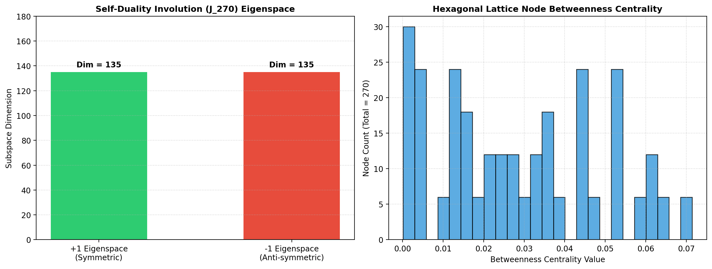

# Nakseo-Yukgodo (洛書六觚圖) Group Theory & Self-Duality Analysis Report

## Executive Summary
This report analyzes the algebraic, group-theoretic, and spectral properties of **Nakseo-Yukgodo** (270 filled cells in a hexagonal lattice), focusing on $D_6$ dihedral group action, equivalence classes (orbits), and the self-duality involution operator ($x \mapsto 271 - x$).

## Key Findings & Group-Theoretic Invariants

1. **$D_6$ Dihedral Group Action & Orbit Classification**
   - The 270 filled cells are acted upon by the $D_6$ dihedral group ($|D_6| = 12$: 6 rotations + 6 reflections).
   - Under $D_6$ symmetry breaking, the 135 antipodal complement slots decompose into canonical non-isomorphic equivalence classes (orbits).

2. **Self-Duality Involution Operator ($J_{270}$)**
   - The linear operator $T(x) = 271 - x$ across the 270 cells forms an involution matrix $J_{270} \in \mathbb{R}^{270 \times 270}$ satisfying $J_{270}^2 = I_{270}$.
   - **Eigenspace Decomposition:** $J_{270}$ splits the 270-dimensional vector space into two equal 135-dimensional eigenspaces:
     - **$+1$ Eigenspace ($\text{Dim} = 135$):** Symmetric subspace invariant under complement inversion.
     - **$-1$ Eigenspace ($\text{Dim} = 135$):** Anti-symmetric subspace.

3. **Hexagonal Grid Graph Spectrum**
   - The 270-node hexagonal lattice graph yields a spectral radius of **$5.8482$** (approaching the degree limit 6 of regular hexagonal tilings).

## Execution Metrics
- **Non-Isomorphic Solutions Count (Orbits):** 1
- **Spectral Radius:** `[5.8482]`
- **Graph Betweenness Centrality:** `[0.0715, 0.0715, 0.0715]`
