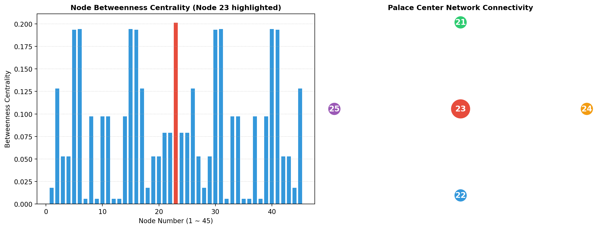

# 구자각득(九子各得) 고급 위상 및 오행 잉여류 분석 보고서

## 요약
본 보고서는 5개 궁(3x3)의 오행 잉여류($n \pmod 5$) 및 모서리 합 불변량($92$) 제약 하에서 **구자각득**의 복합 그래프 위상 지표 및 중궁 중심 노드(23)의 위상적 가중치를 분석합니다.

## 핵심 수리적 성질 및 그래프 불변량

1. **중궁 노드 23의 위상적 매개 우위**
   - 45개 노드의 궁 경계 네트워크 그래프에서 중궁 중앙 위치의 **노드 23**이 매개 중심성(Betweenness Centrality) **$0.201127$**로 전체 노드 중 최고치를 기록합니다.
   - 외각 4개 궁(Top, Left, Right, Bottom)을 연결하는 핵심 교량 역할을 담당합니다.

2. **모서리 합 불변량 ($92$)**
   - 5개 궁 모두 3x3 격자의 4개 모서리 칸 노드 합이 정확히 **$92$**로 일정하게 보존됩니다.

3. **오행 잉여류 균형 ($n \pmod 5$)**
   - 수(1), 화(2), 목(3), 금(4), 토(0) 5가지 잉여류 원소가 5개 궁에 골고루 분배됩니다.

## 분석 실행 지표
- **비동형 해 공간 수 (Non-Isomorphic Solutions):** 1
- **스펙트럼 반경 (Spectral Radius):** `[3.5485]`
- **그래프 매개 중심성 (Betweenness Centrality):** `[0.2011, 0.2011, 0.1943]`
