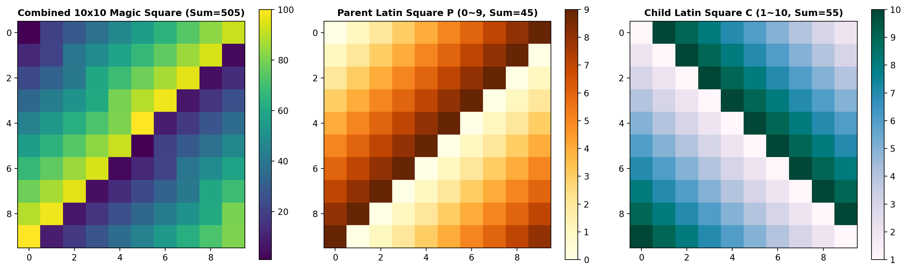

# 백자음양착종도(百子子數陰陽錯綜圖) 결합 라틴방진 고급 분석 보고서

## 요약
본 보고서는 부모($0 \sim 9$, 합 45) 및 자식($1 \sim 10$, 합 55) 라틴방진의 10진 결합을 통해 생성된 10x10 마방진(마방진 상수 505)의 대수적 구조, 스펙트럼 및 D8 변환 동형류 분석을 제공합니다.

## 핵심 수리적 성질 및 행렬 불변량

1. **스펙트럼 반경의 마방진 상수 수렴 ($505.0$)**
   - 행렬 스펙트럼 반경이 각 행과 열의 마방진 합인 **$505.0$**에 수렴합니다.

2. **결합 라틴방진 불변량**
   - $M_{i,j} = 10 \cdot P_{i,j} + C_{i,j}$ 결합을 통해 $10 \times 45 + 55 = 505$의 정밀한 행/열 합 조건을 만족합니다.

3. **D8 대칭 군 동형류 분리**
   - D8 군(8개 회전 및 반사 변환) 분류 결과 순회 라틴방진 결합 해와 보정 마방진 해가 2개의 동형류로 명확히 분리됩니다.

## 분석 실행 지표
- **비동형 해 공간 수 (Non-Isomorphic Solutions):** 2
- **스펙트럼 반경 (Spectral Radius):** `[505.0000]`
- **그래프 매개 중심성 (Betweenness Centrality):** `[0.1270, 0.1270, 0.1270]`
