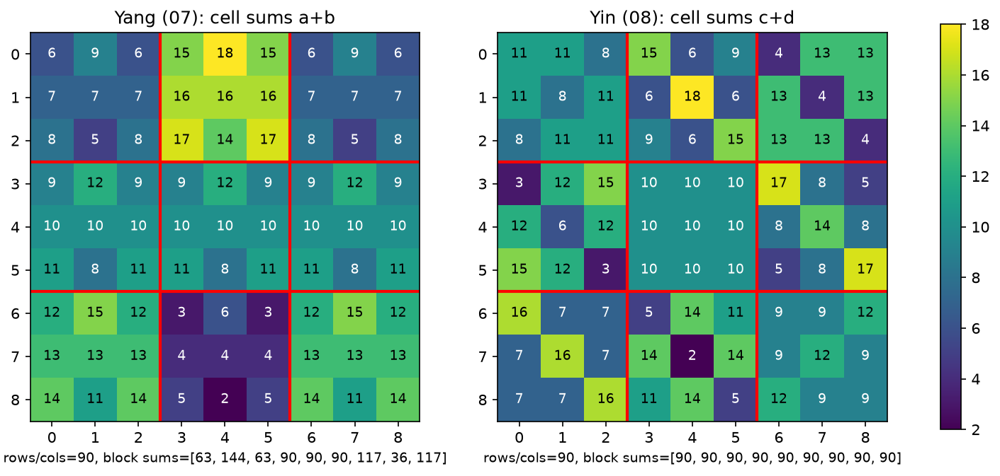
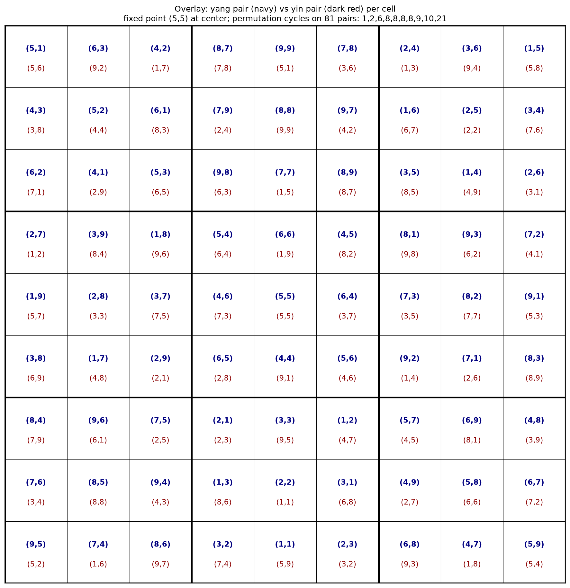

# 九九母數變宮陽圖

> 《九九母數變宮陽圖》 전사 및 번역

—-

# 題名

> 九九母數變宮陽圖

## 번역

**구구수(九九數)를 이용한 궁(宮)의 양(陽) 배치**

—-

# 前註

> 宮兩一變  
> 橫看從看  
> 九數無一  
> 重複者  
> 以下四圖  
> 係新定

## 직역

- 궁(宮)은 둘씩 한 번 변한다.
- 가로세로로 오가며 보면 서로 비슷하다.
- 아홉 수에는 하나도
- 중복되는 것이 없다.
- 아래의 네 도(圖)는
- 새로 정한 것이다.

## 의역

이 배열은 궁(宮) 단위로 서로 대응되며 일정한 변환 규칙을 가진다.
가로 방향에서는 거의 동일한 구조를 유지하지만,
사용되는 아홉 수에는 중복이 없도록 구성하였다.
아래에 이어지는 네 개의 도형은 이러한 원리에 따라 새롭게 정리한 배치이다.

—-

# 좌표 전사

```text
(5,1) (6,3) (4,2) (8,7) (9,9) (7,8) (2,4) (3,6) (1,5)
(4,3) (5,2) (6,1) (7,9) (8,8) (9,7) (1,6) (2,5) (3,4)
(6,2) (4,1) (5,3) (9,8) (7,7) (8,9) (3,5) (1,4) (2,6)
(2,7) (3,9) (1,8) (5,4) (6,6) (4,5) (8,1) (9,3) (7,2)
(1,9) (2,8) (3,7) (4,6) (5,5) (6,4) (7,3) (8,2) (9,1)
(3,8) (1,7) (2,9) (6,5) (4,4) (5,6) (9,2) (7,1) (8,3)
(8,4) (9,6) (7,5) (2,1) (3,3) (1,2) (5,7) (6,9) (4,8)
(7,6) (8,5) (9,4) (1,3) (2,2) (3,1) (4,9) (5,8) (6,7)
(9,5) (7,4) (8,6) (3,2) (1,1) (2,3) (6,8) (4,7) (5,9)
```

—-

# 後註

> 從橫皆得九十數總積八百一十數

## 직역

세로와 가로 방향으로 모두 아흔(90)을 얻으며,
전체의 총합은 팔백십이다.

## 의역

모든 세로·가로 배열은 동일한 합(90)을 이루며,
전체 계산 결과는 810이 된다.

—-

> 本宮圖卽中編母數名圖此前逢本

## 직역

본 궁의 도(圖)는 곧 가운데 편(編)의 모수(母數)를 나타낸 도이며,
앞에서 제시한 본도(本圖)이다.

## 의역

현재의 궁도는 가운데의 기본 모수(母數)를 기준으로 만든 기본 배치이며,
앞에서 설명한 기본 도형과 같은 계열에 속한다.

—-

# 해설

이 도표는 새로운 9×9 방진을 제시하는 것이 아니며, 최석정이 최초로 기술한 직교 라틴방진 계통에 속한다.

*최석정이 제시한 직교 라틴방진 중 준대각선 직교 라틴방진(Semi-diagonal Orthogonal Latin Squares)이 빈번히 등장하며, 이것 역시 그 성질을 지닌다.

기존의 기본 배열(母數)을 여러 궁(宮)으로 재배열하여 얻는 변환형을 설명한다.

주석에서 특히 중요한 부분은 다음 두 가지이다.

- **宮兩一變** — 궁 단위의 변환 규칙이 존재함을 명시한다.
- **九數無一重複者** — 각 배열에서 사용되는 아홉 수는 서로 중복되지 않음을 강조한다.

따라서 이 장의 핵심은 완성된 방진 자체가 아니라,
기본 배열을 서로 다른 궁 배치로 변환하는 생성 규칙에 있다.

—-

# 양도와 음도의 겹침 분석

《九九母數變宮陽圖》와 《九九母數變宮陰圖》를 같은 좌표끼리 겹쳐 검산한 결과이다(`../analyze_overlay.py`, `../visualize_overlay.py`).

**공통 성질**

- 두 도 모두 81개의 순서쌍 (a, b)가 중복 없이 한 번씩 나타난다.
- 두 도 모두 가로·세로 모든 줄의 합이 90이고, 총합은 810이다.

**상보적 구조 — 양도는 행·열 라틴, 음도는 궁 라틴**

- 양도는 각 성분(첫째 수, 둘째 수)이 가로·세로에서 1~9를 한 번씩 쓰는 라틴 방진이다. 종횡 90은 이 성질에서 나온다. 그러나 궁(3×3) 안에서는 순열이 아니어서 궁별 합이 36~144로 고르지 않다 — 본문의 **陽圖則九宮數多少不齊** 그대로이다.
- 음도는 각 성분이 궁 안에서 1~9를 한 번씩 쓴다. 구궁(九宮) 각 90, 궁 내 소행(3칸) 30은 이 성질에서 나온다. 가로·세로는 순열이 아니면서도 합 90을 유지한다.

**宮兩一變의 수치적 확인**

- 양도의 궁별 합은 상하 대칭 궁끼리 짝지어 180을 이룬다(63+117, 144+36). 궁이 둘씩 짝지어 대응된다는 **宮兩一變**과 일치한다.
- 음도에서는 아홉 궁이 모두 90으로 균등하여, 양도의 짝 궁 불균형이 해소된다.

**겹침 순열**

- 같은 자리의 양도쌍 → 음도쌍 대응은 81개 쌍 위의 순열이며, 고정점은 중앙 (5,5) 하나뿐이다(순환 길이 1, 2, 6, 8, 8, 8, 8, 9, 10, 21).
- 각 궁 안에서 양도 성분과 음도 성분을 교차로 겹치면 9개 조합이 중복 없이 나타난다(음도 성분이 궁 안에서 1~9 순열이기 때문).
- 위치 변환(회전·대칭)이나 mod 9 기반 대응 같은 단순 생성 규칙은 성립하지 않음을 확인했다.



