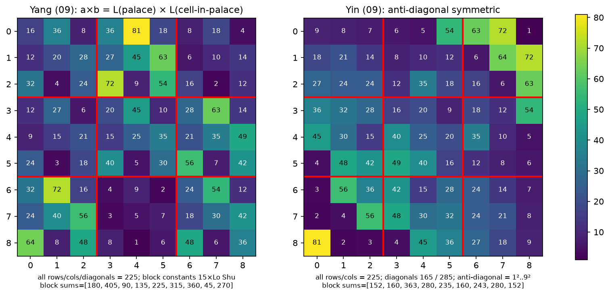
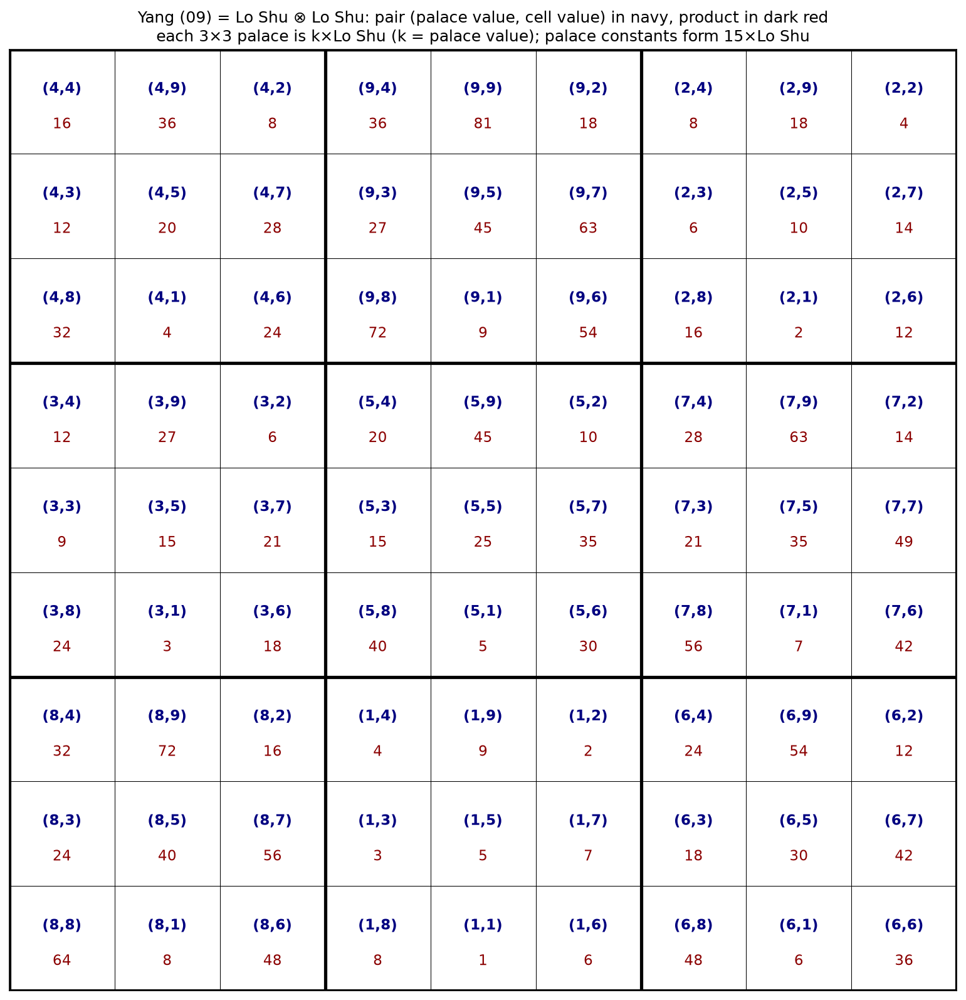

# 구구자수변궁양도(九九子數變宮陽圖)

```text
16 36  8 36 81 18  8 18  4
12 20 28 27 45 63  6 10 14
32  4 24 72  9 54 16  2 12
12 27  6 20 45 10 28 63 14
 9 15 21 15 25 35 21 35 49
24  3 18 40  5 30 56  7 42
32 72 16  4  9  2 24 54 12
24 40 56  3  5  7 18 30 42
64  8 48  8  1  6 48  6 36
```

# 구구자수변궁음도(九九子數變宮陰圖)

```text
 9  8  7  6  5 54 63 72 1
18 21 14  8 10 12  6 64 72
27 24 24 12 35 18 16  6 63
36 32 28 16 20  9 18 12 54
45 30 15 40 25 20 35 10  5
 4 48 42 49 40 16 12  8  6
 3 56 36 42 15 28 24 14  7
 2  4 56 48 30 32 24 21  8
81  2  3  4 45 36 27 18  9
```

—-

# 해설

07·08의 모수도(母數圖)가 순서쌍 (a, b)를 배치한 도라면, 09의 자수도(子數圖)는 각 칸에 그 곱 a×b, 곧 구구수(九九數)를 배치한 도이다. 모수도가 종횡 90을 이루듯, 자수도는 종횡 225를 이룬다. 81개 칸에는 구구단의 81개 곱(순서쌍 (a,b)마다 하나씩)이 정확히 한 번씩 들어 있다 — **九九八十一** 그대로이다.

아래는 두 도를 검산하고 구조를 분석한 결과이다(`../analyze_zisu.py`, `../visualize_zisu.py`).

## 공통 성질

- 81개 칸은 구구단의 81개 곱의 순서쌍 (a,b)마다 정확히 한 번씩 담고 있다(1은 1×1뿐, 25·49·64·81도 각각 한 번뿐인 점까지 일치).
- 모든 가로줄·세로줄의 합이 225이고, 총합은 2025 = 45²이다.
- 곱의 합 225는 모수도의 (a+b) 합 90에 대응한다. 한 줄의 아홉 쌍이 각 성분에서 1~9를 한 번씩 쓰는 경우 곱의 합은 배치에 따라 165~285 사이에서 달라지는데, 두 도 모두 모든 줄의 그 중앙값 225로 고르게 맞췄다. 참고로 음도의 두 대각선 합은 정확히 그 양 극단 165와 285이다.

## 양도: 낙서(洛書)의 크로네커 곱

양도는 **낙서⊗낙서**이다. 낙서 L = (4 9 2 / 3 5 7 / 8 1 6)에 대해, 각 칸의 값은 **L(궁의 위치) × L(궁 안의 위치)**이다. 즉 궁(3×3) 아홉 개가 각각 k×낙서(k = 1,2,…,9)이고, 배수 k의 배치가 다시 낙서이다. 예를 들어 중앙 궁은 5×낙서, 아래 가운데 궁은 낙서 그 자체(k = 1)이다.

- 각 궁은 그 자체로 소마방진이다. 궁 안의 세 칸짜리 소행·소열의 합이 모두 15k로 같다.
- 궁 상수(15k)의 배치 60 135 30 / 45 75 105 / 120 15 90은 다시 15×낙서이며, 그 가로·세로·대각 합이 225이다.
- 따라서 가로·세로뿐 아니라 **두 대각선도 225**이다 — 09 양도는 대각선까지 갖춘 온전한 9×9 마방진이다.
- 각 칸의 순서쌍 (궁의 낙서값, 궁 안의 낙서값)은 81개 순서쌍을 중복 없이 한 번씩 지나가므로, 곱의 관점에서 81곱이 한 번씩 나타나는 것도 이 구조의 직접적인 귀결이다.
- 쌍의 배치 규칙은 07 양도(각 성분이 행·열에서 1~9 순열인 라틴 방진)와는 다른 계열이다.

## 음도: 반대각선 대칭

음도는 양도의 궁 단위 규칙 대신 **반대각선(우상단↔좌하단) 대칭**으로 조직되어 있다. 위의 칸에 대해 cell(r,c) = cell(8−c,8−r)이 성립한다.

- 반대각선 위에는 아홉 개의 제곱수 1², 8², 4², 3², 5², 7², 6², 2², 9²가 놓여 있다. 곧 대각쌍 (k,k)가 모두 이 축 위에 있다.
- 가로·세로는 모두 225이나 대각선은 아니다. 반대각선 합은 제곱수의 합 285, 주대각선 합은 165이며(9, 21, 24, 16, 25, 16, 24, 21, 9 — 회문), 둘의 평균이 225이다.
- 궁별 합 152 160 363 / 280 235 160 / 243 280 152도 반대각선 대칭 쌍끼리 같다(152=152, 160=160, 280=280).
- 08 음도의 후주가 말한 **尨妙** — 겉보기에는 뒤섞여 있으나 묘한 균형 — 과 같은 성격의 배치이다.

## 양도와 음도의 겹침

- 같은 위치에 같은 값이 놓인 칸은 여섯 곳이다: 2행 7열 6, 3행 3열 24, 3행 7열 16, 중앙 25, 7행 7열 24, 8행 3열 56. 07·08 겹침에서 고정점이 중앙 (5,5) 하나인 듯, 여기서도 중앙 25 = 5×5는 양도·음도가 공유한다.
- 양도는 낙서의 자기곱으로 생성되는 규칙 배치, 음도는 같은 81곱을 반대각선 대칭으로 재배열한 혼합 배치로, 07(행·열 라틴)과 08(궁 라틴)의 상보 관계에 대응한다.



