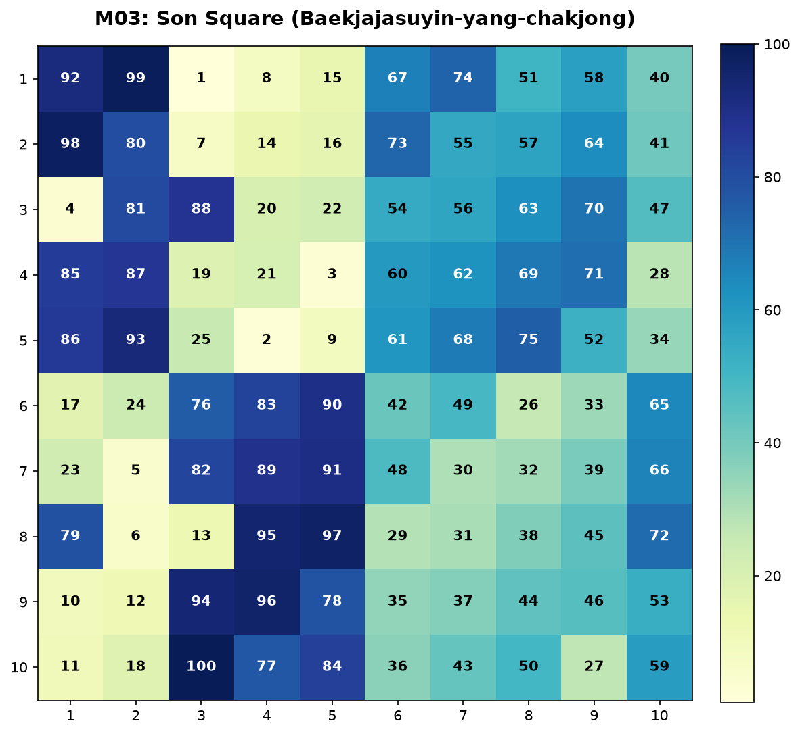
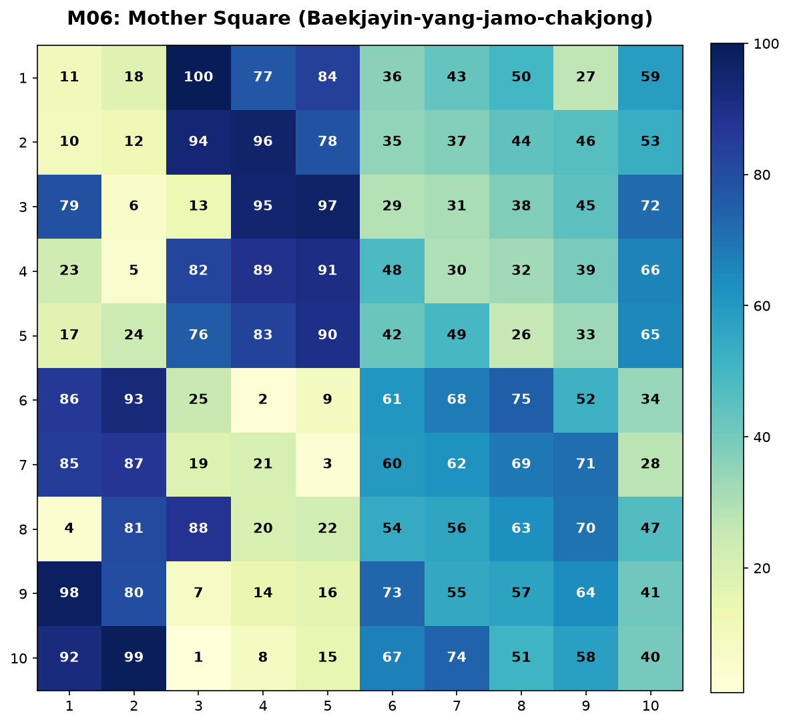
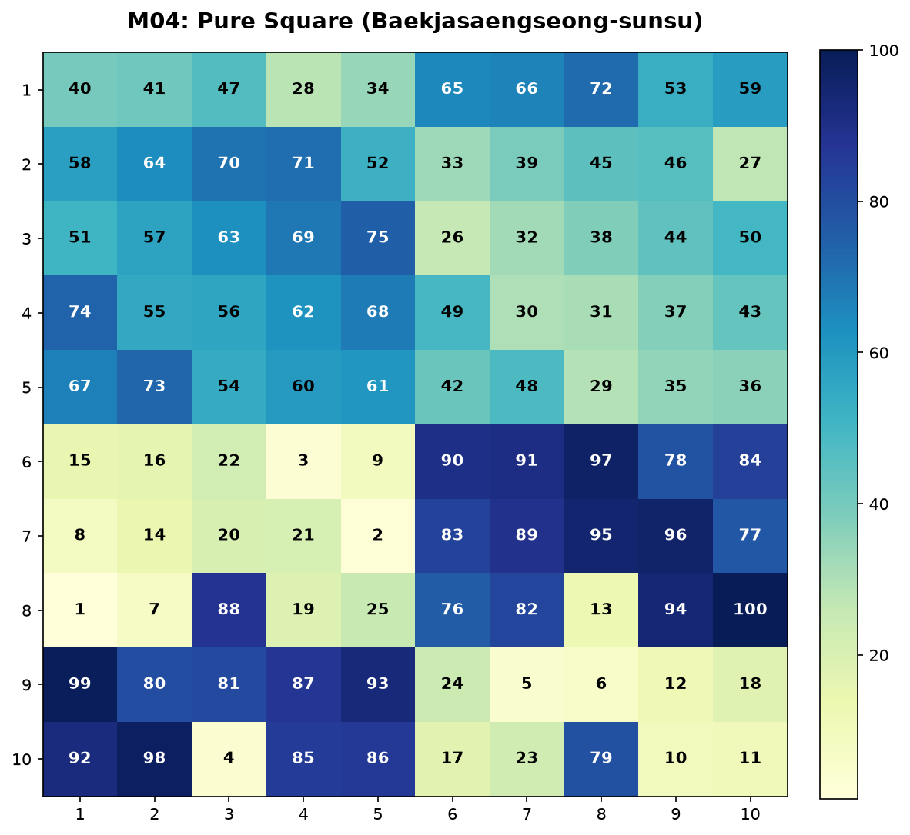
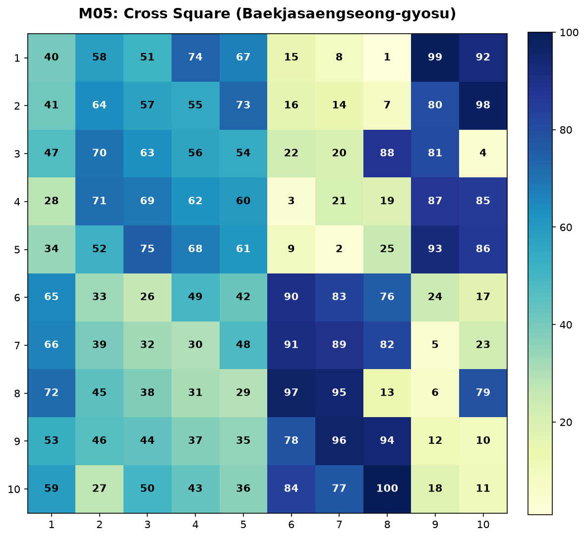

# 백자도(10×10 마방진) 계통의 생성 및 분류 체계 설명서

이 문서는 조선 시대의 실학자 최석정이 저술한 《구수략(九數略)》에 수록된 10×10 백자도(百子圖) 계통 마방진들의 수학적 정의, 구조적 연관성, 그리고 정정본(교정본)들 간의 상보적 도출 원리를 세밀하게 정리한 설명서입니다. 

우주론적이거나 철학적인 해석을 배제하고, 순수하게 수학적인 좌표 변환과 조합론적 규칙을 바탕으로 서술되었습니다.

---

## 1. 핵심 용어 정의 및 번역

동양의 수리 철학과 최석정의 서술 방식을 현대 수학 및 조합론의 언어로 번역하고 정의합니다.

*   **엄마 방진 (Mother Square / 모도 母圖)**
    *   **정의**: 방진 군(Group of Magic Squares) 내에서 다른 변형 방진들을 파생시키는 기준점이자 근원이 되는 방진입니다.
    *   **10×10 매핑**: `06-baekjayin-yang-jamo-chakjong` 폴더의 **백자음양자모착종도(百子陰陽子母錯綜圖) 교정본**이 엄마 방진에 해당합니다.
*   **아들 방진 (Son Square / 자도 子圖)**
    *   **정의**: 엄마 방진의 대칭 변환이나 성분의 공간적 배치를 통해 유도되는 파생 방진입니다.
    *   **주의**: 《구수략》 원전에는 `백자자수음양착종도`와 `백자모수음양착종도`가 10×10 크기의 두 개별 라틴 방진(1~10 및 0~9)으로 분리 수록되어 있으며, 이 둘을 하나로 합성한 1~100 형태의 단일 마방진은 책에 수록되지 않았습니다. 따라서 `03-baekjajasuyin-yang-chakjong` 폴더에는 마방진 교정본(`corrected.md`)이 수록되지 않고 기저가 되는 원본 라틴 방진들의 분석만 포함됩니다. 다만, 대수적/공간적 유도 관계를 설명하기 위해 정의한 1~100 크기의 기준 방진 $M_{03}$을 편의상 '아들 방진(자도)'으로 지칭하며, 분석 모듈 내부에서만 사용합니다.
*   **양의 방진 (Yang Square / 양도 陽圖)**
    *   **정의**: 10진수 조합에서 일의 자리(기본수)를 형성하거나, 방진의 결합 구조에서 홀수 계통의 성분으로 기능하는 $1 \sim 10$ 범위의 수로 채워진 라틴 방진입니다.
*   **음의 방진 (Yin Square / 음도 陰圖)**
    *   **정의**: 10진수 조합에서 십의 자리(가중치)를 형성하거나, 방진의 결합 구조에서 짝수 계통의 성분으로 기능하는 $0 \sim 9$ 범위의 수로 채워진 라틴 방진입니다.

---

## 2. 백자도 생성 체계와 교정본 사용 원칙

### 직교 라틴 방진 기반의 백자도 생성 원리
10×10 크기의 백자도는 두 개의 서로 직교하는 10차 라틴 방진인 **양의 방진 $Y$ (1~10)**와 **음의 방진 $X$ (0~9)**를 중첩하여 만들어집니다.
*   **결합 공식 ("양도 먼저 $\rightarrow$ 음도 다음")**: 십의 자리에 양의 방진을 배치하고, 일의 자리에 음의 방진을 결합하는 방식입니다.
    $$M(i, j) = 10 \times (Y(i, j) - 1) + X(i, j) + 1$$
    이 공식을 통해 $Y(i,j) \in \{1,\dots,10\}$과 $X(i,j) \in \{0,\dots,9\}$의 직교쌍은 중복 없이 $1 \sim 100$의 자연수 100개를 평면 상에 정확히 한 번씩 채우게 됩니다.

### 교정본(정정본) 사용 이유
《구수략》 전사본에 실린 원 배열들은 오랜 세월 동안 필사되는 과정에서 일부 수치들의 탈락 및 중복 오류가 누적되어 정상적인 마방진(가로/세로/대각선 합 505) 조건을 충족하지 못합니다. 
따라서 수리적 검산과 도출 구조의 분석을 명확히 하고자, **오류를 바로잡고 가로, 세로, 주대각선 및 반대각선의 합이 모두 505인 완전한 마방진으로 대칭성을 맞춘 교정본(Corrected Version)**을 기준으로 사용합니다.

---

## 3. 정정본 방진 간의 수학적 도출 관계

10×10 백자도 정정본들은 임의로 만들어진 개별 마방진이 아니라, **기준 방진 ($M_{03}$)**을 기준 축으로 삼아 2차원 공간 대칭군(Dihedral Group)의 변환 법칙에 의해 유기적으로 도출됩니다.

### 1) 아들 방진 $\rightarrow$ 엄마 방진 (상하 반전, `flipud`)
*   **출발 방진**: 기저 변환을 위해 정의된 1~100 크기의 기준 방진 ($M_{03}$)
*   **도출 방진**: `06-baekjayin-yang-jamo-chakjong`의 백자음양자모착종도 교정본 ($M_{06}$, 엄마 방진)
*   **도출 공식**:
    $$M_{06}(i, j) = M_{03}(9 - i, j) \quad (0 \le i, j \le 9)$$
    즉, 기준 방진의 행 순서를 위아래로 거꾸로 뒤집어 배열하면 엄마 방진이 완벽히 도출됩니다.

### 2) 아들 방진 $\rightarrow$ 백자생성순수도 (반시계 90도 회전, `rot90`)
*   **출발 방진**: 기저 변환을 위해 정의된 1~100 크기의 기준 방진 ($M_{03}$)
*   **도출 방진**: `04-baekjasaengseong-sunsu`의 백자생성순수도 교정본 ($M_{04}$)
*   **도출 공식**:
    $$M_{04}(i, j) = M_{03}(j, 9 - i) \quad (0 \le i, j \le 9)$$
    즉, 기준 방진을 시계 반대 방향으로 90도 회전시키면 순수도 교정본이 도출됩니다.

### 3) 아들 방진 $\rightarrow$ 백자생성교수도 (좌우 반전, `fliplr`)
*   **출발 방진**: 기저 변환을 위해 정의된 1~100 크기의 기준 방진 ($M_{03}$)
*   **도출 방진**: `05-baekjasaengseong-gyosu`의 백자생성교수도 교정본 ($M_{05}$)
*   **도출 공식**:
    $$M_{05}(i, j) = M_{03}(i, 9 - j) \quad (0 \le i, j \le 9)$$
    즉, 기준 방진을 좌우로 반사(대칭 이동)시키면 교수도 교정본이 도출됩니다.

---

## 4. 시각 자료 분석

시각화 프로그램을 실행하여 생성된 열지도(Heatmap)를 통해 공간적 대칭성과 수치 분포가 완벽히 대응함을 확인할 수 있습니다.

| 방진 구분 | 시각 자료 | 설명 및 수학적 특징 |
| :--- | :---: | :--- |
| **아들 방진 (자도)**<br>기준 방진 ($M_{03}$) |  | 기준이 되는 가상의 방진입니다. 모든 행, 열, 주대각선 합이 505인 완벽한 마방진입니다. |
| **엄마 방진 (모도)**<br>백자음양자모착종도 교정본 |  | 기준 방진($M_{03}$)을 상하 대칭축을 기준으로 뒤집은($M_{03}$의 flipud) 대칭 방진입니다. |
| **생성한 순수 방진 (순수도)**<br>백자생성순수도 교정본 |  | 기준 방진($M_{03}$)을 원점 기준으로 90도 회전($M_{03}$의 rot90)하여 도출된 방진입니다. |
| **생성한 꼰 방진(교수도)**<br>백자생성교수도 교정본 |  | 기준 방진($M_{03}$)을 좌우 대칭축을 기준으로 뒤집은($M_{03}$의 fliplr) 대칭 방진입니다. |

---

## 5. 파이썬3 검증 프로그램 실행 방법

작성된 `generate.py` 프로그램을 실행하여 위에서 기술한 도출 규칙이 수학적으로 일치하는지 직접 검증하고, 시각 자료를 재생성할 수 있습니다.

### 요구 사항
*   Python 3.x
*   필수 패키지: `numpy`, `matplotlib`

### 실행법
1.  터미널을 열고 본 폴더(`squares-module`)로 이동합니다.
2.  다음 명령어를 실행하여 파이썬 가상환경에 설치된 라이브러리로 코드를 구동합니다.
    ```bash
    # 가상환경의 python3를 직접 가리켜 실행
    ../.venv/bin/python3 generate.py
    ```
3.  **예상 출력**:
    ```text
    === 방진 간 유도 관계 수학적 검증 ===
    M04 == rot90(M03, 1): True
    M05 == fliplr(M03): True
    M06 == flipud(M03): True
      M03 (아들 방진) 마방진 충족 여부 (합 505): True (대각합: 505, 505)
      M04 (순수도) 마방진 충족 여부 (합 505): True (대각합: 505, 505)
      M05 (교수도) 마방진 충족 여부 (합 505): True (대각합: 505, 505)
      M06 (엄마 방진) 마방진 충족 여부 (합 505): True (대각합: 505, 505)
    시각 자료 저장 완료: .../squares-module/figures/m03_son.png
    시각 자료 저장 완료: .../squares-module/figures/m04_pure.png
    시각 자료 저장 완료: .../squares-module/figures/m05_cross.png
    시각 자료 저장 완료: .../squares-module/figures/m06_mother.png
    ```
4.  실행이 끝나면 `figures/` 디렉토리 밑에 정교한 열지도 이미지(PNG)가 생성 및 저장됩니다.
