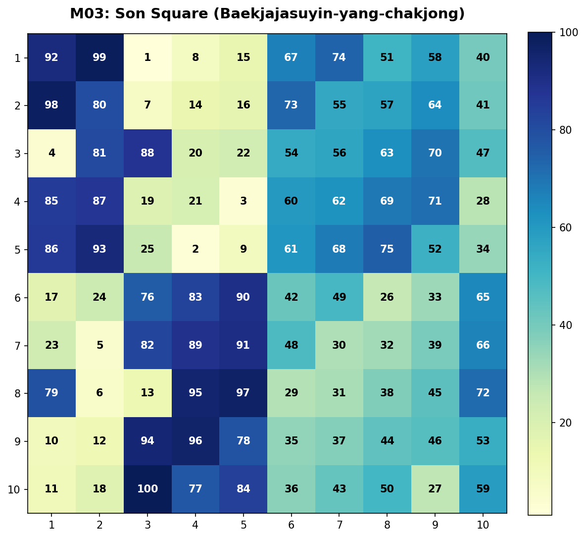
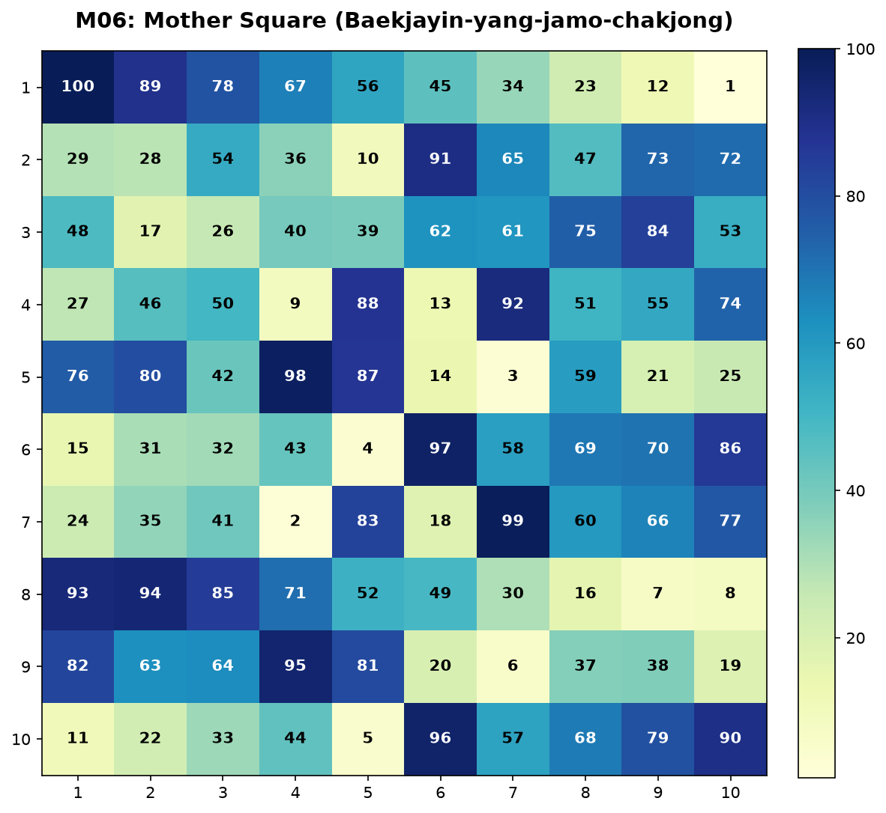
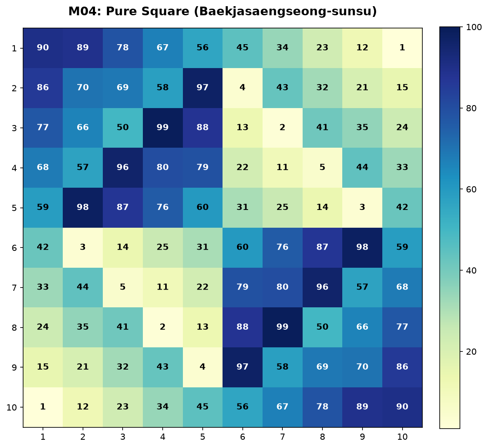
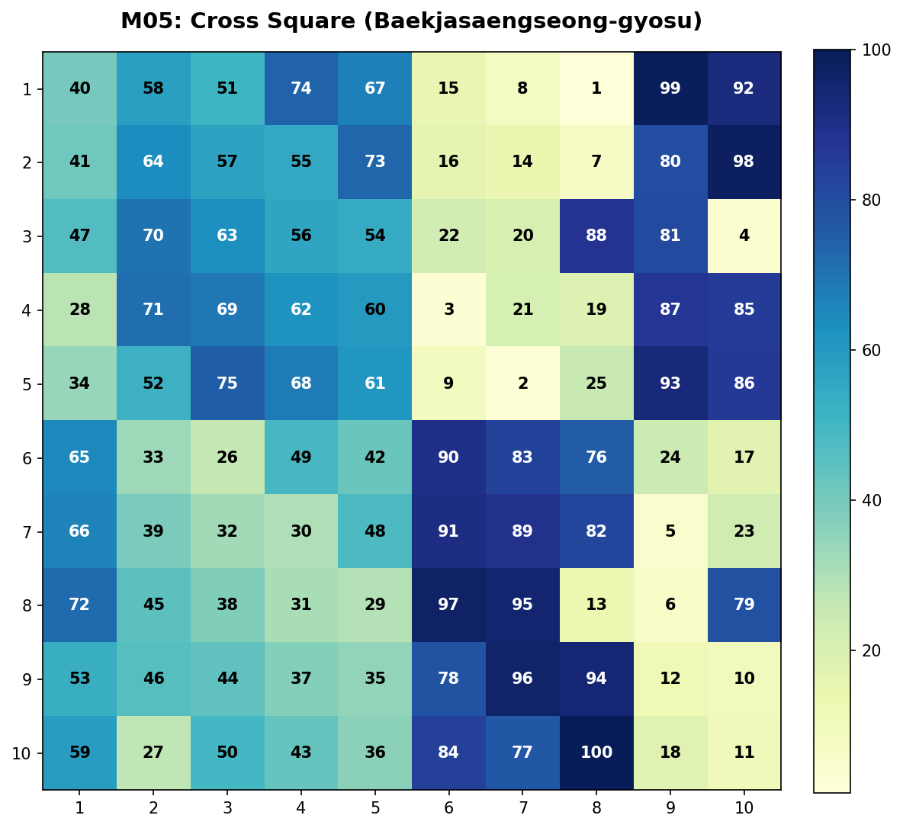

# 백자도(10×10 마방진) 계통의 생성 및 분류 체계 설명서

이 문서는 《구수략(九數略)》의 백자(百子) 계통에서 착안한 10×10 구성 배열들의
좌표 변환을 다루는 수학 모형입니다. 원문 배열의 교정본이나 복원본이 아닙니다.

우주론적이거나 철학적인 해석을 배제하고, 순수하게 수학적인 좌표 변환과 조합론적 규칙을 바탕으로 서술되었습니다.

---

## 1. 핵심 용어 정의 및 번역

동양의 수리 철학과 최석정의 서술 방식을 현대 수학 및 조합론의 언어로 번역하고 정의합니다.

*   **엄마 방진 (Mother Square / 모도 母圖)**
    *   **정의**: 방진 군(Group of Magic Squares) 내에서 다른 변형 방진들을 파생시키는 기준점이자 근원이 되는 방진입니다.
    *   **모형 내 용도**: 이 모듈의 구성 배열 $M_{06}$을 엄마 방진이라 부르며, `06-baekjayin-yang-jamo-chakjong`의 원문 전사와 동일시하지 않습니다.
*   **아들 방진 (Son Square / 자도 子圖)**
    *   **정의**: 엄마 방진의 대칭 변환이나 성분의 공간적 배치를 통해 유도되는 파생 방진입니다.
    *   **주의**: 원전에는 두 라틴방진이 분리되어 있고, 이를 합성한 1~100 마방진은 수록되지 않았습니다. 1~100 기준 방진 $M_{03}$은 이 모듈 안에서만 쓰는 구성 모형입니다.
*   **양의 방진 (Yang Square / 양도 陽圖)**
    *   **정의**: 10진수 조합에서 일의 자리(기본수)를 형성하거나, 방진의 결합 구조에서 홀수 계통의 성분으로 기능하는 $1 \sim 10$ 범위의 수로 채워진 라틴 방진입니다.
*   **음의 방진 (Yin Square / 음도 陰圖)**
    *   **정의**: 10진수 조합에서 십의 자리(가중치)를 형성하거나, 방진의 결합 구조에서 짝수 계통의 성분으로 기능하는 $0 \sim 9$ 범위의 수로 채워진 라틴 방진입니다.

---

## 2. 구성 배열 생성 체계

### 직교 라틴 방진 기반의 백자도 생성 원리
10×10 크기의 백자도는 두 개의 서로 직교하는 10차 라틴 방진인 **양의 방진 $Y$ (1~10)**와 **음의 방진 $X$ (0~9)**를 중첩하여 만들어집니다.
*   **결합 공식 ("양도 먼저 $\rightarrow$ 음도 다음")**: 십의 자리에 양의 방진을 배치하고, 일의 자리에 음의 방진을 결합하는 방식입니다.
    $$M(i, j) = 10 \times (Y(i, j) - 1) + X(i, j) + 1$$
    이 공식을 통해 $Y(i,j) \in \{1,\dots,10\}$과 $X(i,j) \in \{0,\dots,9\}$의 직교쌍은 중복 없이 $1 \sim 100$의 자연수 100개를 평면 상에 정확히 한 번씩 채우게 됩니다.

### 모형의 범위
이 모듈의 배열은 결합 공식과 이면체군 변환을 설명하기 위해 구성한 것이다.
이 배열의 마방진 성질은 원문 전사를 교정하거나 원전의 의도를 복원한다는 근거가 아니다.

---

## 3. 구성 배열 간의 수학적 도출 관계

구성 배열들은 **기준 방진 ($M_{03}$)**을 기준 축으로 하는 2차원 이면체군(Dihedral Group)의 변환 관계를 보인다.

### 1) 아들 방진 $\rightarrow$ 엄마 방진 (상하 반전, `flipud`)
*   **출발 방진**: 기저 변환을 위해 정의된 1~100 크기의 기준 방진 ($M_{03}$)
*   **도출 모형 배열**: $M_{06}$ (엄마 방진)
*   **도출 공식**:
    $$M_{06}(i, j) = M_{03}(9 - i, j) \quad (0 \le i, j \le 9)$$
    즉, 기준 방진의 행 순서를 위아래로 거꾸로 뒤집어 배열하면 엄마 방진이 완벽히 도출됩니다.

### 2) 아들 방진 $\rightarrow$ 백자생성순수도 (반시계 90도 회전, `rot90`)
*   **출발 방진**: 기저 변환을 위해 정의된 1~100 크기의 기준 방진 ($M_{03}$)
*   **도출 모형 배열**: $M_{04}$
*   **도출 공식**:
    $$M_{04}(i, j) = M_{03}(j, 9 - i) \quad (0 \le i, j \le 9)$$
    즉, 기준 방진을 시계 반대 방향으로 90도 회전시키면 순수도 교정본이 도출됩니다.

### 3) 아들 방진 $\rightarrow$ 백자생성교수도 (좌우 반전, `fliplr`)
*   **출발 방진**: 기저 변환을 위해 정의된 1~100 크기의 기준 방진 ($M_{03}$)
*   **도출 모형 배열**: $M_{05}$
*   **도출 공식**:
    $$M_{05}(i, j) = M_{03}(i, 9 - j) \quad (0 \le i, j \le 9)$$
    즉, 기준 방진을 좌우로 반사(대칭 이동)시키면 교수도 교정본이 도출됩니다.

---

## 4. 시각 자료 분석

시각화 프로그램을 실행하여 생성된 열지도(Heatmap)를 통해 공간적 대칭성과 수치 분포가 완벽히 대응함을 확인할 수 있습니다.

| 방진 구분 | 시각 자료 | 설명 및 수학적 특징 |
| :--- | :---: | :--- |
| **아들 방진 (자도)**<br>기준 방진 ($M_{03}$) |  | 기준이 되는 가상의 방진입니다. 모든 행, 열, 주대각선 합이 505인 완벽한 마방진입니다. |
| **엄마 방진 (모도)**<br>모형 배열 $M_{06}$ |  | 기준 방진($M_{03}$)을 상하 대칭축으로 뒤집어 만든 모형 배열입니다. |
| **생성한 순수 방진 (순수도)**<br>모형 배열 $M_{04}$ |  | 기준 방진($M_{03}$)을 원점 기준으로 90도 회전해 만든 모형 배열입니다. |
| **생성한 꼰 방진(교수도)**<br>모형 배열 $M_{05}$ |  | 기준 방진($M_{03}$)을 좌우 대칭축으로 뒤집어 만든 모형 배열입니다. |

---

## 5. 파이썬3 검증 프로그램 실행 방법

작성된 `generate.py` 프로그램을 실행하여 위에서 기술한 도출 규칙이 수학적으로 일치하는지 직접 검증하고, 시각 자료를 재생성할 수 있습니다.

### 요구 사항
*   Python 3.x
*   필수 패키지: `numpy`, `matplotlib`

### 실행법
1.  터미널을 열고 본 폴더(`squares-module`)로 이동합니다.
2.  다음 명령어를 실행하여 파이썬 가상환경에 설치된 라이브러리로 코드를 구동합니다.
    ```bash
    # 가상환경의 python3를 직접 가리켜 실행
    ../.venv/bin/python3 generate.py
    ```
3.  **예상 출력**:
    ```text
    === 방진 간 유도 관계 수학적 검증 ===
    M04 == rot90(M03, 1): True
    M05 == fliplr(M03): True
    M06 == flipud(M03): True
      M03 (아들 방진) 마방진 충족 여부 (합 505): True (대각합: 505, 505)
      M04 (순수도) 마방진 충족 여부 (합 505): True (대각합: 505, 505)
      M05 (교수도) 마방진 충족 여부 (합 505): True (대각합: 505, 505)
      M06 (엄마 방진) 마방진 충족 여부 (합 505): True (대각합: 505, 505)
    시각 자료 저장 완료: .../squares-module/figures/m03_son.png
    시각 자료 저장 완료: .../squares-module/figures/m04_pure.png
    시각 자료 저장 완료: .../squares-module/figures/m05_cross.png
    시각 자료 저장 완료: .../squares-module/figures/m06_mother.png
    ```
4.  실행이 끝나면 `figures/` 디렉토리 밑에 정교한 열지도 이미지(PNG)가 생성 및 저장됩니다.
