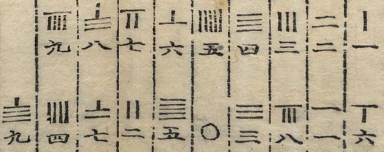

## 數象苐四

수상(數象) 제4 (수의 상에 대하여)

象者數之形也所以布䇿而明數者也有位
상(象)이란 수의 형상이니, 산목(策)을 놓아 수를 명확히 나타내는 수단이다.
斯有象矣故數象次之
자릿수(位)가 있으면 곧 상(象)이 생기므로, 수의 형상(數象)을 다음에 놓는다.

*참고: 산목 표기법은 유니코드에 나오지 않음. 아래는 인도-아라비아 숫자로 대체하였으나 원문의 표기 지침은 별도 이미지로 전달함.*

布筭口訣見啓蒙
산목 놓는 구결은 《산학계몽(算學啓蒙)》에 나온다.

一從十𢖍百立千僵
일의 자리는 세로(從), 십의 자리는 가로(橫)로 놓으며, 백의 자리는 세우고(立) 천의 자리는 눕힌다(僵).

千十相並萬百相望
천의 자리와 십의 자리가 서로 형태를 같이하고, 만의 자리와 백의 자리가 서로 형태를 대응한다.

滿六以上五在上方
6 이상으로 차면 5를 나타내는 산목을 위에 놓는다.

六不積聚五不單張
6은 개별 산목을 6개 쌓지 않으며, 5는 아래쪽에 단독으로 펼쳐 놓지 않는다.

言十過身不滿自當
10을 넘어가면 자릿수를 올리고, 10이 채워지지 않으면 그대로 해당 자리의 수로 삼는다.

若明此訣可習九章
만약 이 구결을 명확하게 안다면 구장산술(九章算術)을 익힐 수 있다.

解曰一者單數也綂徴

해설하여 가로되, 1(一)은 단수(일의 자리 수)이니 통틀어 나타내고

一至九之數十者十數

1부터 9까지의 수이다. 10(十)은 십의 자리 수이니

九十之數

90까지의 수이며,

也統一十至

또한 10부터 통틀어 나타낸다.

遇一則下筭遇二則下二筭三泗五放此六則下 一六而加一於上以當五數七則上一下二八則上一下三九則上一下四即河圖一含五而得六二含五而得七三含五而得八四含五而得九也

1을 만나면 아래에 산목 1개를 놓아두고, 2를 만나면 아래에 2개를 놓으며, 3·4(泗)·5도 이와 같다. 6은 아래에 1개를 놓아두고 위에 1개를 더하여 5의 수에 해당하게 한다. 7은 위에 1개·아래에 2개, 8은 위에 1개, 아래에 3개, 9는 위에 1개·아래에 4개를 놓는다. 이는 곧 하도(河圖)에서 1이 5를 머금어 6이 되고, 2가 5를 머금어 7이 되며, 3이 5를 머금어 8이 되고, 4가 5를 머금어 9가 되는 원리와 같다.

人之手指僂數亦象之也布筭一從一𢖍隂陽錯綜之義也

사람이 손가락을 굽혀 수를 세는 것 역시 이 상(象)을 본뜬 것이다. 산목를 놓을 때 한 자리는 세로(從=縱), 한 자리는 가로(𢖍=橫)로 놓는 것은 음양이 서로 교차하는 뜻이다.

從者宙數也𢖍者宇數也傳曰宇宙在乎手非此之謂歟

세로는 주(宙, 시간)의 수이고, 가로는 우(宇, 공간)의 수이다. 옛 글에 "우주가 손안에 있다"라고 한 것이 바로 이를 두고 한 말이 아니겠는가?

𢖍與横同從輿縦同

𢖍은 橫과 같고, 從은 縱과 같다.

## 해설

산목의 표기법은 5진법이 10진법 안에 쪼개져 있는 형태이다. 가령 6을 표시할 때는 5+1로 표기하고, 7을 표기할 때는 2+7로 표기한다. 자릿수를 바꾸게 되면 착종한다. 이를 통하여 바른 순서로 되어 있는 산목은 $10^{2x}$자리, 뒤집어진 순서로 되어 있는 산목은 $10^{2n+1}$자리라는 읽기 규칙이 생긴다. 이러한 착종 규칙은 과거 산학 뿐만 아니라, 현대 기법을 이해할 때도 많은 도움이 된다. 수학으로 우주를 설명할 수 있다고 주장하는 수학철학적인 선언문을 뒤로 하고 봐도 이것은 매우 명확하다.

만약 f(x)/f'(x)를 표기한다고 하면, 도함수는 가로세로가 모두 뒤집히면서 한 차원이 내려간다. 만약 도함수의 차수를 실수로 제대로 내리지 못한 경우를 가정해 보자. $f(x)=x^3+2x+1$에 대한 접선을 나타내는 $f'(x)=3x^2+2x$를 표기하려 했는데, 실수로 $f(x)=3x^3+2x^2$ 자리에 뒀다. 만약 회전까지는 기억하여 두었는데, 자릿수만을 실수한 것이면 곧바로 도함수의 표기 위치가 잘못된 것을 알고 한 칸 오른쪽 방향으로 밀기만 하면 된다. 아쉽게도 최석정이 살던 시기에서는 서양에서도 미적분학이 이제 막 발전하는 시기였고, 당연히 동양에 수입되었을 리도 만무한 학문이었다. 하지만 역설적으로 미적분학이 수입되고, 모두가 도함수 개념을 아는 이 시대에 산가지의 자릿수 표기법은 우연히 검산 단계에서 큰 이점을 준다. 따라서, 이 교재에 대한 보충 해설도 상태 재활용이 가능하거나 검산이 중요한 경우 산가지를 사용해서 진행한다.

이것이 하도 그래프의 동작 원리에 대해 말하고 있지만, 실상 그 원리를 파헤쳐 보면 오진법이라는 말을 우회적으로 하고 있다. 따라서, 앞으로 구수략을 비롯한 동양 수학 서적을 읽고 풀 때는 오진법과 십진법 모두에 능숙한 것이 좋다.

비록 해설하여 풀 만한 것이 없는 우주론적 설명이지만, 산가지를 쓰는 법은 이 단계에서 아주 잘 익혀 둬야 한다. 앞으로 나올 방정식 등의 문제에서는 복잡한 연산이 산가지나 주판으로 진행될 것이다. 문제없이 따라오려면 잘 쓸 줄 알아야 한다.
가능하면 호너법, 뉴턴-랩슨법, 리차드슨 외삽 등의 현대 수치해석 기법들을 산가지로 해 보아도 좋다. 소 잡는 칼로 닭을 잡으면 안 된다고 하지만, 소 잡는 칼을 잘 쓰는 사람은 닭 잡는 칼도 잘 적응한다.
