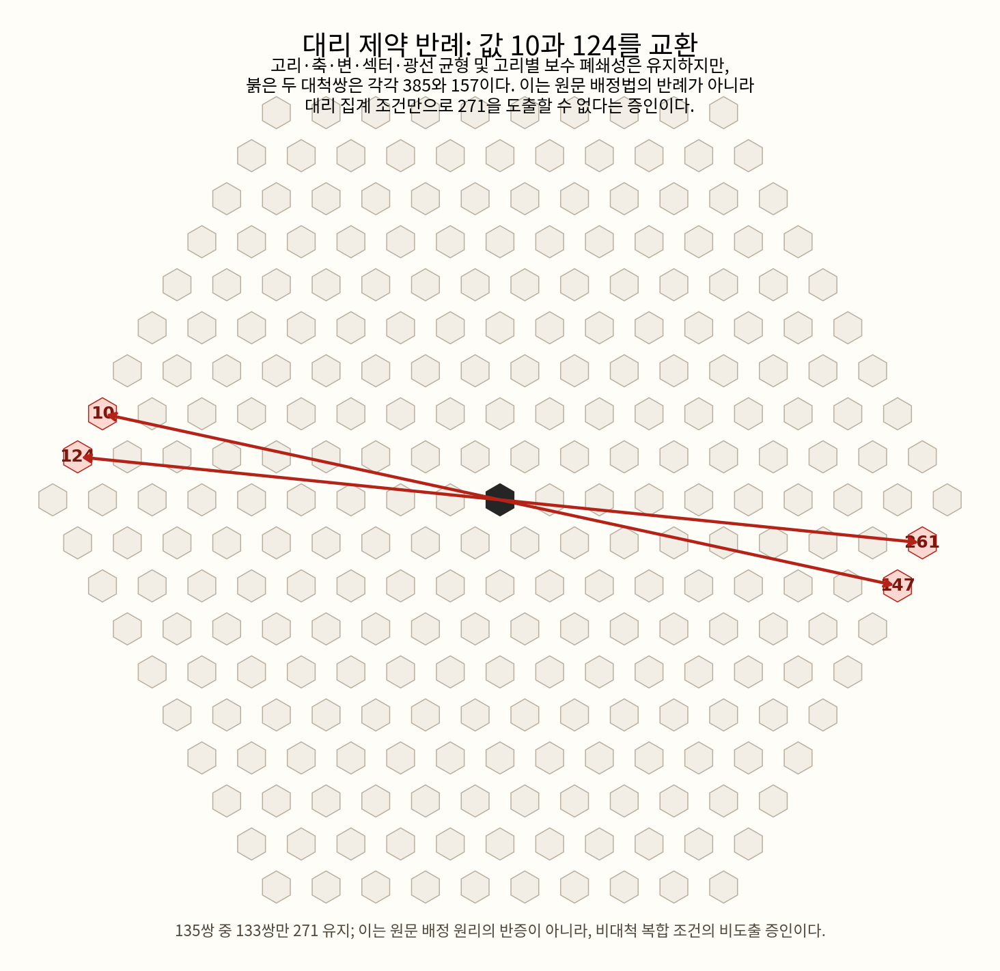

# 대척보수 조건 감사

## 결론

`v(c)+v(-c)=271`은 현재 판독된 來積法과 기하 수치에서 **논리적으로 도출되지 않는다**. 洛書 보수대합, `通加洛書數六倍`, `54+6=60`, 중심대칭 기하, 1…270의 보수 집합은 강한 내부 정합성을 이룬다. 병편의 圓束樣式은 중심 공백의 기하 선례를 보태며, `一百四十四隻`의 `隻`은 짝의 한쪽(외짝)을 세는 단위이므로 대척쌍 단위의 강한 내부 선례도 보탠다.

따라서 문서 전체에서 다음 두 층을 구별한다.

| 층 | 판정 |
| --- | --- |
| 271칸·虛一·외주54·변10·中觚19·`19+2×((10+18)×9/2)=271` | 원문/기하에서 직접 또는 강하게 지지 |
| 대척 위치의 값 합 271 | 강한 복원 조건; 위치-값 대응의 직접 문구는 미확인 |

병편 〈太陰之數〉 제2법(二之四)의 선례는 중심의 유일한 고정점을 비워 주변을 쌍 단위로 남기는 최소 모형(7→6=2×3)이며, 육고도의 `271→270=2×135`와 구조가 같다. 자세한 전사와 개념도는 README의 해당 절을 따른다.

## 가설-제거 실험

기존 `yukgodo.solver`는 처음부터 135개 대척 슬롯에 `(i, 271-i)`를 넣는다. 그 모델은 가설 아래의 증인해를 찾는 데에는 적합하지만, 대척보수가 다른 조건에서 나오는지를 시험할 수는 없다. 이를 피하기 위해 `yukgodo.antipodal_audit`는 저장된 조건부 증인해에서 같은 구조 소속을 가진 두 셀의 값을 맞바꾼다.

재현 명령:

```bash
python3 tests/test_antipodal_audit.py
python3 -m yukgodo.antipodal_audit
```

2026-08-09 실행에서 외주 9고리·제5변에 함께 속하고 어느 中觚 축에도 속하지 않는 두 셀 `(-9,1)`, `(-9,2)`의 값 `10`, `124`를 교환했다. 그 결과는 다음과 같다.

| 조건 | 결과 |
| --- | --- |
| 값 집합 | 1…270을 한 번씩, 총합 36585 유지 |
| 고리합 | `813, 1626, …, 7317` 전부 유지 |
| 축합 | `2439, 2439, 2439` 유지 |
| 6변합 | 각 `1355` 유지 |
| 섹터합 | 모두 6097 또는 6098 유지 |
| 광선합 | 모두 1219 또는 1220 유지 |
| 대척합 271 | 135쌍 중 133쌍만 성립; 절대편차 합 228 |

따라서 현 솔버가 사용하는 다른 균형 목표와 위 집계까지 보태어도, 대척보수는 필연이 아니다. 같은 종류의 국소 교환을 조건부 증인해 전체에서 전수 검사하면 500개 이상이 성립한다. 이는 방대한 해공간에서 우연히 얻은 단일 예외가 아니라, 집계 제약이 위치-값 등변성을 대체하지 못한다는 구조적 사실이다.



다만 이 반례는 역사적으로 그 원리를 채택할 동기가 약하다는 뜻도, 원문이 대척보수를 부정한다는 뜻도 아니다. 시험을 위해 `v∘τ=κ_{271}∘v`를 고의로 제거한 반사실일 뿐이다. 따라서 이것은 90% 이상의 논리적 확정을 막는 경계이지, 원문의 해석적 가능성을 그 자체로 낮추는 부정 증거가 아니다.

## 來積法 해독과의 관계

가장 정합적인 후반 계산망은 다음의 도형 적수 해석이다.

\[
271 = 19 + 2\left(\frac{10+18}{2}\times9\right).
\]

이는 中觚와 양쪽 동형 梯田 영역의 분해를 설명한다. 그러나 여기의 271은 전체 칸 수이며, 확인된 구절에는 `對觚相合二百七十一` 또는 `相對二數合二百七十一`처럼 셀 값의 대척합을 지시하는 문장은 없다. 그러므로 來積法의 해독 강화와 대척보수 가설의 강한 동기는 인정하되, 양자를 동일한 증거 등급으로 합치지 않는다.
