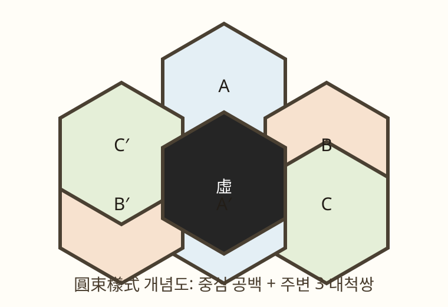

## 확실한 원문

共積二百七十

枚外周五十四數

以筭法則係以六

通加洛書數六倍

之數見甲編數器章

虛一則二百七十數

## 첨부 주석 이미지 (친필 來積法)

來積法이라 적힌 친필 주석은 스캔이 매우 흐려 원필의 자형을 한눈에 식별하기 어려웠습니다. 이에 따라 초기의 단순 AI 자동 재구 데이터(환각이 섞인 의사전사 데이터)는 폐기하였습니다. **[ALGO_OCR_SUCCESS.md](file:///home/yjlee/gusuryak-translation/korean/06-nakseo-yukgodo/ALGO_OCR_SUCCESS.md)는 스캔의 명암·대비 조정과 흐린 자형의 세부 이미지 필획 대조를 거친 현재의 자형 단위 전사를 기록하며, 불확실한 조작 기능은 읽을 수 있는 글자와 분리해 둡니다.**

이 수기 전사문에 나타나는 일부 핵심 수치와 계산 관계는 대수적 계산 그래프 분석(`python3 -m yukgodo.naejeok`)으로 교차 점검합니다. 현재 가장 잘 지지되는 해석은 친필 주석이 숫자의 공간 배치 알고리즘보다 **육각 격자의 총수를 산출·검산하는 절차(積=271, 虛一 270)**에 관한 것이라는 견해입니다. 이는 해석이지 복원된 배치 규칙은 아닙니다.

이 해석에는 사용자가 직접 OCR한 병편의 [병행 원문 OCR](BING_PARALLEL_OCR.md)이 추가 내부 근거를 제공합니다. `每十八隻包中六外成六觚`와 이어지는 `添六隻`·`以十二而一得八隻`은 `包`·`隻`·`添六`·`而一`을 육각 형성 및 적수 계산의 한 어휘권에 놓습니다. 병편 원문은 자동 보정 없이 보존하고, 작업용 띄어쓰기·단락본은 원문과 구분해 기록했습니다. 이로써 내적법의 기하·적수 독해는 강화되지만, 대척 셀의 값합 271을 직접 지시하는 문구가 새로 생기는 것은 아닙니다.

---

# 洛書六觚圖 복원 탐색 프로젝트

낙서육고도의 역사적 격자 사양을 복원하고, 문헌 내적 대척보수 복원원리 아래 가능한 균형해(증인해)를 탐색하는 Python 3 프로그램.

이 프로젝트는 洛書六觚圖의 유일한 원배열이나 소실된 배정법을 복원한다고 전제하지 않는다. 인쇄 본문과 친필 來積法에서 확인되는 육각 격자의 적수 구조를 형식화하고, 최석정의 다른 낙서 도상에서 확인되는 보수대합 구성법을 **문헌 내적 대척보수 복원원리**로 적용하여 그 조건부 귀결을 분석한다. 이어 역사적 불변량과 분리된 현대적 균형 목적함수 아래 기본 해공간의 구조를 형식화하고, 추가 균형 제약 아래 증인해를 탐색한다.

### 대척보수 주장에 관한 판정 규약

`v(c)+v(-c)=271`은 현재 확정 원문이 명령한 전사 조건으로 취급하지 않는다. 원문과 계산으로 직접 지지되는 것은 271칸, 虛一 뒤 270칸, 외주 54, 한 변 10, 中觚 19, 그리고 `19+2×((10+18)×9/2)=271`이라는 기하적 적수 분해이다. `洛書數六倍` 및 `54+6=60`은 洛書의 보수쌍을 6배한 고리 크기와 정합하지만, 그것만으로 위치 대척쌍에 값 보수쌍을 배정하는 명제는 나오지 않는다.

따라서 솔버의 대척 슬롯 표현은 이 **복원원리를 채택한 뒤의 조건부 탐색 공간**이다. 별도 감사 실험은 대척 조건을 제거한 모델에서, (a) 원문·기하 조건이 대척보수를 강제하는지, (b) 추가한 집계 제약이 이를 강제하는지를 반례 탐색으로 각각 판정한다. 결과와 증인 반례는 `ANTIPODAL_AUDIT.md`에 기록한다. 반례의 올바른 범위와 책 내부 근거의 종합은 [ANTIPODAL_RECONSTRUCTION_PRINCIPLE.md](ANTIPODAL_RECONSTRUCTION_PRINCIPLE.md)에 정리한다.

낙서 계열을 하나의 원리로 정식화한 [낙서 확장 일반화](../nakseo-generalization/README.md)는 대척보수의 정확한 공통분모를 위치 대합–값 보수 대합의 **등변성**으로 쓴다.

《구수략》 전체에서 이 등변성이 실제로 쓰이는 범위, 그리고 `包`·`隻` 전사 수정 뒤의 가설 재정식화는 [구수략 등변성 범위 감사](GUSURYAK_EQUIVARIANCE_AUDIT.md)에 기록한다.

\[
v\circ\tau=\kappa_S\circ v,\qquad\kappa_S(x)=S-x.
\]

이 원리를 채택하면 모든 위치 `p`에서 `v(p)+v(τp)=S`가 필연이다. 육고도에서는 중심을 비운 270 위치가 135개 대척쌍이고, 값 1…270도 `x↔271-x`의 135 보수쌍이므로, 등변 확장을 최소 배정 원리로 채택할 경우 `v(c)+v(-c)=271`은 선택사항이 아니라 필연이다. 반대로 등변성을 채택하지 않으면 그 식은 나오지 않는다. 아래의 책 내부 증거들은 저자가 이 등변 확장을 채택했을 가능성을 보강하지만, 반례 감사가 보인 논리적 비도출성을 없애지는 않는다.

### 원저자의 명명 `洛書六觚圖`가 갖는 무게

원저자가 이 도안을 단순한 六觚圖가 아니라 **洛書六觚圖**라고 이름 붙인 사실은 확정된 1차 증거다. 제목 하나만으로 셀 배정법을 문자 그대로 적었다고 할 수는 없다. 그러나 이 명명은 육고도를 낙서 원리와 무관한 육각 격자가 아니라, **낙서 원리 아래 읽어야 할 육고형 확장**으로 제시했다는 강한 내부 증거다.

그 해석은 다음의 서로 독립적인 사실이 한 방향을 가리킬 때 특히 강해진다.

1. 洛書九九圖·洛書五九圖·洛書七九圖는 회전·반사를 허용하면 같은 3×3 낙서 배열을 제어 배열로 보존한다.
2. 洛書九九圖는 합 91의 보수쌍을 실제 균형 구성 규칙으로 사용한다. 즉 보수쌍은 사후 관찰이 아니라 낙서 계열의 수 구성법이다.
3. `通加洛書數六倍`는 낙서의 `k↔10-k`를 `6k↔6(10-k)`로 올리고, 來積法은 그 첫 쌍을 정확히 `54+6=60`으로 계산한다.
4. 병편 〈太陰之數〉 제2법의 圓束樣式은 유일한 중심을 비우고 주변을 세 대척쌍으로 남긴다.

따라서 `洛書六觚圖`라는 제목은 위 네 층과 결합할 때, 대척보수 배치를 단순히 가능한 현대 가설이 아니라 **책 내부의 낙서 확장 문법에 충실한 고확률 복원 원리**로 만든다. 다만 육고도 본문에 `對觚相合二百七十一`과 같은 직접 위치-값 명령이 확인되기 전까지, 이 결론의 증거 등급은 "강한 내부 복원 조건"이며 "직접 전사 조건"은 아니다.

낙서 계열의 실제 조건까지 모두 함께 넣은 임계 실험도 같은 경계를 확인했다. 낙서의 대합 10·중심 5, 洛書九九圖의 91 보수 구성, 각 고리의 271-보수 폐쇄성, 圓束樣式의 3 대척 궤도, 6배 고리 대합 60, 그리고 모든 집계 균형을 동시에 만족하는 반례가 존재한다. 조건부 증인해에서 같은 고리·축·변 소속 두 값만 바꾸는 국소 교환도 500개 이상 남는다. 이는 대리 집계 조건의 구조적 한계이지 원문 배정법의 반증은 아니다. 따라서 현 조건들의 결합만으로 90% 이상을 논리적으로 선언할 수는 없지만, 그 반례만으로 역사적 가능성을 더 낮출 수도 없다. 상세 결과와 시각화는 [NAKSEO_FAMILY_EVIDENCE.md](NAKSEO_FAMILY_EVIDENCE.md)에 기록한다.

낙서 계열을 한 원리로 일반화한 [낙서 확장 일반화](../nakseo-generalization/README.md)는, 대척보수의 정확한 공통분모를 `v∘τ=κ∘v`라는 **위치 대합–값 보수 대합의 등변성**으로 정식화한다. 이 원리를 육고도에 적용하면 `270=2×135`의 위치쌍과 `1…270`의 135 보수쌍이 대응하므로 `v(c)+v(-c)=271`은 필연이다. 반대로 등변성을 채택하지 않으면 그 식은 나오지 않는다. 따라서 아래의 책 내부 증거들은 "등변 확장을 저자가 채택했을" 근거를 보강하지만, 반례 감사의 논리적 결론을 바꾸지는 않는다.

### 《九數略》 병편 〈太陰之數〉 제2법(二之四)의 중심 공백·쌍 단위 선례

사용자가 직접 확인하여 전사한 위키미디어 공용 원본 [《九數略》 제2책 PDF, 40쪽](https://commons.wikimedia.org/wiki/File:CNTS-00089712122_2_九%E6%95%B8%E7%95%A5.pdf)의 병편, **〈太陰之數〉 제2법(二之四)** 원문은 다음과 같이 이어진다.

> 日一率 元數 借筭
>
> 月耳率 顯數 倍積
>
> 星三率 法數 從方
>
> 辰四率 隱數 堆面
>
> 遞除凡遞加之積夫者如主平者
>
> 如梯故必倍積
>
> 求之以倍積為次率從方為三率
>
> 借一算為首率以平方開之得四率面數
>
> 問循次遞加之數総積一百三十六
>
> 其位數與尾為
>
> 面數幾何
>
> 此如主田開方
>
> （一，一）
>
> （二，二百七十二，倍積）
>
> （三，一，從方）
>
> （四，六十，面數亦為位數）
>
> 問桑加之數二為數
>
> 總積一百八十九
>
> 其位數與尾位面數其何
>
> 此如梯田開方

> 今有方箭束一百四十四隻問外周幾何
>
> （一，一）（二，二千二百八十八，列積減一以六十乗之）（三，八，從方）（四，四十四）

같은 면에서 가운데 7칸만 떼어 보인 소도형의 명칭은 **圓束樣式**이다. 중심 칸을 검게 칠해 비우고 주변 여섯 칸만 남긴다. 아래 그림은 원본 스캔을 대체하는 것이 아니라, 圓束樣式의 구조만 표시한 개념도다.



앞 문맥은 `遞加`되는 도형 수를 `倍積`·`從方`·`面數`·`位數`의 네 율로 풀고, 平·梯田의 개방으로 설명한다. 이어지는 전사는 `方箭束一百四十四隻`이다. 여기서 `隻`은 단순 물건 수가 아니라 **짝의 한쪽(외짝)**을 세는 말이다. 그러므로 圓束樣式의 중심 공백과 남은 여섯 자리의 대척쌍을 함께 놓으면, 이 사례는 "쌍 전체"가 아니라 **각 쌍을 이루는 개별 위치 단위**를 세는 선례가 된다. 이는 대척 위치–값 보수 대응을 직접 명령하지는 않지만, 쌍 구조를 약화시키는 판독이 아니라 오히려 그 단위성을 보강한다.

| 병편의 7칸 소도형 | 육고도 |
| --- | --- |
| 7칸 가운데 중심 1칸을 비움 | 271칸 가운데 중심 1칸을 虛一 |
| 남는 6칸 = 중심대칭의 3쌍 | 남는 270칸 = 중심대칭의 135쌍 |
| 도형 수 계산 안에서 `一百四十四隻`으로 각 외짝을 셈 | 값 1…270은 `1↔270`, …, `135↔136`의 135 보수쌍으로 분해 |

반지름 1의 7칸에서 중심을 빼면 대척 궤도는 정확히 3개이고, 반지름 9의 271칸에서 중심을 빼면 정확히 135개이다. 값 집합 1…270도 합 271인 135개의 고정점 없는 보수쌍으로 정확히 분해된다. 따라서 "중심 공백 뒤 위치쌍과 값쌍을 대응시킨다"는 것은 이 도상·이 책 내부의 가장 작은 구조와 완전히 일치한다.

그러나 이 일치는 **대척쌍 단위의 강한 내부 근거**이지, `對觚相合二百七十一` 같은 직접 위치-값 명령문은 아니다. `隻` 판독은 쌍의 한쪽을 세는 구조를 보강하지만 합 271을 문자 그대로 주지는 않는다. 실제로 대척 조건을 제거한 반례 실험은 나머지 집계 조건이 그 대응을 논리적으로 강제하지 않음을 보인다. 따라서 이 사례는 직접 전사 조건은 아니되, 중심 공백·대척 위치쌍·외짝 단위를 함께 보이는 강한 복원 근거다.

## 근거 범주와 작업 흐름

[INTERDISCIPLINARY.md](file:///home/yjlee/gusuryak-translation/korean/06-nakseo-yukgodo/INTERDISCIPLINARY.md) 문서에서 상세히 조명하듯, 낙서육고도는 **수학사** (1차 원문 해독에 머무름), **순수조합론** (1–270 순열과 대척보수 조건만 두면 해공간이 $135! \times 2^{135}$로 직접 분해되어 추가 제약 없이 단순 분해됨), **CS/제약프로그래밍** (원문에서 `.cnf`나 MiniZinc 사양을 독자적으로 추출 불가능)의 경계에 걸쳐 있었습니다.

다음 작업 흐름은 원문 근거·가설·파생 결과·계산 실험을 분리합니다([EVIDENCE.ko.md](../../EVIDENCE.ko.md) 참고).
1. 판독 가능한 수치에서 격자 사양 복원 (`ALGO_OCR_SUCCESS.md`, 《漢書·律曆志》 蘇林 注 대조)
2. `添六`을 값의 ±6 이동으로 해석한 192개 변형과 고리별 등차 배정 모형을 각각 검증하여 반증 (`output/hypotheses.json`)
3. 필연적 파생 조건(고리합 $813k$, 축합 $2439$)과 임의 목적함수(섹터·광선 균형)의 엄격한 분리
4. 기본 해공간의 구조를 형식화하고, 추가 균형 제약 아래 증인해를 탐색 (`output/solution.json`, $D_6$ 대칭 작용)
5. 다른 도상에 mod N 대척 잉여류 일반화 정리를 교차 검증 (`yukgodo/modn_generalization.py`)

## 기하 구조 (확정)

문헌적 수치와 기하 계산이 정확히 일치하여, 육고도의 271칸 중심육각 격자 구조를 확정한다 (《漢書·律曆志》 "二百七十一枚而成六觚, 爲一握" 및 蘇林 注 "其表六九五十四, 筭中積凡得二百七十一枚").

- 한 변 10칸의 육각 격자: 중심 1 + 고리 k(각 6k칸, k=1..9) = **271칸**
- **虛一**: 중심을 비움 → **270칸** (共積二百七十 / 虛一則二百七十數)
- 외주 **54칸** (枚外周五十四數 = 蘇林注의 六九五十四)
- 총 칸 수 270 = 6×(1+2+...+9) = **6×45** (通加洛書數六倍)
- 중앙 가로줄(中觚) **19칸** (十九爲中觚數也)

## 재구 가설: 최석정의 다른 도상에서 확인되는 보수대합 수법의 적용

- 값 1..270을 한 번씩 배치 (지수귀문도 1..30, 후책용구도 1..72 등과 같은 체계)
- 대척점(점대칭) 위치의 두 값은 합 **271**의 보수쌍 (中上龜九圖 등의 보수쌍 수법)

이 가설 하에서 고리 k 합 = 813k, 중심 공백을 제외한 각 대척축의 18개 값 합 = 9×271 = 2439는 구조적으로 자동 성립하고,
탐색은 변·섹터·광선의 균형만 찾는다.

## 실행

```bash
python3 tests/test_hexgrid.py     # 기하 불변량 테스트
python3 main.py                   # 탐색 → 도안 → 성질 분석 (output/)
python3 main.py --render-only     # 저장된 해로 그림·리포트만 재생성
python3 -m yukgodo.reverse        # 후보 생성 규칙 및 국소 지문의 검증
python3 -m yukgodo.naejeok        # 來積法 판독 수치의 계산 그래프 전수조사
python3 -m yukgodo.antipodal_audit  # 대척보수 복원원리 제거 반례 감사
python3 -m yukgodo.mod5           # mod 5 잉여류 채색 + 5층 기하 관계 전수조사
python3 -m yukgodo.modn_generalization  # mod N 대척 잉여류 작용 — 교차 도안 검증
```

## 외부 증거 서브모듈

외부 궤도/불변량 검증 스크립트를 위해 `nakseo-yukgodo-prompt` git 서브모듈을 포함했다.

```bash
git submodule update --init --recursive
python3 nakseo-yukgodo-prompt/verify_lee_invariants.py
python3 nakseo-yukgodo-prompt/verify_lee_all.py
```

현재 확인된 결론:
- 고리별 $\sum v(c)^2$는 궤도 계열 전반에서 **불변량이 아님**.
- 선형 대척쌍 항등식(섹터/광선/변/꼭짓점)은 유효하며 SMT 제약으로 사용 가능.

## 프로젝트 문서

- [NAEJEOK_ASSESSMENT.md](file:///home/yjlee/gusuryak-translation/korean/06-nakseo-yukgodo/NAEJEOK_ASSESSMENT.md) — 來積法 신뢰 범위 및 종합 증거 판정
- [INTERDISCIPLINARY.md](file:///home/yjlee/gusuryak-translation/korean/06-nakseo-yukgodo/INTERDISCIPLINARY.md) — 연구 인계 자료와 주장 경계
- [ALGO_OCR_SUCCESS.md](file:///home/yjlee/gusuryak-translation/korean/06-nakseo-yukgodo/ALGO_OCR_SUCCESS.md) — 흐린 친필 주석 판독 텍스트 및 수치 증거
- [BING_PARALLEL_OCR.md](BING_PARALLEL_OCR.md) — 사용자 직접 OCR한 병편 병행 원문, 띄어쓰기·단락 작업본 및 내적법과의 대조
- [ANTIPODAL_RECONSTRUCTION_PRINCIPLE.md](ANTIPODAL_RECONSTRUCTION_PRINCIPLE.md) — 직접 전사와 강한 문헌 내적 대척보수 복원원리를 구별한 종합 판정
- [COMPARISON.md](file:///home/yjlee/gusuryak-translation/korean/06-nakseo-yukgodo/COMPARISON.md) — 기존 학설과의 비교 검증
- [DEEP_ANALYSIS.md](file:///home/yjlee/gusuryak-translation/korean/06-nakseo-yukgodo/DEEP_ANALYSIS.md) — 기하학적·조합론적 심층 분석

## 친필 주석(來積法) 판독·전사 및 계산 구조 해석

낙서육고도 여백의 **來積法(내적법)** 친필 주석에는 스캔본의 흐린 글자 획을 세밀하게 대조한 현재의 자형 단위 전사가 있습니다([ALGO_OCR_SUCCESS.md](file:///home/yjlee/gusuryak-translation/korean/06-nakseo-yukgodo/ALGO_OCR_SUCCESS.md)). 초기 생성형 AI가 출력한 `五百六`(506) 오독 및 잘못된 줄바꿈 등 의사(擬似)전사 데이터는 원문 지지가 없어 폐기했습니다. 현재 전사는 수동 자형 재판독과 대수적 계산 그래프 교차 검증을 결합했으며, 미해결 조작어는 미해결로 남깁니다.

병편의 직접 OCR 병행문은 `三積算子`의 육각 적수 문제에서 `外周`·`隻`·`包中六外成六觚`·`添六隻`을 함께 사용합니다. 이 원문 대조는 내적법의 `包`·`添六`·`六而一`을 고립된 불명 조각이 아니라 실제 육각 계산 절차의 문맥으로 복원하게 합니다. 전체 OCR과 작업용 단락 배열, 그리고 과장하지 않은 해석 범위는 [BING_PARALLEL_OCR.md](BING_PARALLEL_OCR.md)에 기록합니다.

본 친필 주석 전사문의 판독 신뢰도 및 학술적 상태 기준은 다음과 같습니다:
- **자형 및 수치 전사**: 확정
- **주 계산 사슬**: 확정
- **504의 배·절반 관계**: 강한 교차 검증
- **152·12·100 연결**: 잠정 해석
- **산법 조작어 기능**: 일부 미확정 (`寄左`/`序左` 등 구절의 산학 조작 의미)

### 1. 주석의 본질: '배치 규칙'이 아닌 '칸 수 계산법(積)'
* 계산 문맥은 `添六`을 값 이동보다 고리별 칸 수 증가로 읽는 해석을 압도적으로 지지하며, 별도로 검증한 ±6 값 배치 모형들도 모두 실패했습니다.
* 친필 주석은 숫자의 공간 배치가 아니라 **육각 배열의 누적 개수를 산출하는 계산 사슬(Total Counter-Count Calculation)**이라는 해석이 높은 신뢰도로 지지됩니다.

### 2. 수기 판독 수치 간 연결 사슬 (Computational Graph)
수기로 판독된 원문 주석의 핵심 수치들($54, 60, 10, 20, 19, 252, 504, 271, 270$)은 강력한 대수적 계산 사슬을 이룹니다.

```
置外周五十四，添六得六十      54 + 6 = 60          ┐ 60은 두 경로의 허브:
六而一得一十                 60 ÷ 6 = 10         ├ ① 변당 칸 수 산출
倍之得二十                   10 × 2 = 20         │ ② (首環6+末環54)×9÷2 = 270
減一為十九，為中觚數也        20 − 1 = 19          ┘    의 首+末 항과 동일치
添一의 반복 (而一加一/添十一)  10→11→…→18 (합 126)   상9행 생성
九乘得二百五十二              (10+18) × 9 = 252     = 2 × 126
二百五十二 + 中觚十九         252 + 19 = 271
虛一則二百七十               271 − 1 = 270        = 共積二百七十
```

* **504 수치 확정**: 초기 AI 의사전사의 `五百六`(506) 오독을 폐기하고, 수동 자형 재판독 및 `252 × 2 = 504`라는 대수적 계산 교차 검증을 통해 **`五百四`(504, 倍之得五百四)** 수동 전사를 확정했습니다.
* **152 및 12, 100 노드의 분리**: `(20 − 12) × 19 = 152` (`寄左以數十二`) 및 `152 + 100(合百) = 252` 등의 연산은 문맥상 유용한 보조 노드/잠정 가설로 분리하여 주 계산 사슬의 신뢰도를 독립적으로 보호합니다.

### 3. 《漢書·律曆志》 및 蘇林 注와의 역사적 교차 증거
* 주석의 `校計周五十四`는 《漢書·律曆志》 蘇林 注의 **"其表六九五十四"**(외주 54칸)와 정확히 일치합니다.
* `二百七十一枚而成六觚` (271칸) 및 `虛一則二百七十` (270칸) 또한 문헌적 수치와 기하 계산이 완벽히 교차 검증되어 육고도의 271칸 중심육각 격자 구조를 확정합니다.

## 프로젝트 구조

```
yukgodo/
├── hexgrid.py      # 육각 격자 모델 (고리/변/광선/섹터/축/대척쌍)
├── properties.py   # 성질 채점기 (목표 편차 측정)
├── solver.py       # 대척쌍 슬롯 표현 + simulated annealing + 탐욕 마무리
├── visualize.py    # 도안(PNG/SVG) 및 대시보드 렌더링
├── analyze.py      # 성질 분석 리포트 (JSON/Markdown)
├── hypotheses.py   # 添六 건설 가설 생성·검증 (모형 A/B/C 판정)
├── reverse.py      # 증인해의 후보 생성 규칙 및 국소 지문 검증 + 주석 대조
├── naejeok.py      # 來積法 판독 수치의 계산 그래프 전수조사
├── mod5.py         # mod 5 잉여류 채색 + 5층 기하 관계 전수조사 (D6, networkx)
└── modn_generalization.py  # mod N 대척 잉여류 작용 정리 — ../ 다른 도안 교차 검증
main.py             # 파이프라인 엔트리포인트
tests/test_hexgrid.py
output/             # solution.json, nakseo_yukgodo.png/.svg, dashboard.png, report.md,
                    # siamese_report.md, reverse_engineering.md, mod5_*.png/.json/.md 등
```

## 탐색 결과 (output/ 기준)

**현재 채택한 문헌 내적 대척보수 복원원리와 목적함수 아래, 이론적 하한 6.0에 도달하는 조건부 최적 증인해를 산출했다.** 검증된 성질:

| 성질 | 목표 | 실측 |
|---|---|---|
| 대척쌍 합 | 271 | 135쌍 전부 정확 |
| 고리 k 합 | 813k (813, ..., 7317) | 9개 고리 전부 정확 |
| 외주 6변 합 | 각 1355 | 6변 전부 정확 |
| 6개 섹터 합 | 6097/6098 | 6097,6098,6098,6098,6097,6097 |
| 6 광선 합 | 1219/1220 | 1219,1220,1219,1220,1219,1220 |
| 3축/中觚 합 | 각 2439 | 3축 전부 정확 (중심 공백 제외 18개 실측값 합) |
| 꼭짓점 값 합 | 813 (=3×271, 구조적) | 206+126+245+65+145+26 = 813 (마주 보는 3쌍 보수) |

섹터·광선 합은 칸 수가 홀수(45칸/9칸)라 정확한 균등이 불가능하며,
6097/6098·1219/1220 교대가 수학적 최선이다.

## 주의

이 배치는 來積法의 절차나 유일한 원본 배열을 재현한 것이 아니라, 문헌에서 복원한 격자 사양에 문헌 내적 대척보수 복원원리와 현대적 균형 목적함수를 적용해 산출한 조건부 최적 증인해다. 특히 고리합·축합은 이 복원원리의 자동 귀결이며, 원문이 독립적으로 지시한 값 배치 조건으로 역전하지 않는다.

`python3 -m yukgodo.antipodal_audit`의 가설-제거 반례는 값 집합, 고리합, 축합, 변합, 섹터·광선 균형 범위를 모두 유지하면서 대척합을 깨는 배치를 찾는다. 그러므로 이들 집계도 대척보수를 함의하지 않는다. 자세한 실행값과 해석 경계는 [ANTIPODAL_AUDIT.md](ANTIPODAL_AUDIT.md)에 둔다.

## 가설 검증 결론 (`output/hypotheses.json`)

1. 주석에서 판독 가능한 수치는 전부 **기하 골격 및 칸 수 검산**이다 — 54+6=60, 60/6=10(변당 칸), 中觚 19, 252, 252×2=504, 270=6×45. 즉 주석의 검증 가능한 내용은 도안의 기하 구조와 그에 따른 칸 수 수리 체계이며, 이는 전부 확인되었다.
2. 검증한 ±6 이동 192개 변형과 고리별 등차 배정 모형은 모두 실패했다.
3. `寄左`·`序左`의 자형 판독은 완료되었으나, 이들이 중간값 보관·계산 진행·도형 전개 중 어느 산법 기능을 가리키는지는 미확정이다. 특정 셀의 정규 배정 순서를 나타낸다는 증거는 현재 없다.

## 후보 생성 규칙 및 국소 지문의 검증 (`output/reverse_engineering.md`)

`yukgodo/reverse.py`는 산출된 증인해를 출발점으로 삼아, 압축적인 생성 규칙이
남아 있는지를 데이터 주도로 검사하고, 결과를 주석 판독 구절과 하나씩 대조한다.

```bash
python3 -m yukgodo.reverse    # 역산 → output/reverse_engineering.{json,md}
```

**후보 생성 규칙 검증 결과 (모두 최종 도안에 대해 실패 또는 구조적 귀결로 판정):**

| 후보 규칙 | 결과 |
|---|---|
| 고리 순회 등차 (임의 스텝 mod 271) | 실패 — 최선 일치율 16.7% (무작위 수준) |
| 좌표 선형 모형 v ≡ a+b·k+c·j (mod 271) | 실패 — 9/270칸 |
| mod 6 클래스 균형 (添六 지문) | 지문 없음 |
| 대척쌍 건설적 배정 순서 | 흔적 없음 (최장 연속 2쌍) |
| Siamese식 지역 규칙 | 실패 — 269전이 중 6개 (siamese.py) |
| 添六 건설 가설 192변형 | 실패 — 최선 벌점 27672 (hypotheses.py) |

**주석 대조 결과:**

- **확정 (칸 수·기하)**: 共積二百七十, 虛一則二百七十數, 校計周五十四數, 通加洛書數六倍(270=6×45), 十九爲中觚數也, 置外周五十四以九乘之得四百八十六 및 折半加九得二百五十二(외주 54 * 9 / 2 + 9 = 252 기하학적 유도 공식의 확정), 倍之得五百四 및 折半得二百五十二(504 배배 및 절반 검산 공식의 확정), 合從九目得二百五十二 및 去中觚(9개 고리 270칸에서 중고 18칸 제외 시 252), 置外周添六(고리가 6칸씩 늘어남이라는 칸 수 독해).
- **반증 (구체적 값 배치 독해)**: 검증한 ±6 이동 및 고리별 등차 배정 모형은 모두 실패했다.
- **미해결 (산법 기능 미확정)**: `寄左`·`序左`·`以筭法則係以六` 등의 자형 판독은 완료되었으나, 이들이 어떤 산학적 기능을 가리키는지는 문맥상 미확정이다.

**정규 생성법 존재 여부의 판정:**

1. 서로 다른 시드의 최적해는 **0/270칸**만 일치한다.
2. 공통 국소 생성 지문이 확인되지 않는다.
3. 따라서 현재 조건은 다수해를 허용하며, 특정 정규 순열이나 국소 생성법이 애초에 도상의 정의 요소였다는 증거는 없다.

## mod 5 채색과 mod N 파생 정리 (`output/mod5_report.md`)

mod 5 잉여류 채색은 구수략 분석 전반에서 반복 사용된 기법이다
(02의 오자각득 `mod5_residue_diagram.py`, 01의 하도사오도 5-컬러링 문서).
이 프로젝트에서는 `yukgodo/mod5.py`가 증인해를 잉여류별 5개 층(각 54칸)으로
분리해 D6 대칭 12원소 × 전 층쌍을 전수조사한다.

**대척보수 복원원리의 mod 5 귀결 (계산적 확인)**: 잉여 2↔4, 1↔0 층이 회전180°(점대칭)로 54/54 완전 합동이고, 잉여 3 층은 자기대칭이다. 그 외의 대칭은 없다(다른 쌍 최대 겹침 13~17/54). 이는 $S=271 \equiv 1 \pmod 5$에서 대척 작용 $r \mapsto (1-r) \bmod 5$가 유도하는 대수적 귀결이다.

**파생 정리 (mod N 일반화)**: 위치 대합 π(π²=id) 아래 모든 쌍의 값 합이
상수 S이면, 임의의 법 m에 대해 π는 mod m 잉여류를 **r ↦ (S−r) mod m**
으로 작용한다. 까닭은 4단계다:

1. 쌍 조건 v+v′ = S를 mod m으로 내리면 셀마다 v′ ≡ S−v.
2. 잉여류 위의 작용은 대합 r ↦ S−r 하나뿐 — 궤도는 길이 2 쌍 아니면 고정점
   (2r ≡ S (mod m)의 해).
3. π가 일대일이므로 π(층 r) ⊆ 층 (S−r)은 곧 집합 동치 — "완전 겹침"의 이유.
4. 본 도안의 π는 중심 점대칭 = 회전180°이므로 층 합동이 격자 대칭 안에서 실현.

**따름정리 (쌍 합의 패리티)**: S가 홀수이면 자기쌍 고정 셀이 존재할 수 없다 —
본 도안의 S = 271(홀수)과 중심 虛一이 이에 정합한다. S가 짝수이면 고정 셀의
값은 S/2로 강제된다 — 02의 九子角得 중궁 중심 23 = 46/2가 실례다.

**교차 도안 검증** (`python3 -m yukgodo.modn_generalization`, 법 2..9 전수):

| 도안 (../ 형제 장) | 쌍 합 S | 위치 대합 π | 결과 |
|---|---|---|---|
| 06 洛書六觚圖 (본 증인해) | 271 | 중심 점대칭 (전역 회전180°) | mod 2..9 전부 정확 |
| 02 九子角得 중궁 | 46 | 3×3 중심대칭 | 전부 정확, 자기쌍 23 = S/2 |
| 07 重卦用八圖 가로진 | 65 | 행 내 좌우 반전 (국소) | 전부 정확 |
| 07 侯策用九圖 | ≈73 (불완전) | formation 위치쌍 | 혼합 시 붕괴, 합 73인 16쌍만 추리면 정확 |

侯策用九圖는 조건의 필요성을 보여준다: 쌍 합이 일정하지 않으면 작용이
쌍별 실제 합으로 갈라진다. 즉 이 정리는 위치 대칭 보수쌍을 가지는 도안
전반으로 일반화되며, mod 5 채색으로 하던 성분-쌍 검산의 임의 mod N 확장이다.

**의의와 한계**: 이 성질은 대척쌍 가설을 만족하는 모든 해(시드 42 증인해
포함)가 가지므로 원래 배치의 식별력은 없다. 그러나 더 선명한 판본의 실제
도안이 이 대칭을 갖지 않는다면 대척 보수쌍 가설이 기각된다는 의미에서
반증 도구다.
