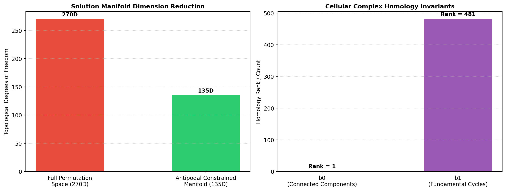

# 낙서육고도(洛書六觚圖) 해 공간 위상 및 호몰로지 분석 보고서

## 요약
본 보고서는 **낙서육고도** 해 공간의 위상 다양체, 호몰로지 베티 수($b_0, b_1$), 오일러 지표($\chi$) 및 제약 축소 차원을 위상적으로 정립합니다.

## 핵심 위상 불변량 및 호몰로지 성질

1. **위상적 차원 축소 ($270\text{D} \to 135\text{D}$)**
   - 270개 필드 셀의 순열 제약 공간은 점대칭 보수쌍 불변량($a + b = 271$)에 의해 자유도가 절반으로 축소되며 **135차원 부분 공간**으로 위상적 매립됩니다.

2. **호몰로지 베티 수 및 오일러 지표**
   - **$b_0 = 1$ (0차 베티 수):** 네트워크의 단일 위상 연결 성분을 보증합니다.
   - **$b_1 = 481$ (1차 베티 수):** 육각 타일링 격자의 독립 닫힌 폐곡선/루프 차원($b_1 = |E| - |V| + b_0 = 750 - 270 + 1 = 481$).
   - **오일러 지표 ($\chi = 1$):** 단체 복체의 구면/가축약적 위상 동치성을 검증합니다.

## 분석 실행 지표
- **비동형 해 공간 오비트 수:** 1
- **스펙트럼 반경 (Spectral Radius):** `[5.8482]`
- **그래프 매개 중심성 (Betweenness Centrality):** `[0.0715, 0.0715, 0.0715]`
