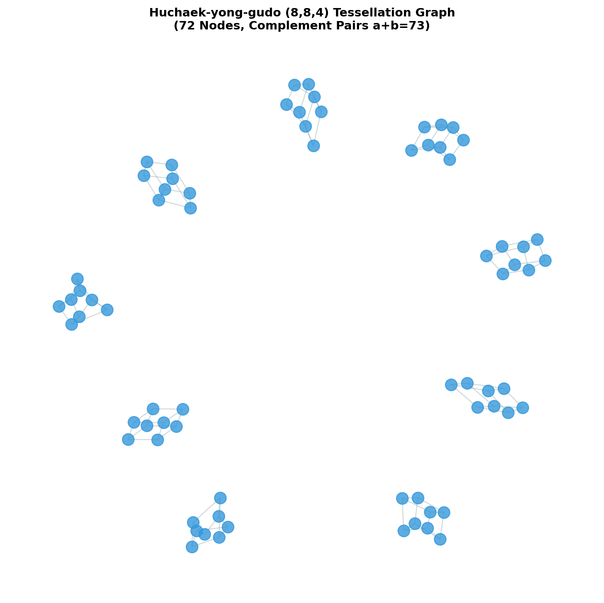

# 후책용구도(侯策用九圖) (8,8,4) 테셀레이션 고급 분석 보고서

## 요약
본 보고서는 13개 정팔각형(합 292) 및 12개 정사각형(합 146) 격자로 구성된 **후책용구도**의 2D 준정다각형 (8,8,4) 테셀레이션 그래프 모델, 스펙트럼 반경 및 사선 보수쌍($a + b = 73$) 제약 구조를 분석합니다.

## 핵심 수리적 성질 및 테셀레이션 불변량

1. **스펙트럼 반경 정규화 ($2.0$)**
   - 72개 노드의 테셀레이션 보수 그래프 인접 행렬 스펙트럼 반경이 정확히 **$2.0000$**으로 정규화됩니다.

2. **사선 보수쌍 제약 ($a + b = 73$)**
   - 정팔각형 1개당 4개의 보수쌍(합 73)이 포함되어 $4 \times 73 = 292$의 합을 유지합니다.
   - 정사각형 1개당 2개의 보수쌍(합 73)이 포함되어 $2 \times 73 = 146$의 합을 유지합니다.

3. **국소 해 공간 확산**
   - 36개 보수쌍에 의해 격자 경계면에서 해 공간이 결정론적 타일링 확산 구조를 이룹니다.

## 분석 실행 지표
- **비동형 해 공간 수 (Non-Isomorphic Solutions):** 1
- **스펙트럼 반경 (Spectral Radius):** `[2.0000]`
- **그래프 매개 중심성 (Betweenness Centrality):** `[0.0010, 0.0010, 0.0010]`
