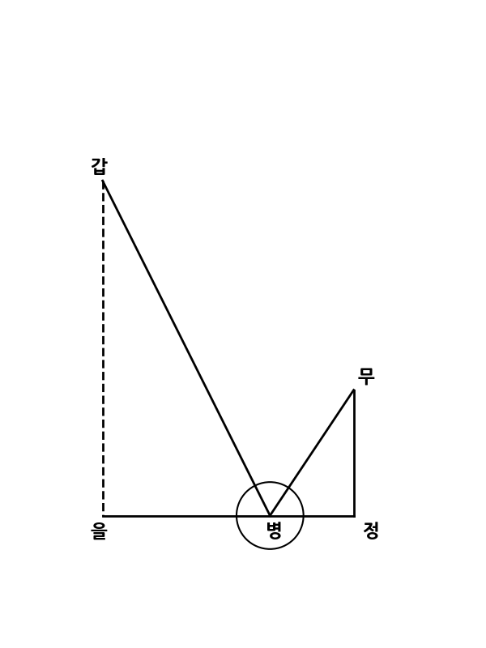

圖後表是
그림 뒤의 표는 다음과 같다.

苐二圖
제2도.

以平鏡測髙
평평한 거울로 높이를 측정한다.

用孟水亦同
그릇의 물을 쓰는 것도 이와 같다.

欲知甲乙之髙置平鏡于丙人立于丁
갑을의 높이를 알고자 하면 평평한 거울을 병에 놓고 사람은 정에 선다.

其丙丁取平人目在戊向物頂之甲
병과 정 사이의 수평을 맞추고, 사람의 눈은 무에서 물체 꼭대기인 갑을 향한다.

稍移就之令目見甲在鏡中心而甲影從
조금씩 움직여 눈으로 거울 중심에 있는 갑을 보게 하면, 갑의 그림자가 거울 중심에서 눈으로 반사한다.

弓量自丁至丙之度為自率
정에서 병까지의 거리를 재어 첫째 비율로 삼는다.

丁戊為次率
정에서 무까지의 높이를 둘째 비율로 삼는다.

乙丙為三率筆之得甲乙髙
을에서 병까지의 거리를 셋째 비율로 삼아 계산하면 갑을의 높이를 얻는다.

以下岀天學初凾
이하는 천학초함에서 나온다.

以表測地平逺
표목으로 지평의 거리를 측정한다.

## 해설

그림과 본문에서 설명하는 산술 방식은 삼각형의 닮음을 이용한 비례식 산술이다.

거울 반사의 법칙(입사각 = 반사각)에 의해 형성되는 두 직각삼각형 $\triangle \text{갑을병}$과 $\triangle \text{무정병}$이 서로 닮음임을 이용한다.

본문에 명시된 대응 관계와 비례식은 다음과 같다.

* **첫째 비율(自率):** 정에서 병까지의 거리 ($\text{정병}$)
* **둘째 비율(次率):** 정에서 무까지의 높이 ($\text{정무}$, 사람의 눈높이)
* **셋째 비율(三率):** 을에서 병까지의 거리 ($\text{을병}$)

**계산식:**

$$\text{정병} : \text{정무} = \text{을병} : \text{갑을}$$

구하고자 하는 물체의 높이($\text{갑을}$)는 다음과 같이 산출한다.

$$\text{갑을} = \frac{\text{정무} \times \text{을병}}{\text{정병}}$$

