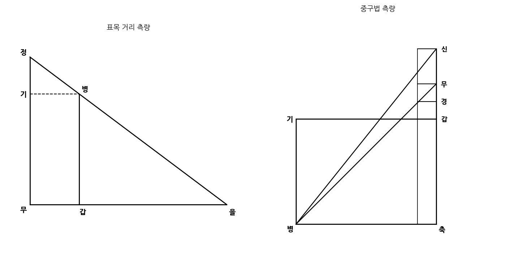

## 그림1 (표목 거리 측량)

稍坐于身以便窺望次却立干或目在
몸을 조금 낮추어 가만히 엿보기에 편하게 하고, 다음으로 조금 뒤로 서서 눈을 정(丁)에 둔다.

丁視表末丙與逺際乙相參直次移丙
정(丁)에서 표목의 끝인 병(丙)과 멀리 있는 대상인 을(乙)이 서로 일직선이 되도록 바라본 다음, 병(丙)을 옮긴다.

度于己截取丁己為首率申戊為次率
거리를 측정하여 정기(丁己)를 잘라내어 첫째 비율로 삼고, 신무(申戊)를 둘째 비율로 삼는다.

丙甲表度為三率筭得甲乙之逺
병갑(丙甲) 표목의 길이를 셋째 비율로 삼아 계산하면 갑을(甲乙) 사이의 먼 거리를 얻는다.

以重矩兼測無廣之深無深乏廣
중구법(겹친 꺾쇠자 측량법)으로 너비를 알 수 없는 깊이와 깊이를 알 수 없는 너비를 함께 측정한다.

---

## 그림2 (중구법)

有壁立深谷不知甲乙之廣欲測
깎아지른 절벽의 깊은 골짜기가 있어 갑을(甲乙)의 너비를 알지 못하고 측정하고자 하는 경우,

乙丙之深則用重矩法先于甲岸
을병(乙丙)의 깊이에는 중구법을 사용한다. 먼저 갑(甲) 언덕 위에서

上依垂下直線立戊甲已勾股矩
아래로 내려뜨린 수직선 기준에 따라 무갑기(戊甲己) 구고거(꺾쇠자)를 세운다.

尺其甲己勾長六尺人従股尺上
그 갑기(甲己) 구(너비)의 길이는 6척이며, 사람은 고(높이) 거울 위를 따라 관찰한다.

## 그림1 해설 (표목 거리 측량)

이 측량법은 닮음비(비례삼법)를 이용해 직접 건너갈 수 없는 먼 거리(甲乙)를 측정하는 방식이다.

* **원리:** 관측자의 눈 위치(丁)에서 표목의 끝(丙)을 거쳐 멀리 있는 목표점(乙)을 일직선상에 놓는다.
* **비례식:** 수직축의 관측 구간 거리(丁己)와 수평 보조선(申戊/己丙), 그리고 표목의 높이(丙甲) 사이의 비율을 세워 대상까지의 거리(甲乙)를 산출한다.

$$\text{丁己}(\text{첫째 비율}) : \text{申戊}(\text{둘째 비율}) = \text{丙甲}(\text{셋째 비율}) : \text{甲乙}(\text{구하고자 하는 거리})$$

---

## 그림2 해설 (중구법 / 겹친 꺾쇠자 측량)

절벽이나 깊은 계곡처럼 접근이 불가능한 지형에서 너비(甲乙)와 깊이(乙丙)를 동시에 구하기 위해 꺾쇠자(구고거) 두 개를 겹쳐 사용하는 기하학적 측량법이다.

* **원리:** 수직 기준선(戊甲己)을 세우고, 기준이 되는 너비인 갑기(甲己, 6척)를 정한 뒤 꺾쇠자의 고(股, 수직변)를 따라 두 번의 시선을 교차시킨다.
* **산술 기법:** 높이가 다른 두 관측점에서 직각삼각형을 각각 만들어 관측 각도의 차이와 기준 척도의 비례 관계를 계산한다. 이를 통해 수평 거리인 골짜기의 너비(甲乙)와 수직 깊이(乙丙)를 기하학적으로 도출해 낸다.
