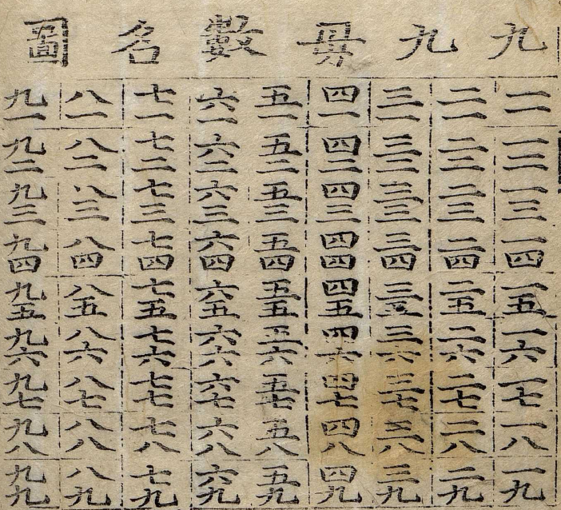
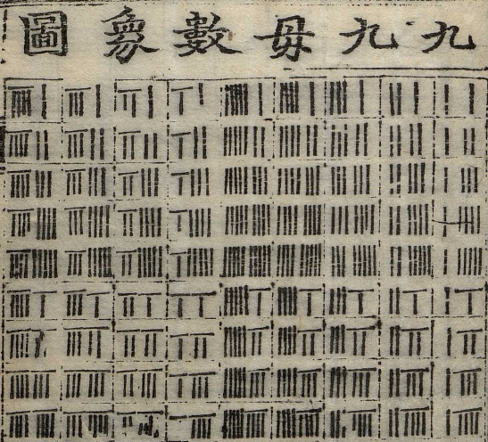
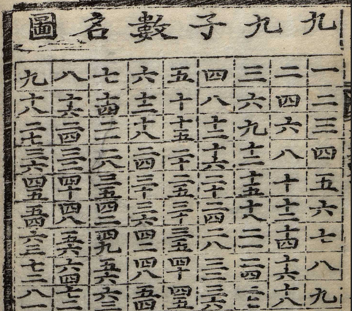
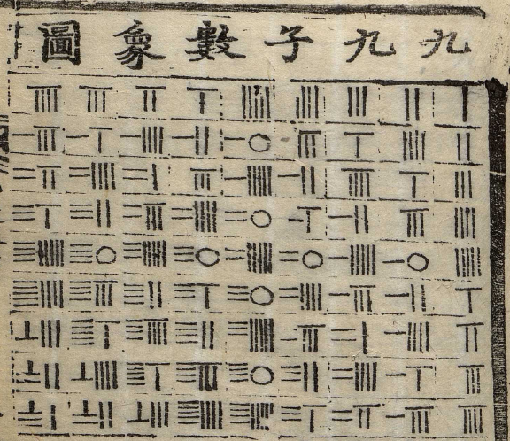

## 본문

上為綱數

윗 수가 강이 되는 수이고,

下為目數

아래 수가 목이 되는 수이다.

*생물학 및 학술 분류에서 강이 상위 개념, 목이 하위 개념이다.*

右為目數

오른쪽 수가 목이 되는 수이고,

左為綱數

왼쪽 수가 강이 되는 수이다.

夫綱而妻目也

강이 되는 수가 남편 수이고, 목이 되는 수가 아내 수이다.

圖即蔡氏範數方圖

그림은 채씨(채침, 남송의 철학자이자 수학자)가 말한 범수방도이다.

自上而下橫格有九自右而左直行有九綱第一直行為目直行自上看其相值處即相乘數
위에서 아래로 아홉 행을 두고, 오른쪽에서 왼쪽으로 아홉 열을 둔다. 첫째 세로줄을 머리항목으로 삼아 위에서부터 읽으며, 행과 열이 만나는 칸에는 두 수의 곱을 적는다.

*전치행렬의 두 쌍을 곱한 것이다.*

右為單數
오른쪽 수가 1의 자리이다.
左為十數
왼쪽 자리가 10의 자리이다.
從一而衡十也
1을 따라 가로로 눕히면 10의 자리이다.

九九合數口訣
구구합수구결(구구단 외는 법)

一一如一

일일은일

一二如二

일이는이

二二為四

이이는사

一三如三

일삼은삼

二三為六

이삼은육

三三為九

삼삼은구

一四如四

일사는사

二四為八

이사는팔

三四一十二

삼사일십이

四四一十六

사사일십육

一五如五

일오는오

二五得一十

이오는일십

三五一十五

삼오일십오

四五得二十

사오는이십

五五二十五

오오이십오

一六如六

일육은육

二六一十二

이육일십이

三六一十八

삼육일십팔

四六二十四

사륙이십사

五六得三十

오륙은삼십

六六三十六

육육삼십육

一七如七

일칠은칠

二七一十四

이칠일십사

三七二十一

삼칠이십일

四七二十八

사칠이십팔

五七三十五

오칠삼십오

六七四十二

육칠사십이

七七四十九

칠칠사십구

一八如八

일팔은팔

二八一十六

이팔일십육

三八二十四

삼팔이십사
四八三十二

사팔삼십이

五八得四十

오팔은사십

六八四十八

육팔사십팔

七八五十六

칠팔오십육

八八六十四

팔팔육십사

一九如九

일구는구

二九一十八

이구일십팔

三九二十七

삼구이십칠

四九三十六

사구삼십육

五九四十五

오구사십오

六九五十四

육구오십사

七九六十三

칠구육십삼

八九七十二

팔구칠십이

九九八十一

구구팔십일

*당신은 100줄 넘는 한문을 읽었지만 정작 한건 구구단을 왼 것이다.*

致加减者存乎

더하기와 빼기를 지극히 이르게 하는 이가 존재하는가?

乗除妙乗除者存乎

곱하기와 나누기의 묘를 곱하기와 나누기에 있게 하는 이가 존재하는가?

九九如言九九八十一九

'구구(九九)'는 "구구는 팔십일(9×9=81)"이라고 말하는 것과 같으니,

九者九箇九也九九母數也八十一子數也

'구구'라는 것은 9가 9개 있다는 뜻이다. '구구(9×9)'는 모수(원래의 수)이고, '팔십일(81)'은 자수(결과로 생겨난 수)이다.

如言八九七十二八九者八箇九也九箇八亦為七十二也以八乗九生七十二

"팔구는 칠십이(8×9=72)"라 말하는 것과 같이, '팔구'는 9가 8개 있다는 뜻이며 8이 9개 있어도 역시 72가 된다. 8로 9를 곱하면 72가 생겨난다.

八為夫而九為妻也

(여기서 앞의) 8은 남편(승수/곱하는 수)이 되고 (뒤의) 9는 아내(피승수/곱해지는 수)가 된다.

諸數放此有四十五句或該而或省者圖以揭其全訣以提其要也

모든 수는 이 예시를 따라 45구가 되는데, 혹 빠짐없이 다 갖추기도 하고 필요없는 부분을 줄여 생략하기도 한 것은,
그림으로 그 전모를 밝혀 보여주고, 구결로 그 요점을 제시하기 위함이다.
