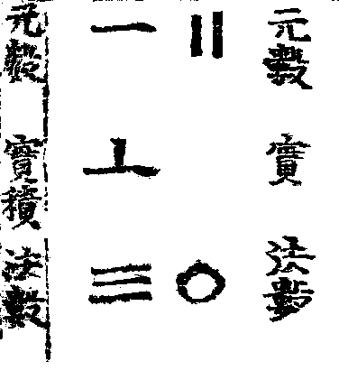
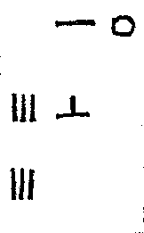
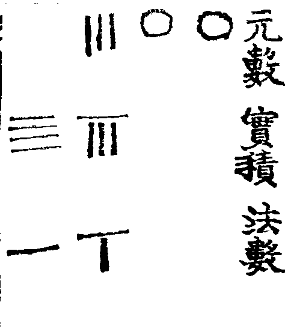
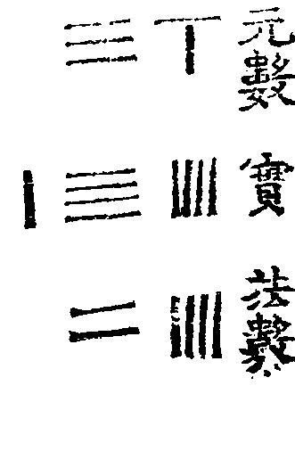
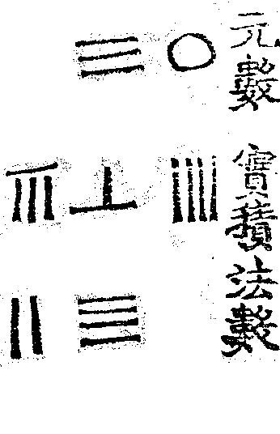

## 總論八法: 산술의 여덟 가지 법에 대하여

總除有八法正數二變數六
곱셈과 나눗셈은 8가지 법이 있으며, 근본이 되는 법은 둘이고 파생되는 법은 두 가지이다.

乗有因加乗三法
곱셈에는 인법·가법·승법의 세 가지가 있고,

除有歸減三法即陰陽之變數也
나눗셈에는 귀법·감법·제법의 세 가지가 있다. 이 여섯 가지는 곧 음과 양에서 갈라져 나온 변화의 법이다.

步乗一法兼因加乗三法
보승은 하나의 근본법으로서 인법·가법·승법의 세 법을 아우르고

商除一法兼歸減三法
상제는 하나의 근본법으로서 귀법·감법·제법의 세 법을 아우른다.

如乾坤之統六子即陰陽之正數也

이는 마치 건과 곤이 여섯 자녀를 거느리는 것과 같으니, 보승과 상제 두 법이 곧 음양에 해당하는 근본법이다.

### 陰陽正數 二法: 기본 산술법 2가지

步乗者陽之正揚輝謂之相乗俗稱影筭
보승은 양의 방법이다. 양휘(남송 시대 중국의 수학자) 말한 서로 곱한다는 것은 속칭으로는 영산이라고 불리는 셈이다.

上列元數幾何
위에 늘어 둔 원수(으뜸 수)는 무엇인가?

下列法數幾何
아래에 늘어 둔 법 수(법이 되는 수)는 무엇인가?

上下相乗中列實積其何
위 아래를 곱하여 얻는 실제 곱셈 결과는 무엇인가?

上數象天下數象地中數象人即三格算也
위의 수가 하늘의 모양, 아래의 수가 땅의 모양이라고 하면, 가운데 수는 사람이 되어, 세 격이 셈을 이룬다.

*산가지를 이용하여 계산할 때, 수의 배치 규칙을 천지인에 빗대어 알기 쉽게 풀이했다.*

十乗十生百乗百生千
십에 십을 곱하면 백이 되고, (십에) 백을 곱하면 천이 생긴다.

先從元數末位起筭
먼저 원수의 끝자리부터 계산을 시작한다.

元數位多者
원수의 자릿수가 여러 개이면

法數次次進位
법수를 차례차례 높은 자리로 옮긴다.

以商除還原
상제로써 다시 원래대로 되돌린다.

乗法生扵田衮加
승법은 전곤가에서 생겨났다.

暦家所謂以策由衮加者是也
역가에서 산가지를 써서 곤가를 따른다고 한 것이 바로 이것이다.

圖試具後
시험할 그림은 뒤에 갖추어 두었다.

### 문제 1. 1년을 360일로 가정하여 12 곱하기 30을 하기

姑設一題
우선 한 문제를 들어 보자.

如云
다음과 같이 말한다.

羹入有十二月
한 해에는 열두 달이 있고

每月有三十日
달마다 삼십 일이 있을 때

問一台戚日數㡬何
한 해를 모두 합한 날수는 얼마인가

荅曰三百六十日
답은 삼백육십 일이 된다. *사실 1년은 365일이 조금 넘지만, 여기선 계산 편의를 위해서 360일로 한다.*

#### 해설

곱셈과 나눗셈에는 모두 여덟 가지 법이 있다. 그 가운데 근본이 되는 법은 둘이고, 여기에서 갈라져 나온 법은 여섯이다.

곱셈에는 인법·가법·승법의 세 가지가 있고, 나눗셈에는 귀법·감법·제법의 세 가지가 있다. 보승은 앞의 세 법을 아우르고, 상제는 뒤의 세 법을 아우른다.

저자는 이 두 근본법과 여섯 세부법의 관계를, 건과 곤이 여섯 자녀를 거느리는 음양론의 구조에 비유한다.

이하에서는 이러한 우주론적 분류보다, 그 직후 제시되는 실제 계산 절차에 초점을 맞춘다. 곧바로 아래의 계산을 검산하여 밝힌다.

실제 계산은 원수 (12)를 끝자리부터 처리하여 부분곱 (60)과 (300)을 얻는 방식이다.

$$
12\times 30
$$

먼저 원수의 끝자리 (2)를 법수 (30)과 대응시킨다.

$$
2\times 30
———————————

2\times 3\times 10
$$

구결로는 다음과 같다.

$$
2\times 3=6
$$

따라서 (6)을 십의 자리에 놓는다.

$$
6\times 10=60
$$

즉 첫 번째 부분곱은 다음과 같다.

$$
2\times 30=60
$$

계산이 끝난 원수의 끝자리 (2)를 없애면 원수에는 십의 자리 (1)이 남는다.

$$
12=1\times 10+2
$$

이제 십의 자리 (1)을 계산한다. 십의 자리 (1)은 실제로 (10)을 나타내므로 법수 (30)과의 곱은 다음과 같다.

$$
10\times 30
———————————

1\times 3\times 100
$$

구결로는 다음과 같다.

$$
1\times 3=3
$$

따라서 (3)을 백의 자리에 놓는다.

$$
3\times 100=300
$$

즉 두 번째 부분곱은 다음과 같다.

$$
10\times 30=300
$$

두 부분곱을 합한다.

$$
60+300=360
$$

따라서 답은 다음과 같다.

$$
12\times 30=360
$$

전체 과정을 한 줄로 쓰면 다음과 같다.

$$
\begin{aligned}
12\times 30
&=(10+2)\times 30\
&=10\times 30+2\times 30\
&=300+60\
&=360
\end{aligned}
$$


#### 산목 풀이 1

依圖布算 以十二為元數 列江益
그림에 따라 산가지를 늘어놓아서, 십이를 원수로 삼아 강익의 방식으로 늘어놓는다.

以三什為法 百零對零入
삼십을 법수로 삼아 백 자리의 영을 영에 맞추어 들인다.

先以法數三與元數二對
먼저 법수 삼을 원수 이와 마주 놓고

呼二三如六
이삼은 육이라고 말한다. *구구단 하듯 외면 된다.*

下六筭扵十格
십의 자리에 산가지 육을 내려놓는다.

即六十數也
곧 육십이라는 수이다.

上呑去二數
위에서 이라는 수를 먹어 없앤다.

成㓛者去
계산을 마친 수는 없앤다.

次呼十歩之一
다음으로 십 자리의 일을 계산한다.

將法數三十進位扵百
법수 삼십을 백의 자리로 올려 옮긴다.

呼一三如三
일삼여삼이라 부른다.

下三扵中格
가운데 자리에 이를 내려놓는다.

六十之
육십에 이를 더한다.



산목으로 두면 아래와 같다.

| 수의 명칭 | 10의 자리| 1의 자리 |
| - | - | - |
| 元數(으뜸 수) | 1 | 2 |
| 實積(곱셈 결과) | 6 | 0 |
| 法數(법수) | 3 | 0 |


左即三百數也
왼쪽은 300이다.

合得三百六十
합은 360이다.

是為一歲之日數
이것은 1세(날짜의 단위, 여기서는 360일을 일컬음)의 일 수이다.

此一問以因法求之亦得
이 한 문제는 인법으로 구하여도 역시 답을 얻을 수 있다.

揚輝以元數稱實數
양휘는 원수(으뜸 수)를 일컬어 실수(실제 결과 수)라 하였다.

此云元數所以別扵積數也
이것은 원수와 적수(곱셈의 결과)를 구별하기 위함이다.

下文或混稱如云
아래 문장에서는 혼용해서 말하기도 한다.



산목으로 두면 아래와 같다.

| 수의 명칭 | 100의 자리| 10의 자리 | 1의 자리
| 元數(으뜸 수) | 1 | 2 |
| 實積(곱셈 결과) | 6 | 0 |
| 法數(법수) | 3 | 0 |

12의 2를 떼어 아래 법수의 30과 곱하면 60을 얻는다. 이후 12의 10을 마저 30과 곱하면 십진법에서 자연스레 자리가 올라간다.

300에 60을 더하여 360의 결과를 얻는다.

## 2. 문제 2: 은자(중국식 은화)의 값어치

今有銀子三百斤
지금 은자가 300근이 있다.

問該幾兩
그 양은(300근만큼의 양은) 총 몇 냥의 값어치가 되는가?

答曰四千八百兩
정답은 4800냥이다.

依圖布算 以三百為元數 以斤法一十 為法數

그림에 따라 산가지를 늘어놓아 300이 원수(으뜸 수)가 되게 하고 근법은 16이니 이것을 법수가 되게 한다.



先呼百步之二將法數進二位

"백 보"라고 말하고 법수를 두 칸 밀어 자릿수가 두 칸 나아가게 한다.

上下對呼一三如三
위아래로 대조해 보면, 일 삼은 삼이다.

下三筭扵中格
산가지 세 개를 중간 칸에 놓는다.

千位次呼

다음에, "천 위"라고 말한다.

三六一十八下一千八百

삼 육은 십팔이니, 아래에 1800을 놓는다.

答得四千八百兩
답은 4800냥이다.

### 해설

은자 1개가 16냥의 값어치를 한다고 하자.

먼저 아래와 같이 숫자를 적는다.

| 1000의 자리 | 100의 자리 | 10의 자리 | 1의 자리 | 변수 이름 |
| - | - | - | - | - |
| | 3 | 0 | 0 | 元數(으뜸 수) |
| 4 | 8 | | | 實積(실제 곱셈 결과) |
| 1 | 6 | | | 法數(법수) |

300의 유효 숫자는 3이고, 그 3은 백의 자리에 있다. 따라서 법수 16을 계산판에서 두 자리 옮겨 놓으면, 이후의 한 자리 곱셈 결과가 자동으로 백 배의 위치에 기록된다.

그렇다면 자릿수를 빠르게 맞추기 위해서는 10을 300보다 한 칸 앞에, 6을 300의 칸에 두면 된다.

우선, 구구단을 외면 삼 육은 십팔이라고 얻을 수 있다.

곱하여서 18을 얻어서 내려 놓으면 이미 두 칸이 밀려 있어서 1800이 바로 나온다.

3 곱하기 1은 3이다. 이미 세 칸이 밀려 있으니 바로 3000이 나온다.

두 자리는 산가지의 특성 상 자동으로 뭉친다.

#### 전산학적 재해석

이것을 C언어로 구현해 보면 더욱 쉽게 이해할 수 있다.

```c
#include <stdio.h>

int count_zeroes_from_right(const int *num, size_t len);
static void print_res(const char *tag, const int *t, size_t t_len, const int *res, size_t res_len, const int *s, size_t s_len);

int main(void) {
    int t[] = { 3, 0, 0 };
    size_t t_len = sizeof(t) / sizeof(t[0]);

    int s[] = { 1, 6 };
    size_t s_len = sizeof(s) / sizeof(s[0]);

    constexpr int RES_LEN = 4;
    int result[RES_LEN] = { 0 };

    int t_zeroes = count_zeroes_from_right(t, t_len);
    int s_zeroes = count_zeroes_from_right(s, s_len);

    int t_start_from = (int)t_len - t_zeroes - 1;
    int s_start_from = (int)s_len - s_zeroes - 1;

    print_res("Initial State", t, t_len, result, RES_LEN, s, s_len);
    printf("\nIndex multiplication and accumulation\n");

    for (auto i = t_start_from; i >= 0; i--) {
        for (auto j = s_start_from; j >= 0; j--) {
            int prod = t[i] * s[j];

            int pos_from_right = (t_start_from - i) + (s_start_from - j) + t_zeroes + s_zeroes;
            int res_idx = (RES_LEN - 1) - pos_from_right;

            int sum = result[res_idx] + prod;
            int digit = sum % 10;
            int carry = sum / 10;

            result[res_idx] = digit;

            int idx = res_idx - 1;
            int temp_carry = carry;
            while (temp_carry > 0 && idx >= 0) {
                int c_sum = result[idx] + temp_carry;
                result[idx] = c_sum % 10;
                temp_carry = c_sum / 10;
                idx--;
            }

            if (carry > 0) {
                printf("t[%d](%d) * s[%d](%d) = %2d  -> accumulates into %d->result[%d] %d->result[%d]\n",
                       i, t[i], j, s[j], prod, carry, res_idx - 1, digit, res_idx);
            } else {
                printf("t[%d](%d) * s[%d](%d) = %2d  -> accumulates into result[%d]\n",
                       i, t[i], j, s[j], prod, res_idx);
            }

            print_res("current result", t, t_len, result, RES_LEN, s, s_len);
        }
    }

    printf("\ncarry\n");
    for (auto idx = RES_LEN - 1; idx > 0; idx--) {
        if (result[idx] >= 10) {
            int carry = result[idx] / 10;
            result[idx - 1] += carry;
            result[idx] %= 10;

            printf("result[%d] carry applied (+%d -> result[%d])\n", idx, carry, idx - 1);
            print_res("  current result", t, t_len, result, RES_LEN, s, s_len);
        }
    }

    int start_print = 0;
    while (start_print < RES_LEN - 1 && result[start_print] == 0) {
        start_print++;
    }

    printf("\nfinal output: ");
    for (int i = start_print; i < RES_LEN; i++) {
        printf("%d", result[i]);
    }
    printf("\n");

    return 0;
}

int count_zeroes_from_right(const int *num, size_t len) {
    int idx = (int)len - 1;
    while (idx >= 0 && num[idx] == 0) {
        idx--;
    }
    return (int)len - 1 - idx;
}

static void print_res(const char *tag, const int *t, size_t t_len, const int *res, size_t res_len, const int *s, size_t s_len) {
    (void)tag;
    printf("[   ");
    for (size_t i = 0; i < t_len; i++) {
        printf("%d ", t[i]);
    }
    puts("]: t");

    printf("[ ");
    for (size_t i = 0; i < res_len; i++) {
        printf("%d ", res[i]);
    }
    puts("]: result");

    printf("[     ");
    for (size_t i = 0; i < s_len; i++) {
        printf("%d ", s[i]);
    printf("]: s\n");
}
```


이와 같이 구현해 보면 정석적인 필산 곱셈에, 0처리와 받아올림 처리를 즉시 진행하는 것을 알 수 있다.
이는 보기에 직관적이나 시간복잡도는 $O(N^2)$이라 카라츠바 등에 비해 느리며, 산가지를 놓을 때가 아니라면 큰 수의 빠른 곱셈은 카라츠바를 쓰는 것이 낫다. 필산으로 산대를 둘 것이면 권장할 만한 방법이다.
구수략에서도 말하듯, 이는 가장 기초적인 곱셈과 나눗셈법으로 해설한다.

## 문제 3: 신외가법으로 곱셈하기

此一問以 身外加求之 如云
이 문제를 신외가법으로 구한다. 다음과 같다.

今有直田長三十七步闊二十四步
직전(직사각형 꼴의 밭)이 있다. 길이는 37보, 너비는 24보이다.

問該積其步幾何
가로와 세로를 곱한 것을 몇 보를 얻는가?

答曰八百六十四步
답은 864보이다.

依圖布筭以長三十六為元數以闊二十四為法數
그림과 같이 산대를 놓아, 높이 36이 원수(으뜸 수)가 되게 하고, 너비 24가 법수가 되게 한다.



先以法數與元數六

먼저 법수에게 원수의 6부터 더불어 쓰게 한다.

呼二六一十二四六二十四
이 육은 십이, 사 육은 이십사라고 말한다.

下一四四扵中格
144를 중간 칸에 내려놓는다.

上格去六數成功者去
윗 칸에서 6을 소거해서, 성공한 자리는 없어졌다.



次將法數進一位與元數三十
법수가 장차 한 칸 나아가게 하고, 원수에는 30만 남겨라.

對呼二三如六三四一十二下七百二十於中格
이 삼은 육, 삼 사는 십이이니 중간 칸에 720을 내려놓는다.

合得八百六十四步
합은 864보를 얻는다.
 

